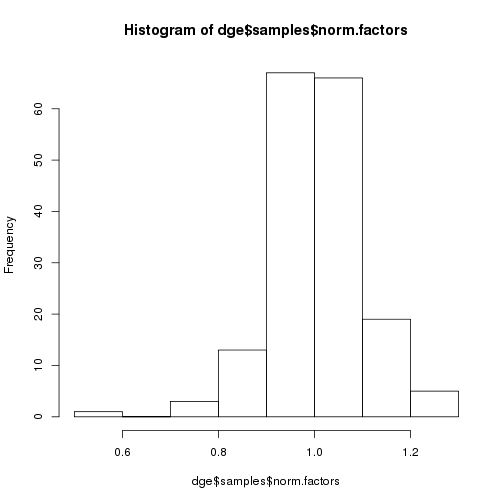
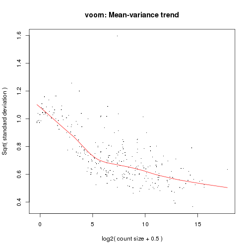

**Script: ** `2_create_dge_g_objects_for_eqtl.R`

**Directory of Code:**  `/mnt/research/pigeqtl/analyses/microRNA/2_mirna_characterization_expression/3_build_dge_object_for_eqtl/scripts`

**Date:**  2/23/16

**Input File Directory:**  

1. `/mnt/research/pigeqtl/analyses/microRNA/2_mirna_characterization_expression/3_build_dge_object_for_eqtl/`

2. `/mnt/research/pigeqtl/analyses/microRNA/2_mirna_characterization_expression/2_create_expression_matrix_of_known_mirna/`

3. `/mnt/research/pigsnp/MSUPRP/carcass_quality/data/MSUPRP_meat.RData`

**Input File(s):** 

1. `3_msuprp_mirna_gpdata.Rdata`

2. `2_mature_mirna_annotation.Rdata`

3. `2_create_expression_matrix_of_known_mirna/1_exp_filtered_rounded_mean_mature_mirna_expression.Rdata`

4. `MSUPRP_meat.RData`

**Output File Directory:** `/mnt/research/pigeqtl/analyses/microRNA/2_mirna_characterization_expression/3_build_dge_object_for_eqtl/`

**Output File(s):** 

1. `4_msuprp_mirna_gpdata_pheno_counts.Rdata`

2. `5_normalized_dge_object_and_voom_output.Rata`

3. `6_Z_G_miRNA_gblup_gwas.Rdata`

**Table of contents:**

1. [Objectives](#objectives)
2. [Install libraries](#install-libraries)
3. [Load data](#load-data)
4. [Analysis](#analysis)
5. [Save data](#save-data)

## Objectives
The objective of this script is to create the dge object by combining the filtered, rounded read counts and the annotation file for the mature miRNA expression profiles.

This object will then be used in transforming the read counts to log cpm, and filtering miRNAs expressed at 1 cpm in less than 1/4 the samples (If 1cpm in >= 44 libraries, retain miRNA). 
The normalized counts from this dge object will be used in the eQTL analysis as the expression/phenotypic data, added to the gpdata pheno object.

Additionally, the matrix of SNP markers will be standardized in this script, and the standardized matrix (Z) will be multiplied by its transpose (Z') to form the G matrix. 
The G matrix will be used in the eQTL analysis; the Genomic Relationship Matrix. 

# This analysis conducted with R/3.2.0

## Install libraries


```r
library(synbreed)
library(regress)
library (limma)
```

```
## Loading required package: methods
```

```r
library (edgeR)
library(gwaR)
library(parallel)
library(qvalue)
```

```
## Warning: replacing previous import by 'grid::arrow' when loading 'qvalue'
```

```
## Warning: replacing previous import by 'grid::unit' when loading 'qvalue'
```

```r
rm(list=ls())
setwd("/mnt/research/pigeqtl/analyses/microRNA/2_mirna_characterization_expression/3_build_dge_object_for_eqtl/scripts/")
```

Load Yeni's function for standardizing the Z matrix:


```r
load("/mnt/research/pigsnp/GBLUP-based_GWA_Package/test_functions/testpkg/funct_eqtl.Rdata")
ls()
```

```
## [1] "absmap"     "add_legend" "AddPosGene" "manhpt"     "plot.GMA"  
## [6] "stb"        "tbpos"      "zstandard"
```

## Load data

The mature miRNA annotation:


```r
load("../2_mature_mirna_annotation.Rdata")
```

The rounded, filtered mean read counts:


```r
load("../../2_create_expression_matrix_of_known_mirna/1_exp_filtered_rounded_mean_mature_mirna_expression.Rdata")
```

Load the gpdata object created for the filtered markers:


```r
load("../3_msuprp_mirna_gpdata.Rdata")
```

Load the MSUPRP_meat gpdata object for use in standardizing the SNP genotypes:


```r
load("/mnt/research/pigsnp/MSUPRP/carcass_quality/data/MSUPRP_meat.RData")
ls()
```

```
##  [1] "absmap"                     "add_legend"                
##  [3] "AddPosGene"                 "final_MSUPRP_miRNA"        
##  [5] "manhpt"                     "MSUPRP_meat"               
##  [7] "no.zero.dfmeanrcround"      "plot.GMA"                  
##  [9] "stb"                        "summary_final_MSUPRP_miRNA"
## [11] "tbpos"                      "total.mature.annot2"       
## [13] "zstandard"
```

## Analysis

### 1. Create the dge object and transform the read counts: log-cpm, then filter genes by expression (1 cpm in 44 or more samples retained):

Create the dge object:


```r
dge<-DGEList(counts=no.zero.dfmeanrcround,genes=total.mature.annot2)
dim(dge)
```

```
## [1] 335 174
```

```r
dge[1:5,1:5]
```

```
## An object of class "DGEList"
## $counts
##                1034  1036  1041  1049  1058
## ssc-let-7a    48132 23427 28448 29860 40758
## ssc-let-7c    32745 14987 18144 18681 34313
## ssc-let-7d-3p   381   192   198   269   778
## ssc-let-7d-5p  4925  1938  2511  3076  3472
## ssc-let-7e     2811  1302  1463  1690  2512
## 
## $samples
##      group lib.size norm.factors
## 1034     1  1462358            1
## 1036     1   830436            1
## 1041     1   944837            1
## 1049     1  1081483            1
## 1058     1  1257197            1
## 
## $genes
##                        Name  chr0     start       end width strand  type
## ssc-let-7a       ssc-let-7a  chr3  44864443  44864464    22      + miRNA
## ssc-let-7c       ssc-let-7c chr13 191559351 191559372    22      + miRNA
## ssc-let-7d-3p ssc-let-7d-3p  chr3  44867331  44867352    22      + miRNA
## ssc-let-7d-5p ssc-let-7d-5p  chr3  44867277  44867298    22      + miRNA
## ssc-let-7e       ssc-let-7e  chr6  51858385  51858406    22      + miRNA
##                      Alias          Precursors
## ssc-let-7a    MIMAT0013865 MI0017984,MI0013085
## ssc-let-7c    MIMAT0002151           MI0002445
## ssc-let-7d-3p MIMAT0025357           MI0022120
## ssc-let-7d-5p MIMAT0025356           MI0022120
## ssc-let-7e    MIMAT0013866           MI0013086
```

Calculate the read counts per million in order to filter miRNAs by normalized expression:


```r
cpm.dge<-cpm(dge)
dim(cpm.dge)
```

```
## [1] 335 174
```

```r
cpm.dge[1:5,1:5]
```

```
##                     1034       1036      1041       1049      1058
## ssc-let-7a    32913.9650 28210.4822 30108.897 27610.2352 32419.740
## ssc-let-7c    22391.9177 18047.1463 19203.312 17273.5031 27293.256
## ssc-let-7d-3p   260.5381   231.2038   209.560   248.7325   618.837
## ssc-let-7d-5p  3367.8484  2333.7139  2657.601  2844.2426  2761.699
## ssc-let-7e     1922.2379  1567.8511  1548.415  1562.6690  1998.096
```

```r
if (sum(rownames(no.zero.dfmeanrcround)!=rownames(cpm.dge))!=0) stop ("miRNAs not the same between read counts and cpm")
if (sum(colnames(no.zero.dfmeanrcround)!=colnames(cpm.dge))!=0) stop ("animal ids not the same between read counts and cpm")
```

Filter miRNAs with at least 1 cpm in at least 1/4 of the samples (174/4=43.5-->44)


```r
filtercpm<-rowSums(cpm.dge>=1)>=44
sum(filtercpm)
```

```
## [1] 295
```

We are removing 40 miRNA profiles from the analysis

So, keep the miRNA profiles in dge based on those retained in the cpm-filtering step:

This retains the rounded, filtered mean read counts, not the cpm.


```r
dge<-dge[filtercpm,]
names(dge)
```

```
## [1] "counts"  "samples" "genes"
```

```r
dge[1:5,1:5]
```

```
## An object of class "DGEList"
## $counts
##                1034  1036  1041  1049  1058
## ssc-let-7a    48132 23427 28448 29860 40758
## ssc-let-7c    32745 14987 18144 18681 34313
## ssc-let-7d-3p   381   192   198   269   778
## ssc-let-7d-5p  4925  1938  2511  3076  3472
## ssc-let-7e     2811  1302  1463  1690  2512
## 
## $samples
##      group lib.size norm.factors
## 1034     1  1462358            1
## 1036     1   830436            1
## 1041     1   944837            1
## 1049     1  1081483            1
## 1058     1  1257197            1
## 
## $genes
##                        Name  chr0     start       end width strand  type
## ssc-let-7a       ssc-let-7a  chr3  44864443  44864464    22      + miRNA
## ssc-let-7c       ssc-let-7c chr13 191559351 191559372    22      + miRNA
## ssc-let-7d-3p ssc-let-7d-3p  chr3  44867331  44867352    22      + miRNA
## ssc-let-7d-5p ssc-let-7d-5p  chr3  44867277  44867298    22      + miRNA
## ssc-let-7e       ssc-let-7e  chr6  51858385  51858406    22      + miRNA
##                      Alias          Precursors
## ssc-let-7a    MIMAT0013865 MI0017984,MI0013085
## ssc-let-7c    MIMAT0002151           MI0002445
## ssc-let-7d-3p MIMAT0025357           MI0022120
## ssc-let-7d-5p MIMAT0025356           MI0022120
## ssc-let-7e    MIMAT0013866           MI0013086
```

```r
dim(dge$counts)
```

```
## [1] 295 174
```

```r
if (sum(colnames(dge)!=colnames(cpm.dge))!=0) stop ("colnames not the same between dge and cpm.dge")
```

Apply the TMM normalization:


```r
dge<-calcNormFactors(dge)
head(dge$samples)
```

```
##      group lib.size norm.factors
## 1034     1  1462358    1.0600569
## 1036     1   830436    1.0612208
## 1041     1   944837    1.0625273
## 1049     1  1081483    1.1020920
## 1058     1  1257197    1.2027002
## 1060     1   927156    0.9505157
```

```r
hist(dge$samples$norm.factors)
```

 

```r
dge<-estimateCommonDisp(dge,verbose=TRUE)
```

```
## Disp = 0.11373 , BCV = 0.3372
```

```r
dge$common.dispersion
```

```
## [1] 0.1137292
```

This function (estimateCommonDisp) applies normalization factors, caluclates normalized expression based on robust count of normalized reads.
Save this object before voom transformation so we can access the pseudo.counts if needed.
Run voom transformation:


```r
v<-voom(dge,plot=TRUE)
```

 

```r
names(v)
```

```
## [1] "genes"   "targets" "E"       "weights" "design"
```

```r
dim(v$weights)
```

```
## [1] 295 174
```

```r
dim(v$genes)
```

```
## [1] 295   9
```

```r
v$genes[1:5,1:5]
```

```
##                        Name  chr0     start       end width
## ssc-let-7a       ssc-let-7a  chr3  44864443  44864464    22
## ssc-let-7c       ssc-let-7c chr13 191559351 191559372    22
## ssc-let-7d-3p ssc-let-7d-3p  chr3  44867331  44867352    22
## ssc-let-7d-5p ssc-let-7d-5p  chr3  44867277  44867298    22
## ssc-let-7e       ssc-let-7e  chr6  51858385  51858406    22
```

```r
v$weights[1:5,1:5]
```

```
##           [,1]      [,2]      [,3]      [,4]      [,5]
## [1,] 12.739579 11.819073 12.025105 12.303396 12.697604
## [2,] 11.974140 11.103495 11.300026 11.562518 11.934603
## [3,]  5.793730  5.330961  5.420053  5.546369  5.768169
## [4,]  9.002745  8.164449  8.356027  8.606709  8.963905
## [5,]  8.102738  7.193156  7.407590  7.691216  8.064036
```

```r
v$targets[1:5,]
```

```
##      group lib.size norm.factors
## 1034     1  1550183     1.060057
## 1036     1   881276     1.061221
## 1041     1  1003915     1.062527
## 1049     1  1191894     1.102092
## 1058     1  1512031     1.202700
```

Extract the voom precision weights and transform them for use in the GBLUP error term:


```r
wt<-t(v$weights)
dim(wt)
```

```
## [1] 174 295
```

```r
wt[1:5,1:5]
```

```
##          [,1]     [,2]     [,3]     [,4]     [,5]
## [1,] 12.73958 11.97414 5.793730 9.002745 8.102738
## [2,] 11.81907 11.10349 5.330961 8.164449 7.193156
## [3,] 12.02511 11.30003 5.420053 8.356027 7.407590
## [4,] 12.30340 11.56252 5.546369 8.606709 7.691216
## [5,] 12.69760 11.93460 5.768169 8.963905 8.064036
```

Standardize the voom weights: [(1/sqrt(wt))/mean(1/sqrt(wt))]


```r
wtsq<-1/sqrt(wt)
wtcen<-as.matrix(sweep(wtsq,2,FUN="/",STATS=colMeans(1/sqrt(wt))))
rownames(wtcen)<-rownames(t(v$E))
colnames(wtcen)<-colnames(t(v$E))
dim(wtcen)
```

```
## [1] 174 295
```

```r
wtcen[1:5,1:5]
```

```
##      ssc-let-7a ssc-let-7c ssc-let-7d-3p ssc-let-7d-5p ssc-let-7e
## 1034  0.9627891  0.9622429     0.9592847     0.9502803  0.9418588
## 1036  0.9995787  0.9992566     1.0000549     0.9978741  0.9996361
## 1041  0.9909786  0.9905290     0.9918017     0.9863686  0.9850612
## 1049  0.9797070  0.9792209     0.9804428     0.9718978  0.9667278
## 1058  0.9643792  0.9638355     0.9614078     0.9523368  0.9441162
```

Now, replace the gpdata "pheno" object with the voom-adjusted read counts:

The pheno object must be a data frame with rows of animals and columns of miRNAs.
So, the voom-transformed read count matrix (E) must be transposed to comply, and then be made into an array of 3 dimensions:


```r
final_MSUPRP_miRNA$pheno <- array(t(v$E), dim=c(ncol(v$E),nrow(v$E),1))
rownames(final_MSUPRP_miRNA$pheno)<- colnames(v$E)
colnames(final_MSUPRP_miRNA$pheno)<- rownames(v$E)
dim(final_MSUPRP_miRNA$pheno)
```

```
## [1] 174 295   1
```

```r
final_MSUPRP_miRNA$pheno[1:5,1:5,1]
```

```
##      ssc-let-7a ssc-let-7c ssc-let-7d-3p ssc-let-7d-5p ssc-let-7e
## 1034   14.92228   14.36657      7.943100      11.63362   10.82469
## 1036   14.69825   14.05380      7.771047      11.10306   10.52940
## 1041   14.79043   14.14161      7.627356      11.28869   10.50957
## 1049   14.61269   13.93607      7.820885      11.33382   10.46998
## 1058   14.71832   14.47000      9.008064      11.16527   10.69842
```

```r
if (sum(final_MSUPRP_miRNA$pheno[,,1] != t(v$E)) != 0) stop ("pheno object not equal to voom counts")
if (sum(rownames(final_MSUPRP_miRNA$pheno) != rownames(final_MSUPRP_miRNA$geno)) != 0) stop ("pheno object rownames not equal to geno object rownames")
if (sum(rownames(final_MSUPRP_miRNA$pheno) != final_MSUPRP_miRNA$covar$id) != 0) stop ("pheno object rownames not equal to covar id column")
sum(rownames(no.zero.dfmeanrcround) %in% colnames(final_MSUPRP_miRNA$pheno))
```

```
## [1] 295
```

Create the correct gpdata summary for the updated final_MSUPRP_miRNA:


```r
summary_final_MSUPRP_miRNA<-summary(final_MSUPRP_miRNA)
summary_final_MSUPRP_miRNA
```

```
## object of class 'gpData' 
## covar 
## 	 No. of individuals 174 
## 	         phenotyped 174 
## 	          genotyped 174 
## pheno 
## 	 No. of traits:		   295 
## 
##    ssc.let.7a      ssc.let.7c    ssc.let.7d.3p    ssc.let.7d.5p  
##  Min.   :14.23   Min.   :13.42   Min.   : 7.074   Min.   :10.48  
##  1st Qu.:14.76   1st Qu.:14.05   1st Qu.: 7.911   1st Qu.:11.29  
##  Median :14.92   Median :14.26   Median : 8.179   Median :11.51  
##  Mean   :14.92   Mean   :14.25   Mean   : 8.218   Mean   :11.51  
##  3rd Qu.:15.08   3rd Qu.:14.46   3rd Qu.: 8.432   3rd Qu.:11.75  
##  Max.   :15.69   Max.   :15.02   Max.   :12.059   Max.   :12.39  
##    ssc.let.7e      ssc.let.7f      ssc.let.7g      ssc.let.7i    
##  Min.   : 9.26   Min.   :12.19   Min.   :11.45   Min.   : 9.947  
##  1st Qu.:10.36   1st Qu.:14.30   1st Qu.:13.27   1st Qu.:12.369  
##  Median :10.70   Median :14.49   Median :13.44   Median :12.535  
##  Mean   :10.64   Mean   :14.46   Mean   :13.44   Mean   :12.514  
##  3rd Qu.:10.92   3rd Qu.:14.63   3rd Qu.:13.62   3rd Qu.:12.697  
##  Max.   :11.84   Max.   :15.34   Max.   :14.21   Max.   :13.231  
##    ssc.miR.1      ssc.miR.100     ssc.miR.101     ssc.miR.103    
##  Min.   :15.98   Min.   :10.35   Min.   :10.55   Min.   : 9.701  
##  1st Qu.:17.90   1st Qu.:10.83   1st Qu.:12.95   1st Qu.:10.356  
##  Median :18.07   Median :11.10   Median :13.16   Median :10.530  
##  Mean   :18.00   Mean   :11.25   Mean   :13.10   Mean   :10.531  
##  3rd Qu.:18.16   3rd Qu.:11.43   3rd Qu.:13.42   3rd Qu.:10.695  
##  Max.   :18.77   Max.   :13.50   Max.   :14.02   Max.   :11.370  
##   ssc.miR.106a    ssc.miR.107    ssc.miR.10a.3p   ssc.miR.10a.5p 
##  Min.   :3.579   Min.   :6.777   Min.   :0.7184   Min.   :10.91  
##  1st Qu.:4.452   1st Qu.:7.950   1st Qu.:4.3076   1st Qu.:11.42  
##  Median :4.812   Median :8.205   Median :4.5448   Median :11.68  
##  Mean   :4.805   Mean   :8.163   Mean   :4.5063   Mean   :11.76  
##  3rd Qu.:5.141   3rd Qu.:8.407   3rd Qu.:4.8290   3rd Qu.:11.98  
##  Max.   :5.964   Max.   :9.195   Max.   :5.5440   Max.   :13.28  
##   ssc.miR.10b     ssc.miR.122       ssc.miR.1249     ssc.miR.125a  
##  Min.   :14.75   Min.   : 0.6252   Min.   : 6.328   Min.   :10.65  
##  1st Qu.:15.16   1st Qu.: 5.8668   1st Qu.: 7.089   1st Qu.:11.04  
##  Median :15.37   Median : 7.7251   Median : 7.368   Median :11.15  
##  Mean   :15.37   Mean   : 7.5262   Mean   : 7.370   Mean   :11.25  
##  3rd Qu.:15.56   3rd Qu.: 9.2728   3rd Qu.: 7.603   3rd Qu.:11.34  
##  Max.   :16.15   Max.   :12.6389   Max.   :11.209   Max.   :14.51  
##   ssc.miR.125b   ssc.miR.126.3p  ssc.miR.126.5p   ssc.miR.127    
##  Min.   :11.98   Min.   :12.53   Min.   :11.00   Min.   : 9.448  
##  1st Qu.:12.35   1st Qu.:13.87   1st Qu.:12.48   1st Qu.:10.249  
##  Median :12.47   Median :14.07   Median :12.73   Median :10.487  
##  Mean   :12.53   Mean   :14.03   Mean   :12.67   Mean   :10.666  
##  3rd Qu.:12.59   3rd Qu.:14.24   3rd Qu.:12.92   3rd Qu.:10.965  
##  Max.   :14.59   Max.   :14.91   Max.   :13.59   Max.   :12.859  
##   ssc.miR.1271      ssc.miR.1277     ssc.miR.128     ssc.miR.1285   
##  Min.   :-0.1271   Min.   :-1.930   Min.   :10.40   Min.   : 8.893  
##  1st Qu.: 2.7013   1st Qu.: 3.712   1st Qu.:11.21   1st Qu.:10.459  
##  Median : 3.2656   Median : 4.332   Median :11.36   Median :10.852  
##  Mean   : 3.1235   Mean   : 3.909   Mean   :11.37   Mean   :10.701  
##  3rd Qu.: 3.7555   3rd Qu.: 4.709   3rd Qu.:11.53   3rd Qu.:11.109  
##  Max.   : 4.6742   Max.   : 5.611   Max.   :12.01   Max.   :11.640  
##  ssc.miR.1296.5p  ssc.miR.129a.3p   ssc.miR.129a.5p    ssc.miR.129b    
##  Min.   : 5.751   Min.   :-1.2810   Min.   :-0.6942   Min.   :-0.6942  
##  1st Qu.: 6.419   1st Qu.: 0.7867   1st Qu.: 2.2823   1st Qu.: 2.2823  
##  Median : 6.610   Median : 1.7629   Median : 2.8885   Median : 2.8885  
##  Mean   : 6.673   Mean   : 1.6031   Mean   : 2.9078   Mean   : 2.9078  
##  3rd Qu.: 6.855   3rd Qu.: 2.4371   3rd Qu.: 3.5193   3rd Qu.: 3.5193  
##  Max.   :10.767   Max.   : 4.9427   Max.   : 6.2186   Max.   : 6.2186  
##  ssc.miR.1306.3p ssc.miR.1306.5p   ssc.miR.1307     ssc.miR.130a  
##  Min.   :1.442   Min.   : 6.239   Min.   : 6.828   Min.   :5.192  
##  1st Qu.:3.725   1st Qu.: 7.318   1st Qu.: 7.537   1st Qu.:7.111  
##  Median :4.171   Median : 7.539   Median : 7.718   Median :7.346  
##  Mean   :4.130   Mean   : 7.542   Mean   : 7.785   Mean   :7.286  
##  3rd Qu.:4.522   3rd Qu.: 7.733   3rd Qu.: 7.934   3rd Qu.:7.504  
##  Max.   :5.275   Max.   :11.332   Max.   :10.401   Max.   :8.120  
##   ssc.miR.130b    ssc.miR.132    ssc.miR.133a.3p ssc.miR.133a.5p 
##  Min.   :5.192   Min.   :2.343   Min.   :15.27   Min.   : 9.055  
##  1st Qu.:6.395   1st Qu.:4.049   1st Qu.:15.69   1st Qu.:11.058  
##  Median :6.567   Median :4.405   Median :15.79   Median :11.272  
##  Mean   :6.553   Mean   :4.399   Mean   :15.80   Mean   :11.185  
##  3rd Qu.:6.736   3rd Qu.:4.733   3rd Qu.:15.89   3rd Qu.:11.497  
##  Max.   :7.164   Max.   :6.014   Max.   :17.89   Max.   :12.098  
##   ssc.miR.133b    ssc.miR.1343    ssc.miR.135       ssc.miR.136   
##  Min.   :11.78   Min.   :3.887   Min.   :-1.2533   Min.   :2.022  
##  1st Qu.:12.21   1st Qu.:5.158   1st Qu.: 0.8151   1st Qu.:7.150  
##  Median :12.38   Median :5.381   Median : 1.6030   Median :7.461  
##  Mean   :12.36   Mean   :5.415   Mean   : 1.4413   Mean   :7.260  
##  3rd Qu.:12.52   3rd Qu.:5.594   3rd Qu.: 2.1965   3rd Qu.:7.725  
##  Max.   :13.43   Max.   :9.715   Max.   : 3.6948   Max.   :8.150  
##   ssc.miR.137        ssc.miR.138      ssc.miR.139.3p    ssc.miR.139.5p  
##  Min.   :-1.99362   Min.   :-1.3009   Min.   :-0.7635   Min.   : 5.731  
##  1st Qu.:-0.82236   1st Qu.: 0.7705   1st Qu.: 2.3581   1st Qu.: 6.308  
##  Median :-0.33955   Median : 1.4784   Median : 2.7143   Median : 6.471  
##  Mean   :-0.01497   Mean   : 1.3806   Mean   : 2.6952   Mean   : 6.541  
##  3rd Qu.: 0.79670   3rd Qu.: 2.1064   3rd Qu.: 3.2175   3rd Qu.: 6.637  
##  Max.   : 3.47506   Max.   : 4.0323   Max.   : 4.8292   Max.   :10.050  
##  ssc.miR.140.3p   ssc.miR.140.5p  ssc.miR.142.3p   ssc.miR.142.5p  
##  Min.   : 9.924   Min.   :6.270   Min.   : 6.976   Min.   : 5.722  
##  1st Qu.:10.273   1st Qu.:7.805   1st Qu.: 9.110   1st Qu.: 8.018  
##  Median :10.407   Median :8.000   Median : 9.560   Median : 8.341  
##  Mean   :10.474   Mean   :7.988   Mean   : 9.412   Mean   : 8.290  
##  3rd Qu.:10.627   3rd Qu.:8.190   3rd Qu.: 9.822   3rd Qu.: 8.600  
##  Max.   :12.247   Max.   :9.719   Max.   :11.968   Max.   :10.842  
##  ssc.miR.143.3p  ssc.miR.143.5p   ssc.miR.144    ssc.miR.145.3p 
##  Min.   :14.15   Min.   :3.607   Min.   :3.115   Min.   :6.777  
##  1st Qu.:14.58   1st Qu.:4.982   1st Qu.:7.406   1st Qu.:7.871  
##  Median :14.77   Median :5.316   Median :7.915   Median :8.051  
##  Mean   :14.79   Mean   :5.327   Mean   :7.609   Mean   :8.051  
##  3rd Qu.:14.95   3rd Qu.:5.623   3rd Qu.:8.183   3rd Qu.:8.221  
##  Max.   :16.48   Max.   :7.360   Max.   :9.338   Max.   :9.713  
##  ssc.miR.145.5p    ssc.miR.1468   ssc.miR.146a.5p   ssc.miR.146b   
##  Min.   : 8.915   Min.   :7.201   Min.   : 7.511   Min.   : 6.246  
##  1st Qu.: 9.415   1st Qu.:8.147   1st Qu.: 8.956   1st Qu.: 7.674  
##  Median : 9.561   Median :8.372   Median : 9.255   Median : 8.067  
##  Mean   : 9.620   Mean   :8.388   Mean   : 9.258   Mean   : 8.120  
##  3rd Qu.: 9.781   3rd Qu.:8.619   3rd Qu.: 9.525   3rd Qu.: 8.548  
##  Max.   :11.392   Max.   :9.394   Max.   :10.717   Max.   :10.348  
##  ssc.miR.148a.3p ssc.miR.148a.5p ssc.miR.148b.3p  ssc.miR.148b.5p
##  Min.   :10.70   Min.   :5.101   Min.   : 9.331   Min.   :3.607  
##  1st Qu.:12.13   1st Qu.:5.716   1st Qu.: 9.781   1st Qu.:4.785  
##  Median :12.30   Median :5.970   Median : 9.888   Median :5.034  
##  Mean   :12.28   Mean   :5.942   Mean   : 9.939   Mean   :5.016  
##  3rd Qu.:12.48   3rd Qu.:6.206   3rd Qu.:10.016   3rd Qu.:5.289  
##  Max.   :12.84   Max.   :6.675   Max.   :11.241   Max.   :6.018  
##   ssc.miR.149     ssc.miR.150     ssc.miR.151.3p  ssc.miR.151.5p 
##  Min.   :5.223   Min.   : 8.587   Min.   :10.56   Min.   :12.00  
##  1st Qu.:6.279   1st Qu.: 9.199   1st Qu.:11.25   1st Qu.:12.55  
##  Median :6.482   Median : 9.399   Median :11.42   Median :12.69  
##  Mean   :6.525   Mean   : 9.442   Mean   :11.47   Mean   :12.70  
##  3rd Qu.:6.732   3rd Qu.: 9.624   3rd Qu.:11.67   3rd Qu.:12.82  
##  Max.   :9.874   Max.   :12.137   Max.   :12.39   Max.   :13.47  
##   ssc.miR.152     ssc.miR.153      ssc.miR.155.5p   ssc.miR.15a    
##  Min.   :10.18   Min.   :-2.0380   Min.   :4.829   Min.   : 8.892  
##  1st Qu.:11.29   1st Qu.:-0.7329   1st Qu.:7.443   1st Qu.:11.010  
##  Median :11.44   Median : 0.3499   Median :7.686   Median :11.258  
##  Mean   :11.44   Mean   : 0.3461   Mean   :7.700   Mean   :11.183  
##  3rd Qu.:11.59   3rd Qu.: 1.3470   3rd Qu.:8.055   3rd Qu.:11.423  
##  Max.   :12.05   Max.   : 2.8064   Max.   :8.750   Max.   :11.905  
##   ssc.miR.15b      ssc.miR.16    ssc.miR.17.3p   ssc.miR.17.5p  
##  Min.   :7.608   Min.   :12.38   Min.   :3.497   Min.   :6.666  
##  1st Qu.:8.281   1st Qu.:12.92   1st Qu.:4.889   1st Qu.:8.567  
##  Median :8.502   Median :13.02   Median :5.182   Median :8.700  
##  Mean   :8.478   Mean   :13.03   Mean   :5.122   Mean   :8.684  
##  3rd Qu.:8.661   3rd Qu.:13.13   3rd Qu.:5.370   3rd Qu.:8.824  
##  Max.   :9.851   Max.   :13.52   Max.   :6.089   Max.   :9.424  
##   ssc.miR.181a    ssc.miR.181b    ssc.miR.181c    ssc.miR.181d.5p
##  Min.   :12.61   Min.   :10.49   Min.   : 7.465   Min.   :6.545  
##  1st Qu.:13.36   1st Qu.:11.10   1st Qu.: 8.218   1st Qu.:7.360  
##  Median :13.56   Median :11.37   Median : 8.406   Median :7.515  
##  Mean   :13.60   Mean   :11.33   Mean   : 8.419   Mean   :7.512  
##  3rd Qu.:13.74   3rd Qu.:11.57   3rd Qu.: 8.580   3rd Qu.:7.671  
##  Max.   :16.66   Max.   :12.16   Max.   :10.502   Max.   :8.044  
##   ssc.miR.182     ssc.miR.183      ssc.miR.1839.5p   ssc.miR.184     
##  Min.   :4.531   Min.   :-1.2937   Min.   :-1.379   Min.   :-0.9597  
##  1st Qu.:5.561   1st Qu.: 0.9366   1st Qu.: 1.125   1st Qu.: 3.6919  
##  Median :5.930   Median : 1.8553   Median : 1.819   Median : 4.2950  
##  Mean   :5.973   Mean   : 1.7307   Mean   : 1.671   Mean   : 4.0984  
##  3rd Qu.:6.333   3rd Qu.: 2.6068   3rd Qu.: 2.407   3rd Qu.: 4.7379  
##  Max.   :7.750   Max.   : 5.5022   Max.   : 3.573   Max.   : 6.1474  
##   ssc.miR.185     ssc.miR.186      ssc.miR.187        ssc.miR.18a   
##  Min.   :4.344   Min.   : 9.823   Min.   :-1.99362   Min.   :5.429  
##  1st Qu.:6.458   1st Qu.:11.012   1st Qu.:-0.75900   1st Qu.:6.325  
##  Median :6.691   Median :11.178   Median : 0.03227   Median :6.565  
##  Mean   :6.661   Mean   :11.140   Mean   : 0.07115   Mean   :6.531  
##  3rd Qu.:6.939   3rd Qu.:11.328   3rd Qu.: 0.85191   3rd Qu.:6.790  
##  Max.   :7.332   Max.   :11.663   Max.   : 2.44147   Max.   :7.858  
##   ssc.miR.18b       ssc.miR.190a     ssc.miR.190b    ssc.miR.191    
##  Min.   :-0.8982   Min.   : 5.939   Min.   :1.400   Min.   : 8.567  
##  1st Qu.: 3.2933   1st Qu.: 9.361   1st Qu.:3.653   1st Qu.: 9.222  
##  Median : 3.8525   Median : 9.538   Median :4.299   Median : 9.368  
##  Mean   : 3.5990   Mean   : 9.402   Mean   :4.148   Mean   : 9.493  
##  3rd Qu.: 4.2172   3rd Qu.: 9.730   3rd Qu.:4.724   3rd Qu.: 9.576  
##  Max.   : 5.5364   Max.   :10.322   Max.   :5.974   Max.   :11.059  
##   ssc.miR.192     ssc.miR.193a.3p ssc.miR.193a.5p  ssc.miR.194a  
##  Min.   : 4.165   Min.   :4.344   Min.   :4.921   Min.   :3.824  
##  1st Qu.: 5.719   1st Qu.:6.674   1st Qu.:5.549   1st Qu.:5.216  
##  Median : 6.405   Median :7.032   Median :5.840   Median :5.764  
##  Mean   : 6.606   Mean   :6.946   Mean   :5.875   Mean   :5.968  
##  3rd Qu.: 7.339   3rd Qu.:7.379   3rd Qu.:6.160   3rd Qu.:6.621  
##  Max.   :10.203   Max.   :8.475   Max.   :7.855   Max.   :9.121  
##   ssc.miR.195      ssc.miR.196a    ssc.miR.196b.3p  ssc.miR.196b.5p 
##  Min.   : 9.614   Min.   : 6.666   Min.   :-1.014   Min.   : 8.708  
##  1st Qu.:10.690   1st Qu.: 9.130   1st Qu.: 2.462   1st Qu.: 9.675  
##  Median :10.919   Median : 9.400   Median : 3.021   Median : 9.806  
##  Mean   :10.881   Mean   : 9.371   Mean   : 2.814   Mean   : 9.805  
##  3rd Qu.:11.059   3rd Qu.: 9.602   3rd Qu.: 3.392   3rd Qu.: 9.940  
##  Max.   :11.524   Max.   :10.461   Max.   : 4.625   Max.   :10.492  
##  ssc.miR.199a.3p ssc.miR.199a.5p  ssc.miR.199b.3p ssc.miR.199b.5p 
##  Min.   :12.46   Min.   : 9.797   Min.   :12.46   Min.   : 7.855  
##  1st Qu.:13.58   1st Qu.:10.628   1st Qu.:13.58   1st Qu.:10.133  
##  Median :13.75   Median :10.822   Median :13.75   Median :10.329  
##  Mean   :13.72   Mean   :10.820   Mean   :13.72   Mean   :10.279  
##  3rd Qu.:13.86   3rd Qu.:11.034   3rd Qu.:13.86   3rd Qu.:10.465  
##  Max.   :14.48   Max.   :11.709   Max.   :14.48   Max.   :10.968  
##   ssc.miR.19a     ssc.miR.19b     ssc.miR.202.5p    ssc.miR.204   
##  Min.   :2.022   Min.   : 7.231   Min.   :-1.259   Min.   :4.203  
##  1st Qu.:7.573   1st Qu.: 9.705   1st Qu.: 2.215   1st Qu.:5.560  
##  Median :7.846   Median : 9.948   Median : 2.858   Median :5.868  
##  Mean   :7.621   Mean   : 9.801   Mean   : 2.686   Mean   :5.920  
##  3rd Qu.:8.051   3rd Qu.:10.088   3rd Qu.: 3.364   3rd Qu.:6.287  
##  Max.   :8.848   Max.   :10.778   Max.   : 4.583   Max.   :7.571  
##   ssc.miR.205      ssc.miR.206     ssc.miR.208b     ssc.miR.20a    
##  Min.   :-1.196   Min.   :14.63   Min.   : 7.066   Min.   : 7.514  
##  1st Qu.: 2.131   1st Qu.:15.37   1st Qu.: 9.116   1st Qu.: 9.547  
##  Median : 3.133   Median :15.60   Median : 9.578   Median : 9.723  
##  Mean   : 3.193   Mean   :15.58   Mean   : 9.461   Mean   : 9.670  
##  3rd Qu.: 4.239   3rd Qu.:15.77   3rd Qu.: 9.959   3rd Qu.: 9.865  
##  Max.   : 7.783   Max.   :16.61   Max.   :11.004   Max.   :10.325  
##   ssc.miR.20b      ssc.miR.21     ssc.miR.210     ssc.miR.212     
##  Min.   :2.112   Min.   :11.81   Min.   :3.514   Min.   :-1.3333  
##  1st Qu.:4.017   1st Qu.:14.21   1st Qu.:4.754   1st Qu.:-0.7014  
##  Median :4.428   Median :14.31   Median :5.122   Median : 0.6248  
##  Mean   :4.400   Mean   :14.30   Mean   :5.066   Mean   : 0.4307  
##  3rd Qu.:4.750   3rd Qu.:14.48   3rd Qu.:5.380   3rd Qu.: 1.3107  
##  Max.   :6.170   Max.   :15.61   Max.   :6.328   Max.   : 3.2066  
##   ssc.miR.214      ssc.miR.216       ssc.miR.217       ssc.miR.218   
##  Min.   : 6.806   Min.   :-1.9936   Min.   :-1.5540   Min.   :3.607  
##  1st Qu.: 7.609   1st Qu.:-0.7602   1st Qu.:-0.1171   1st Qu.:6.821  
##  Median : 7.954   Median : 0.4493   Median : 0.8638   Median :7.067  
##  Mean   : 8.032   Mean   : 0.2783   Mean   : 0.6814   Mean   :7.019  
##  3rd Qu.: 8.243   3rd Qu.: 1.1261   3rd Qu.: 1.4193   3rd Qu.:7.255  
##  Max.   :11.555   Max.   : 4.1098   Max.   : 4.2301   Max.   :8.551  
##  ssc.miR.218.5p   ssc.miR.218b    ssc.miR.219a     ssc.miR.221.3p 
##  Min.   :3.607   Min.   :3.607   Min.   :-2.0380   Min.   :6.109  
##  1st Qu.:6.821   1st Qu.:6.821   1st Qu.:-0.9005   1st Qu.:7.201  
##  Median :7.067   Median :7.068   Median :-0.4321   Median :7.526  
##  Mean   :7.019   Mean   :7.020   Mean   :-0.1299   Mean   :7.512  
##  3rd Qu.:7.255   3rd Qu.:7.255   3rd Qu.: 0.7643   3rd Qu.:7.809  
##  Max.   :8.551   Max.   :8.551   Max.   : 2.0219   Max.   :8.937  
##  ssc.miR.221.5p     ssc.miR.222    ssc.miR.22.3p   ssc.miR.22.5p   
##  Min.   :-1.0218   Min.   :5.221   Min.   :11.79   Min.   : 8.172  
##  1st Qu.: 0.9152   1st Qu.:6.242   1st Qu.:12.57   1st Qu.: 9.827  
##  Median : 1.6775   Median :6.603   Median :12.83   Median :10.074  
##  Mean   : 1.5362   Mean   :6.569   Mean   :12.79   Mean   :10.048  
##  3rd Qu.: 2.2246   3rd Qu.:6.904   3rd Qu.:13.04   3rd Qu.:10.318  
##  Max.   : 3.9823   Max.   :8.418   Max.   :13.53   Max.   :10.816  
##  ssc.miR.2320.3p  ssc.miR.2320.5p   ssc.miR.2366      ssc.miR.23a    
##  Min.   :0.6969   Min.   : 5.640   Min.   :-1.6324   Min.   : 8.916  
##  1st Qu.:2.9802   1st Qu.: 6.303   1st Qu.:-0.3547   1st Qu.: 9.474  
##  Median :3.3273   Median : 6.595   Median : 0.7503   Median : 9.729  
##  Mean   :3.2895   Mean   : 6.721   Mean   : 0.6129   Mean   : 9.808  
##  3rd Qu.:3.7575   3rd Qu.: 6.977   3rd Qu.: 1.5111   3rd Qu.:10.056  
##  Max.   :4.5154   Max.   :10.410   Max.   : 3.6068   Max.   :11.331  
##   ssc.miR.23b      ssc.miR.2411     ssc.miR.24.1.5p ssc.miR.24.2.5p
##  Min.   : 9.143   Min.   :-1.6324   Min.   :5.351   Min.   :5.722  
##  1st Qu.: 9.538   1st Qu.:-0.4274   1st Qu.:6.195   1st Qu.:6.918  
##  Median : 9.654   Median : 0.7139   Median :6.418   Median :7.142  
##  Mean   : 9.680   Mean   : 0.5569   Mean   :6.435   Mean   :7.098  
##  3rd Qu.: 9.794   3rd Qu.: 1.4180   3rd Qu.:6.649   3rd Qu.:7.316  
##  Max.   :10.531   Max.   : 3.3346   Max.   :7.361   Max.   :7.851  
##  ssc.miR.24.3p    ssc.miR.2483     ssc.miR.26a     ssc.miR.27a    
##  Min.   :12.29   Min.   :-1.301   Min.   :14.29   Min.   : 9.321  
##  1st Qu.:12.79   1st Qu.: 2.733   1st Qu.:14.62   1st Qu.:10.055  
##  Median :12.91   Median : 3.396   Median :14.71   Median :10.254  
##  Mean   :12.91   Mean   : 3.164   Mean   :14.71   Mean   :10.245  
##  3rd Qu.:13.03   3rd Qu.: 3.746   3rd Qu.:14.80   3rd Qu.:10.385  
##  Max.   :13.42   Max.   : 4.679   Max.   :15.15   Max.   :11.038  
##  ssc.miR.27b.3p  ssc.miR.27b.5p  ssc.miR.28.3p    ssc.miR.28.5p   
##  Min.   :11.92   Min.   :4.142   Min.   : 8.527   Min.   : 8.212  
##  1st Qu.:12.86   1st Qu.:4.768   1st Qu.: 8.940   1st Qu.: 9.543  
##  Median :12.96   Median :5.064   Median : 9.144   Median : 9.655  
##  Mean   :12.95   Mean   :5.044   Mean   : 9.196   Mean   : 9.663  
##  3rd Qu.:13.08   3rd Qu.:5.351   3rd Qu.: 9.374   3rd Qu.: 9.811  
##  Max.   :13.36   Max.   :6.107   Max.   :10.510   Max.   :10.259  
##  ssc.miR.296.3p  ssc.miR.296.5p   ssc.miR.299     ssc.miR.29a   
##  Min.   :4.603   Min.   :2.970   Min.   :5.078   Min.   :11.39  
##  1st Qu.:5.345   1st Qu.:4.308   1st Qu.:6.042   1st Qu.:12.26  
##  Median :5.592   Median :4.653   Median :6.315   Median :12.40  
##  Mean   :5.561   Mean   :4.640   Mean   :6.294   Mean   :12.42  
##  3rd Qu.:5.767   3rd Qu.:4.954   3rd Qu.:6.608   3rd Qu.:12.57  
##  Max.   :8.842   Max.   :8.251   Max.   :7.129   Max.   :13.14  
##   ssc.miR.29b     ssc.miR.29c      ssc.miR.301    ssc.miR.30a.3p 
##  Min.   :5.722   Min.   : 8.917   Min.   :3.323   Min.   :7.905  
##  1st Qu.:7.700   1st Qu.:11.021   1st Qu.:5.390   1st Qu.:8.810  
##  Median :8.102   Median :11.360   Median :5.752   Median :9.022  
##  Mean   :7.995   Mean   :11.312   Mean   :5.667   Mean   :8.998  
##  3rd Qu.:8.437   3rd Qu.:11.627   3rd Qu.:6.142   3rd Qu.:9.179  
##  Max.   :9.465   Max.   :12.346   Max.   :6.808   Max.   :9.897  
##  ssc.miR.30a.5p  ssc.miR.30b.3p   ssc.miR.30b.5p  ssc.miR.30c.1.3p
##  Min.   :13.19   Min.   :0.4012   Min.   :10.15   Min.   :1.385   
##  1st Qu.:13.70   1st Qu.:4.1584   1st Qu.:11.51   1st Qu.:3.491   
##  Median :13.89   Median :4.5137   Median :11.61   Median :3.852   
##  Mean   :13.87   Mean   :4.4063   Mean   :11.60   Mean   :3.809   
##  3rd Qu.:14.05   3rd Qu.:4.7447   3rd Qu.:11.74   3rd Qu.:4.199   
##  Max.   :14.41   Max.   :5.5894   Max.   :12.29   Max.   :5.163   
##  ssc.miR.30c.3p   ssc.miR.30c.5p   ssc.miR.30d    ssc.miR.30e.3p  
##  Min.   :0.1788   Min.   :12.50   Min.   :12.86   Min.   : 9.269  
##  1st Qu.:4.0702   1st Qu.:12.89   1st Qu.:13.31   1st Qu.: 9.887  
##  Median :4.3589   Median :12.99   Median :13.47   Median :10.072  
##  Mean   :4.3158   Mean   :12.99   Mean   :13.47   Mean   :10.103  
##  3rd Qu.:4.6631   3rd Qu.:13.08   3rd Qu.:13.60   3rd Qu.:10.306  
##  Max.   :5.4274   Max.   :13.44   Max.   :15.07   Max.   :11.162  
##  ssc.miR.30e.5p    ssc.miR.31        ssc.miR.32     ssc.miR.320   
##  Min.   :11.87   Min.   :-1.4730   Min.   :4.849   Min.   :10.67  
##  1st Qu.:13.57   1st Qu.:-0.1610   1st Qu.:7.968   1st Qu.:11.24  
##  Median :13.90   Median : 0.8268   Median :8.218   Median :11.45  
##  Mean   :13.81   Mean   : 0.7069   Mean   :8.029   Mean   :11.49  
##  3rd Qu.:14.07   3rd Qu.: 1.5065   3rd Qu.:8.431   3rd Qu.:11.74  
##  Max.   :14.61   Max.   : 3.3987   Max.   :9.080   Max.   :12.55  
##   ssc.miR.323     ssc.miR.324     ssc.miR.326     ssc.miR.328    
##  Min.   :5.536   Min.   :4.549   Min.   :1.385   Min.   : 7.519  
##  1st Qu.:6.615   1st Qu.:5.318   1st Qu.:3.640   1st Qu.: 8.178  
##  Median :6.868   Median :5.486   Median :3.947   Median : 8.349  
##  Mean   :6.843   Mean   :5.493   Mean   :3.920   Mean   : 8.415  
##  3rd Qu.:7.026   3rd Qu.:5.689   3rd Qu.:4.302   3rd Qu.: 8.585  
##  Max.   :8.622   Max.   :6.121   Max.   :7.151   Max.   :12.108  
##  ssc.miR.331.3p   ssc.miR.331.5p   ssc.miR.335     ssc.miR.338   
##  Min.   : 7.911   Min.   :3.517   Min.   :5.722   Min.   :3.607  
##  1st Qu.: 8.357   1st Qu.:4.490   1st Qu.:8.226   1st Qu.:7.373  
##  Median : 8.522   Median :4.711   Median :8.406   Median :7.722  
##  Mean   : 8.519   Mean   :4.723   Mean   :8.285   Mean   :7.640  
##  3rd Qu.: 8.651   3rd Qu.:4.966   3rd Qu.:8.584   3rd Qu.:8.002  
##  Max.   :10.401   Max.   :6.545   Max.   :8.923   Max.   :8.811  
##   ssc.miR.339     ssc.miR.339.3p   ssc.miR.339.5p    ssc.miR.340    
##  Min.   : 7.806   Min.   :-0.143   Min.   : 8.230   Min.   : 7.999  
##  1st Qu.: 8.509   1st Qu.: 2.657   1st Qu.: 8.813   1st Qu.:10.633  
##  Median : 8.646   Median : 3.044   Median : 8.978   Median :10.917  
##  Mean   : 8.681   Mean   : 3.004   Mean   : 9.008   Mean   :10.862  
##  3rd Qu.: 8.860   3rd Qu.: 3.495   3rd Qu.: 9.174   3rd Qu.:11.234  
##  Max.   :10.895   Max.   : 5.722   Max.   :11.282   Max.   :11.788  
##   ssc.miR.342    ssc.miR.345.3p  ssc.miR.345.5p   ssc.miR.34a   
##  Min.   :6.685   Min.   :5.192   Min.   :4.571   Min.   :4.344  
##  1st Qu.:7.363   1st Qu.:6.332   1st Qu.:5.385   1st Qu.:7.748  
##  Median :7.664   Median :6.564   Median :5.802   Median :8.045  
##  Mean   :7.795   Mean   :6.536   Mean   :5.727   Mean   :8.054  
##  3rd Qu.:8.055   3rd Qu.:6.795   3rd Qu.:6.093   3rd Qu.:8.357  
##  Max.   :9.935   Max.   :7.239   Max.   :6.844   Max.   :9.633  
##   ssc.miR.34c       ssc.miR.3613    ssc.miR.361.3p  ssc.miR.361.5p  
##  Min.   :-1.5965   Min.   : 4.671   Min.   :6.028   Min.   : 8.586  
##  1st Qu.:-0.7500   1st Qu.: 9.999   1st Qu.:6.746   1st Qu.: 8.867  
##  Median : 0.2610   Median :10.249   Median :6.919   Median : 8.967  
##  Mean   : 0.1762   Mean   : 9.970   Mean   :6.926   Mean   : 9.009  
##  3rd Qu.: 0.9054   3rd Qu.:10.458   3rd Qu.:7.079   3rd Qu.: 9.090  
##  Max.   : 3.7373   Max.   :11.333   Max.   :8.530   Max.   :10.104  
##   ssc.miR.362     ssc.miR.363    ssc.miR.365.3p  ssc.miR.365.5p   
##  Min.   :7.025   Min.   :3.296   Min.   :7.605   Min.   :-1.6683  
##  1st Qu.:7.603   1st Qu.:4.583   1st Qu.:8.581   1st Qu.:-0.7227  
##  Median :7.942   Median :4.964   Median :8.776   Median : 0.1270  
##  Mean   :8.090   Mean   :4.965   Mean   :8.762   Mean   : 0.1063  
##  3rd Qu.:8.475   3rd Qu.:5.296   3rd Qu.:8.981   3rd Qu.: 0.8366  
##  Max.   :9.993   Max.   :6.406   Max.   :9.484   Max.   : 2.4415  
##   ssc.miR.369      ssc.miR.370    ssc.miR.374a.3p  ssc.miR.374a.5p
##  Min.   : 6.976   Min.   :3.652   Min.   : 6.420   Min.   :11.38  
##  1st Qu.: 9.924   1st Qu.:5.170   1st Qu.: 9.385   1st Qu.:12.72  
##  Median :10.096   Median :5.464   Median : 9.550   Median :12.92  
##  Mean   : 9.988   Mean   :5.450   Mean   : 9.412   Mean   :12.87  
##  3rd Qu.:10.219   3rd Qu.:5.692   3rd Qu.: 9.675   3rd Qu.:13.08  
##  Max.   :10.542   Max.   :7.637   Max.   :10.081   Max.   :13.45  
##  ssc.miR.374b.3p    ssc.miR.374b.5p ssc.miR.376a.3p ssc.miR.376a.5p
##  Min.   :-0.01153   Min.   :8.310   Min.   :3.607   Min.   :1.458  
##  1st Qu.: 3.62976   1st Qu.:8.901   1st Qu.:5.901   1st Qu.:3.695  
##  Median : 3.93032   Median :9.004   Median :6.303   Median :3.999  
##  Mean   : 3.83357   Mean   :9.037   Mean   :6.154   Mean   :3.953  
##  3rd Qu.: 4.27822   3rd Qu.:9.152   3rd Qu.:6.585   3rd Qu.:4.326  
##  Max.   : 5.00087   Max.   :9.784   Max.   :7.528   Max.   :5.044  
##   ssc.miR.376c      ssc.miR.378    ssc.miR.378b.3p  ssc.miR.381    
##  Min.   :-0.8982   Min.   :15.15   Min.   :11.40   Min.   :-1.212  
##  1st Qu.: 3.1738   1st Qu.:15.63   1st Qu.:12.04   1st Qu.: 1.370  
##  Median : 3.6028   Median :15.80   Median :12.28   Median : 1.986  
##  Mean   : 3.4896   Mean   :15.80   Mean   :12.27   Mean   : 1.843  
##  3rd Qu.: 3.9538   3rd Qu.:15.93   3rd Qu.:12.50   3rd Qu.: 2.440  
##  Max.   : 4.7061   Max.   :17.44   Max.   :13.18   Max.   : 3.646  
##   ssc.miR.382     ssc.miR.411    ssc.miR.421.3p  ssc.miR.423.3p  
##  Min.   :5.587   Min.   :4.829   Min.   :4.089   Min.   : 9.391  
##  1st Qu.:6.454   1st Qu.:6.277   1st Qu.:4.729   1st Qu.:10.145  
##  Median :6.706   Median :6.437   Median :5.001   Median :10.284  
##  Mean   :6.691   Mean   :6.408   Mean   :4.997   Mean   :10.318  
##  3rd Qu.:6.945   3rd Qu.:6.604   3rd Qu.:5.214   3rd Qu.:10.436  
##  Max.   :7.673   Max.   :7.396   Max.   :6.043   Max.   :13.244  
##  ssc.miR.423.5p   ssc.miR.424.3p  ssc.miR.424.5p   ssc.miR.425.3p 
##  Min.   : 7.987   Min.   :5.162   Min.   : 8.397   Min.   :6.329  
##  1st Qu.: 8.545   1st Qu.:5.714   1st Qu.:10.083   1st Qu.:6.969  
##  Median : 8.734   Median :6.003   Median :10.325   Median :7.155  
##  Mean   : 8.808   Mean   :6.027   Mean   :10.241   Mean   :7.178  
##  3rd Qu.: 9.052   3rd Qu.:6.299   3rd Qu.:10.498   3rd Qu.:7.382  
##  Max.   :11.540   Max.   :7.514   Max.   :10.944   Max.   :8.790  
##  ssc.miR.425.5p   ssc.miR.429      ssc.miR.432.5p   ssc.miR.4331    
##  Min.   :10.22   Min.   :-1.6683   Min.   :5.415   Min.   :-1.2694  
##  1st Qu.:10.78   1st Qu.:-0.7011   1st Qu.:6.210   1st Qu.: 0.7207  
##  Median :10.94   Median : 0.5851   Median :6.504   Median : 1.5395  
##  Mean   :10.94   Mean   : 0.5758   Mean   :6.459   Mean   : 1.3352  
##  3rd Qu.:11.07   3rd Qu.: 1.6584   3rd Qu.:6.734   3rd Qu.: 2.1263  
##  Max.   :12.09   Max.   : 3.7398   Max.   :7.271   Max.   : 4.4024  
##   ssc.miR.4332   ssc.miR.4334.3p   ssc.miR.450a   ssc.miR.450b.3p
##  Min.   :1.126   Min.   : 7.347   Min.   :6.880   Min.   :4.898  
##  1st Qu.:3.203   1st Qu.: 8.052   1st Qu.:8.362   1st Qu.:6.631  
##  Median :3.751   Median : 8.202   Median :8.680   Median :6.905  
##  Mean   :3.764   Mean   : 8.222   Mean   :8.626   Mean   :6.792  
##  3rd Qu.:4.333   3rd Qu.: 8.403   3rd Qu.:8.942   3rd Qu.:7.155  
##  Max.   :7.008   Max.   :10.410   Max.   :9.529   Max.   :7.606  
##  ssc.miR.450b.5p  ssc.miR.450c.3p ssc.miR.450c.5p   ssc.miR.451    
##  Min.   : 6.666   Min.   :3.384   Min.   : 7.231   Min.   : 8.816  
##  1st Qu.: 9.328   1st Qu.:5.115   1st Qu.: 8.999   1st Qu.:10.206  
##  Median : 9.596   Median :5.424   Median : 9.308   Median :10.503  
##  Mean   : 9.455   Mean   :5.348   Mean   : 9.262   Mean   :10.466  
##  3rd Qu.: 9.748   3rd Qu.:5.701   3rd Qu.: 9.558   3rd Qu.:10.723  
##  Max.   :10.457   Max.   :6.262   Max.   :10.060   Max.   :11.686  
##   ssc.miR.452     ssc.miR.455.3p  ssc.miR.455.5p   ssc.miR.486   
##  Min.   :-1.503   Min.   :4.978   Min.   :5.481   Min.   :13.49  
##  1st Qu.: 1.437   1st Qu.:5.588   1st Qu.:6.786   1st Qu.:14.29  
##  Median : 2.327   Median :5.917   Median :7.153   Median :14.46  
##  Mean   : 2.218   Mean   :5.930   Mean   :7.135   Mean   :14.61  
##  3rd Qu.: 3.037   3rd Qu.:6.211   3rd Qu.:7.476   3rd Qu.:14.75  
##  Max.   : 5.204   Max.   :8.212   Max.   :8.460   Max.   :19.07  
##   ssc.miR.487b       ssc.miR.489     ssc.miR.490      ssc.miR.490.3p   
##  Min.   :-1.19591   Min.   :4.059   Min.   :-1.4730   Min.   :-1.4730  
##  1st Qu.:-0.03789   1st Qu.:4.869   1st Qu.: 0.8906   1st Qu.: 0.8906  
##  Median : 0.98063   Median :5.214   Median : 1.7152   Median : 1.7152  
##  Mean   : 0.85171   Mean   :5.186   Mean   : 1.5579   Mean   : 1.5579  
##  3rd Qu.: 1.61791   3rd Qu.:5.512   3rd Qu.: 2.3011   3rd Qu.: 2.3011  
##  Max.   : 3.12729   Max.   :6.466   Max.   : 3.8341   Max.   : 3.8341  
##   ssc.miR.491    ssc.miR.493.3p  ssc.miR.493.5p   ssc.miR.497   
##  Min.   :3.427   Min.   :1.808   Min.   :3.887   Min.   :7.339  
##  1st Qu.:4.369   1st Qu.:3.445   1st Qu.:5.158   1st Qu.:8.308  
##  Median :4.605   Median :3.749   Median :5.470   Median :8.598  
##  Mean   :4.629   Mean   :3.740   Mean   :5.394   Mean   :8.565  
##  3rd Qu.:4.908   3rd Qu.:4.100   3rd Qu.:5.687   3rd Qu.:8.799  
##  Max.   :5.694   Max.   :5.192   Max.   :6.228   Max.   :9.728  
##  ssc.miR.499.3p  ssc.miR.499.5p    ssc.miR.500      ssc.miR.503   
##  Min.   :3.108   Min.   : 9.701   Min.   : 6.620   Min.   :6.976  
##  1st Qu.:6.239   1st Qu.:11.682   1st Qu.: 7.138   1st Qu.:7.803  
##  Median :6.724   Median :12.007   Median : 7.380   Median :7.988  
##  Mean   :6.513   Mean   :11.935   Mean   : 7.493   Mean   :7.973  
##  3rd Qu.:7.126   3rd Qu.:12.280   3rd Qu.: 7.685   3rd Qu.:8.177  
##  Max.   :7.942   Max.   :13.317   Max.   :10.005   Max.   :8.742  
##   ssc.miR.504      ssc.miR.505    ssc.miR.532.3p  ssc.miR.532.5p 
##  Min.   : 4.492   Min.   :5.349   Min.   :5.415   Min.   :10.04  
##  1st Qu.: 6.199   1st Qu.:6.309   1st Qu.:6.345   1st Qu.:10.52  
##  Median : 6.411   Median :6.589   Median :6.616   Median :10.69  
##  Mean   : 6.465   Mean   :6.554   Mean   :6.662   Mean   :10.70  
##  3rd Qu.: 6.596   3rd Qu.:6.784   3rd Qu.:6.918   3rd Qu.:10.90  
##  Max.   :11.080   Max.   :7.763   Max.   :9.033   Max.   :11.44  
##  ssc.miR.542.3p   ssc.miR.542.5p  ssc.miR.545.3p   ssc.miR.545.5p 
##  Min.   : 6.976   Min.   :6.934   Min.   :0.3256   Min.   :2.651  
##  1st Qu.: 9.885   1st Qu.:7.940   1st Qu.:5.7781   1st Qu.:5.397  
##  Median :10.183   Median :8.180   Median :6.1981   Median :5.784  
##  Mean   :10.058   Mean   :8.136   Mean   :5.9103   Mean   :5.683  
##  3rd Qu.:10.408   3rd Qu.:8.409   3rd Qu.:6.4857   3rd Qu.:6.048  
##  Max.   :10.952   Max.   :8.856   Max.   :7.0290   Max.   :6.987  
##   ssc.miR.551a      ssc.miR.574      ssc.miR.582      ssc.miR.615    
##  Min.   :-2.0380   Min.   : 7.318   Min.   :0.9789   Min.   :-1.139  
##  1st Qu.:-0.8546   1st Qu.: 7.890   1st Qu.:2.4287   1st Qu.: 1.428  
##  Median :-0.4261   Median : 8.041   Median :2.7998   Median : 1.919  
##  Mean   :-0.1293   Mean   : 8.142   Mean   :2.7879   Mean   : 1.833  
##  3rd Qu.: 0.6205   3rd Qu.: 8.323   3rd Qu.:3.2149   3rd Qu.: 2.424  
##  Max.   : 2.2462   Max.   :11.471   Max.   :4.3438   Max.   : 4.829  
##   ssc.miR.628     ssc.miR.652      ssc.miR.664.3p  ssc.miR.664.5p 
##  Min.   :3.607   Min.   :-1.9297   Min.   :4.293   Min.   :4.712  
##  1st Qu.:5.259   1st Qu.: 0.7905   1st Qu.:5.402   1st Qu.:5.697  
##  Median :5.589   Median : 1.4931   Median :5.607   Median :5.968  
##  Mean   :5.553   Mean   : 1.2455   Mean   :5.585   Mean   :5.942  
##  3rd Qu.:5.858   3rd Qu.: 1.9768   3rd Qu.:5.825   3rd Qu.:6.165  
##  Max.   :6.864   Max.   : 3.6068   Max.   :6.427   Max.   :7.214  
##  ssc.miR.671.3p    ssc.miR.671.5p  ssc.miR.676.3p  ssc.miR.6782.3p 
##  Min.   :-0.9874   Min.   :2.200   Min.   :5.192   Min.   : 3.107  
##  1st Qu.: 1.5684   1st Qu.:3.938   1st Qu.:6.944   1st Qu.: 5.952  
##  Median : 1.9904   Median :4.262   Median :7.161   Median : 6.392  
##  Mean   : 1.9756   Mean   :4.245   Mean   :7.144   Mean   : 6.311  
##  3rd Qu.: 2.4468   3rd Qu.:4.646   3rd Qu.:7.367   3rd Qu.: 6.723  
##  Max.   : 5.9287   Max.   :5.192   Max.   :8.115   Max.   :10.275  
##    ssc.miR.7     ssc.miR.708.3p  ssc.miR.708.5p  ssc.miR.7134.3p
##  Min.   :6.292   Min.   :2.022   Min.   :5.722   Min.   :10.75  
##  1st Qu.:8.797   1st Qu.:3.656   1st Qu.:7.944   1st Qu.:11.56  
##  Median :9.027   Median :4.118   Median :8.094   Median :11.70  
##  Mean   :8.954   Mean   :4.047   Mean   :8.062   Mean   :11.77  
##  3rd Qu.:9.223   3rd Qu.:4.448   3rd Qu.:8.258   3rd Qu.:11.87  
##  Max.   :9.867   Max.   :5.349   Max.   :8.732   Max.   :15.34  
##  ssc.miR.7134.5p  ssc.miR.7135.3p  ssc.miR.7135.5p   ssc.miR.7137.3p  
##  Min.   : 6.734   Min.   :-1.185   Min.   :-1.4865   Min.   :-0.6328  
##  1st Qu.: 7.314   1st Qu.: 1.458   1st Qu.:-0.6313   1st Qu.: 1.8244  
##  Median : 7.486   Median : 2.037   Median : 0.6518   Median : 2.5155  
##  Mean   : 7.530   Mean   : 1.908   Mean   : 0.4482   Mean   : 2.3890  
##  3rd Qu.: 7.704   3rd Qu.: 2.501   3rd Qu.: 1.2762   3rd Qu.: 3.0582  
##  Max.   :10.740   Max.   : 3.820   Max.   : 3.2336   Max.   : 4.8292  
##  ssc.miR.7137.5p ssc.miR.7138.5p   ssc.miR.7139.5p   ssc.miR.7142.3p
##  Min.   :4.285   Min.   :-1.9297   Min.   :-1.6683   Min.   :6.598  
##  1st Qu.:5.429   1st Qu.:-0.2990   1st Qu.:-0.6988   1st Qu.:7.642  
##  Median :5.640   Median : 0.8720   Median : 0.6932   Median :7.892  
##  Mean   :5.633   Mean   : 0.6945   Mean   : 0.4068   Mean   :7.930  
##  3rd Qu.:5.844   3rd Qu.: 1.5002   3rd Qu.: 1.3644   3rd Qu.:8.190  
##  Max.   :7.151   Max.   : 3.0404   Max.   : 2.6679   Max.   :9.599  
##  ssc.miR.7144.5p    ssc.miR.744     ssc.miR.758    ssc.miR.769.3p 
##  Min.   :-1.5855   Min.   :2.926   Min.   :5.221   Min.   :1.442  
##  1st Qu.:-0.6892   1st Qu.:4.805   1st Qu.:5.977   1st Qu.:3.272  
##  Median : 0.3319   Median :5.121   Median :6.220   Median :3.686  
##  Mean   : 0.2363   Mean   :5.072   Mean   :6.218   Mean   :3.624  
##  3rd Qu.: 0.8918   3rd Qu.:5.358   3rd Qu.:6.467   3rd Qu.:3.989  
##  Max.   : 2.5968   Max.   :6.976   Max.   :7.694   Max.   :5.481  
##  ssc.miR.769.5p  ssc.miR.7857.3p     ssc.miR.874    ssc.miR.885.3p 
##  Min.   :6.156   Min.   :-1.50284   Min.   :1.588   Min.   :5.364  
##  1st Qu.:7.255   1st Qu.:-0.81943   1st Qu.:4.194   1st Qu.:6.350  
##  Median :7.479   Median :-0.31489   Median :4.733   Median :6.658  
##  Mean   :7.475   Mean   :-0.02709   Mean   :4.747   Mean   :6.675  
##  3rd Qu.:7.678   3rd Qu.: 0.78059   3rd Qu.:5.269   3rd Qu.:6.984  
##  Max.   :8.352   Max.   : 2.66177   Max.   :7.905   Max.   :9.993  
##  ssc.miR.885.5p     ssc.miR.9      ssc.miR.9.1     ssc.miR.9.2   
##  Min.   : 8.317   Min.   :2.022   Min.   :2.022   Min.   :2.022  
##  1st Qu.: 9.005   1st Qu.:4.393   1st Qu.:4.393   1st Qu.:4.393  
##  Median : 9.191   Median :4.730   Median :4.730   Median :4.730  
##  Mean   : 9.224   Mean   :4.721   Mean   :4.721   Mean   :4.721  
##  3rd Qu.: 9.410   3rd Qu.:5.042   3rd Qu.:5.042   3rd Qu.:5.042  
##  Max.   :12.029   Max.   :6.354   Max.   :6.354   Max.   :6.354  
##   ssc.miR.92a    ssc.miR.92b.3p   ssc.miR.935      ssc.miR.95   
##  Min.   :10.86   Min.   :2.069   Min.   :3.706   Min.   :10.44  
##  1st Qu.:11.27   1st Qu.:3.486   1st Qu.:5.104   1st Qu.:10.84  
##  Median :11.38   Median :3.811   Median :5.414   Median :10.97  
##  Mean   :11.41   Mean   :3.828   Mean   :5.432   Mean   :11.00  
##  3rd Qu.:11.48   3rd Qu.:4.122   3rd Qu.:5.776   3rd Qu.:11.17  
##  Max.   :14.14   Max.   :7.448   Max.   :9.440   Max.   :12.01  
##  ssc.miR.96.5p     ssc.miR.9785.5p     ssc.miR.98     ssc.miR.9810.3p 
##  Min.   :-1.5540   Min.   :-1.6683   Min.   : 8.622   Min.   :-1.163  
##  1st Qu.:-0.3425   1st Qu.: 0.1723   1st Qu.:11.010   1st Qu.: 0.351  
##  Median : 0.9795   Median : 1.2243   Median :11.282   Median : 1.240  
##  Mean   : 0.7822   Mean   : 1.0219   Mean   :11.211   Mean   : 1.051  
##  3rd Qu.: 1.6505   3rd Qu.: 1.9858   3rd Qu.:11.430   3rd Qu.: 1.948  
##  Max.   : 3.1574   Max.   : 5.4813   Max.   :12.279   Max.   : 3.625  
##  ssc.miR.9820.5p    ssc.miR.9841.3p  ssc.miR.9843.3p ssc.miR.9851.3p 
##  Min.   :-1.66831   Min.   :0.7184   Min.   :5.887   Min.   :-1.228  
##  1st Qu.:-0.83883   1st Qu.:2.6209   1st Qu.:7.311   1st Qu.: 1.565  
##  Median :-0.28943   Median :3.0214   Median :7.619   Median : 2.188  
##  Mean   :-0.04708   Mean   :3.0948   Mean   :7.577   Mean   : 2.200  
##  3rd Qu.: 0.77702   3rd Qu.:3.5450   3rd Qu.:7.900   3rd Qu.: 2.900  
##  Max.   : 3.60682   Max.   :6.7767   Max.   :8.814   Max.   : 7.307  
##  ssc.miR.9860.5p    ssc.miR.99a     ssc.miR.99b    
##  Min.   :-0.9228   Min.   :11.70   Min.   : 9.356  
##  1st Qu.: 1.7739   1st Qu.:12.02   1st Qu.: 9.837  
##  Median : 2.1765   Median :12.22   Median :10.088  
##  Mean   : 2.2702   Mean   :12.35   Mean   :10.297  
##  3rd Qu.: 2.7996   3rd Qu.:12.52   3rd Qu.:10.389  
##  Max.   : 5.7223   Max.   :14.06   Max.   :14.382  
## 
## geno 
## 	 No. of markers 38319 
## 	 genotypes 0 1 2 
## 	 frequencies 0.281 0.427 0.292 
## 	 NA's 0.000 %
## map 
## 	 No. of mapped markers  38319 
## 	 No. of chromosomes     18 
## 
## 	 markers per chromosome 
## 	
##    1    2    3    4    5    6    7    8    9   10   11   12   13   14   15 
## 4662 2530 1933 2703 1710 2403 2367 2086 2307 1366 1377 1278 3049 2825 2134 
##   16   17   18 
## 1496 1265  828 
## 
## pedigree 
## Number of 
## 	 individuals  174 
## 	 males :  86 , females :  88 
## 	 Par 1 (sire)  0 
## 	 Par 2 (dam)   0 
## 	 generations  1
```

This object is ready to be saved, and used in GBLUP and GWA analyses.

---
### 2. Standardize the matrix of SNPs and create G matrix:

Using zstandard, the function created by Yeni Bernal Rubio:

This Z matrix is constructed using the allele frequencies of the entire F2 population and extracting the markers present in this analysis:

First, extract the F2 population genotypes from the MSUPRP_meat$geno object:


```r
geno<-MSUPRP_meat$geno
dim(geno)
```

```
## [1]  1015 45329
```

Remember that all the animals with ID bigger than 6000 are F0 and smaller than 1000 are F1, thus remove those animals to retain the F2s:


```r
geno_f2<-geno[!((as.numeric(rownames(geno))<=1000) | (as.numeric(rownames(geno))>=6000)),]
dim(geno_f2)
```

```
## [1]   940 45329
```

Calculate allele frequency for the F2s:


```r
all_freq<-colMeans(geno_f2,na.rm=T)/2
length(all_freq)
```

```
## [1] 45329
```

```r
summary(all_freq)
```

```
##    Min. 1st Qu.  Median    Mean 3rd Qu.    Max. 
## 0.01011 0.28720 0.51060 0.50800 0.73190 0.98990
```

Subset the allele frequencies for the markers in this analysis (filtered for fixed SNPs, maf<0.10, and SNPs on sex chromosomes):


```r
all_freq<-all_freq[colnames(final_MSUPRP_miRNA$geno)]
length(all_freq)
```

```
## [1] 38319
```

```r
if (sum(length(all_freq)!=ncol(final_MSUPRP_miRNA$geno))!= 0) stop ("allele freq not the same length as number of markers")
```

Use the heterogeneous protocol from Yeni's function, computing Z with VanRaden et al 2008 option 2, like Jose Luis paper:


```r
Z<-zstandard(final_MSUPRP_miRNA$geno, alfreq=all_freq, procedure="heterogeneous")
dim(Z)
```

```
## [1]   174 38319
```

```r
G<-Z%*%t(Z)
summary(diag(G))
```

```
##    Min. 1st Qu.  Median    Mean 3rd Qu.    Max. 
##  0.6311  0.9076  0.9508  0.9473  0.9882  1.0850
```

```r
IQR(diag(G))
```

```
## [1] 0.08059075
```

## Save data

Save full gpdata object with updated pheno data:


```r
save(final_MSUPRP_miRNA, summary_final_MSUPRP_miRNA, file="../4_msuprp_mirna_gpdata_pheno_counts.Rdata")
```

Save dge object and voom output with weights:


```r
save(dge, v, wtcen, file = "../5_normalized_dge_object_and_voom_output.Rata")
```

Save the Z and G matrices:


```r
save(Z, G, file = "../6_Z_G_miRNA_gblup_gwas.Rdata")
```

