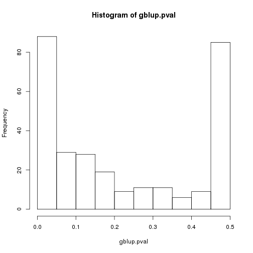

**Script:** `1_miRNA_gblup_gwas_Jun17.R`

**Directory of Code:**  `/mnt/research/pigeqtl/analyses/microRNA/2_mirna_characterization_expression/4_miRNA_gblup_eqtl_analysis/scripts/`

**Date:**  2/24/16 UPDATED 6/1/17

**Input File Directory:**  `/mnt/research/pigeqtl/analyses/microRNA/2_mirna_characterization_expression/3_build_dge_object_for_eqtl/`

**Input File(s):** 

1. `3_msuprp_mirna_gpdata_pheno_counts.Rdata`

2. `4_normalized_dge_object_and_voom_output.Rdata`

3. `5_Z_G_miRNA_gblup_gwas.Rdata`

**Output File Directory:** `/mnt/research/pigeqtl/analyses/microRNA/2_mirna_characterization_expression/4_miRNA_gblup_eqtl_analysis/`

**Output File(s):** 

1. `1_gblup_results_summary.Rdata`

2. `2_gwa_results_summary.Rdata`

**Table of contents:**

1. [Objectives](#objectives)
2. [Install libraries](#install-libraries)
3. [Load data](#load-data)
4. [Analysis](#analysis)
5. [Save data](#save-data)

## Objectives
The objective of this script is to conduct a gblup and gwa scan for the 295 MSUPRP F2 pig miRNA expression profiles.

This analysis will utilize the gwaR package developed by our lab group: <https://github.com/steibelj/gwaR>

## Install libraries


```r
rm(list=ls())
setwd("/mnt/research/pigeqtl/analyses/microRNA/2_mirna_characterization_expression/4_miRNA_gblup_eqtl_analysis/scripts/")

library(synbreed)
library(regress)
library(limma)
library(edgeR)
library(gwaR)
library(parallel)
library(qvalue)
library(plyr)
```

## Load data

The final miRNA gpdata object with the voom-adjusted counts as phenotype data:


```r
load("../../3_build_dge_object_for_eqtl/3_msuprp_mirna_gpdata_pheno_counts.Rdata")
```

The normalized dge object and voom centered precision weights:


```r
load("../../3_build_dge_object_for_eqtl/4_normalized_dge_object_and_voom_output.Rdata")
```

The standardized Z and G matrices:


```r
load("../../3_build_dge_object_for_eqtl/5_Z_G_miRNA_gblup_gwas.Rdata")
ls()
```

```
## [1] "dge"                  "G"                    "MSUPRP_miRNA"        
## [4] "summary_MSUPRP_miRNA" "v"                    "wtcen"               
## [7] "Z"
```

## Analysis

Create the design for the GBLUP model:


```r
design_1<-c(~sex + growth_group)
```

Create miRnames, the list of the miRNAs to be input into the gblup analysis:


```r
miRnames<-colnames(MSUPRP_miRNA$pheno)
length(miRnames)
```

```
## [1] 295
```

## Run gblup:


```r
system.time({
rst.gblup<-lapply(miRnames, function(x) gblup(rsp=x, data=MSUPRP_miRNA, design=design_1, G=G, vdata=NULL, wt=wtcen, pos=c(T,T)))

names(rst.gblup)<-miRnames
})
```

```
## Warning: solution lies close to zero for some positive variance components, their standard errors may not be valid
## Warning: solution lies close to zero for some positive variance components, their standard errors may not be valid
## Warning: solution lies close to zero for some positive variance components, their standard errors may not be valid
## Warning: solution lies close to zero for some positive variance components, their standard errors may not be valid
## Warning: solution lies close to zero for some positive variance components, their standard errors may not be valid
## Warning: solution lies close to zero for some positive variance components, their standard errors may not be valid
## Warning: solution lies close to zero for some positive variance components, their standard errors may not be valid
## Warning: solution lies close to zero for some positive variance components, their standard errors may not be valid
## Warning: solution lies close to zero for some positive variance components, their standard errors may not be valid
## Warning: solution lies close to zero for some positive variance components, their standard errors may not be valid
## Warning: solution lies close to zero for some positive variance components, their standard errors may not be valid
## Warning: solution lies close to zero for some positive variance components, their standard errors may not be valid
## Warning: solution lies close to zero for some positive variance components, their standard errors may not be valid
## Warning: solution lies close to zero for some positive variance components, their standard errors may not be valid
## Warning: solution lies close to zero for some positive variance components, their standard errors may not be valid
## Warning: solution lies close to zero for some positive variance components, their standard errors may not be valid
## Warning: solution lies close to zero for some positive variance components, their standard errors may not be valid
## Warning: solution lies close to zero for some positive variance components, their standard errors may not be valid
## Warning: solution lies close to zero for some positive variance components, their standard errors may not be valid
## Warning: solution lies close to zero for some positive variance components, their standard errors may not be valid
## Warning: solution lies close to zero for some positive variance components, their standard errors may not be valid
## Warning: solution lies close to zero for some positive variance components, their standard errors may not be valid
## Warning: solution lies close to zero for some positive variance components, their standard errors may not be valid
## Warning: solution lies close to zero for some positive variance components, their standard errors may not be valid
## Warning: solution lies close to zero for some positive variance components, their standard errors may not be valid
## Warning: solution lies close to zero for some positive variance components, their standard errors may not be valid
## Warning: solution lies close to zero for some positive variance components, their standard errors may not be valid
## Warning: solution lies close to zero for some positive variance components, their standard errors may not be valid
## Warning: solution lies close to zero for some positive variance components, their standard errors may not be valid
## Warning: solution lies close to zero for some positive variance components, their standard errors may not be valid
## Warning: solution lies close to zero for some positive variance components, their standard errors may not be valid
## Warning: solution lies close to zero for some positive variance components, their standard errors may not be valid
## Warning: solution lies close to zero for some positive variance components, their standard errors may not be valid
## Warning: solution lies close to zero for some positive variance components, their standard errors may not be valid
## Warning: solution lies close to zero for some positive variance components, their standard errors may not be valid
## Warning: solution lies close to zero for some positive variance components, their standard errors may not be valid
## Warning: solution lies close to zero for some positive variance components, their standard errors may not be valid
## Warning: solution lies close to zero for some positive variance components, their standard errors may not be valid
## Warning: solution lies close to zero for some positive variance components, their standard errors may not be valid
## Warning: solution lies close to zero for some positive variance components, their standard errors may not be valid
## Warning: solution lies close to zero for some positive variance components, their standard errors may not be valid
## Warning: solution lies close to zero for some positive variance components, their standard errors may not be valid
## Warning: solution lies close to zero for some positive variance components, their standard errors may not be valid
## Warning: solution lies close to zero for some positive variance components, their standard errors may not be valid
## Warning: solution lies close to zero for some positive variance components, their standard errors may not be valid
## Warning: solution lies close to zero for some positive variance components, their standard errors may not be valid
## Warning: solution lies close to zero for some positive variance components, their standard errors may not be valid
## Warning: solution lies close to zero for some positive variance components, their standard errors may not be valid
## Warning: solution lies close to zero for some positive variance components, their standard errors may not be valid
## Warning: solution lies close to zero for some positive variance components, their standard errors may not be valid
## Warning: solution lies close to zero for some positive variance components, their standard errors may not be valid
## Warning: solution lies close to zero for some positive variance components, their standard errors may not be valid
## Warning: solution lies close to zero for some positive variance components, their standard errors may not be valid
## Warning: solution lies close to zero for some positive variance components, their standard errors may not be valid
## Warning: solution lies close to zero for some positive variance components, their standard errors may not be valid
## Warning: solution lies close to zero for some positive variance components, their standard errors may not be valid
## Warning: solution lies close to zero for some positive variance components, their standard errors may not be valid
## Warning: solution lies close to zero for some positive variance components, their standard errors may not be valid
## Warning: solution lies close to zero for some positive variance components, their standard errors may not be valid
## Warning: solution lies close to zero for some positive variance components, their standard errors may not be valid
## Warning: solution lies close to zero for some positive variance components, their standard errors may not be valid
## Warning: solution lies close to zero for some positive variance components, their standard errors may not be valid
## Warning: solution lies close to zero for some positive variance components, their standard errors may not be valid
## Warning: solution lies close to zero for some positive variance components, their standard errors may not be valid
## Warning: solution lies close to zero for some positive variance components, their standard errors may not be valid
## Warning: solution lies close to zero for some positive variance components, their standard errors may not be valid
## Warning: solution lies close to zero for some positive variance components, their standard errors may not be valid
## Warning: solution lies close to zero for some positive variance components, their standard errors may not be valid
## Warning: solution lies close to zero for some positive variance components, their standard errors may not be valid
## Warning: solution lies close to zero for some positive variance components, their standard errors may not be valid
## Warning: solution lies close to zero for some positive variance components, their standard errors may not be valid
## Warning: solution lies close to zero for some positive variance components, their standard errors may not be valid
## Warning: solution lies close to zero for some positive variance components, their standard errors may not be valid
## Warning: solution lies close to zero for some positive variance components, their standard errors may not be valid
## Warning: solution lies close to zero for some positive variance components, their standard errors may not be valid
## Warning: solution lies close to zero for some positive variance components, their standard errors may not be valid
## Warning: solution lies close to zero for some positive variance components, their standard errors may not be valid
## Warning: solution lies close to zero for some positive variance components, their standard errors may not be valid
## Warning: solution lies close to zero for some positive variance components, their standard errors may not be valid
## Warning: solution lies close to zero for some positive variance components, their standard errors may not be valid
## Warning: solution lies close to zero for some positive variance components, their standard errors may not be valid
## Warning: solution lies close to zero for some positive variance components, their standard errors may not be valid
## Warning: solution lies close to zero for some positive variance components, their standard errors may not be valid
## Warning: solution lies close to zero for some positive variance components, their standard errors may not be valid
## Warning: solution lies close to zero for some positive variance components, their standard errors may not be valid
## Warning: solution lies close to zero for some positive variance components, their standard errors may not be valid
## Warning: solution lies close to zero for some positive variance components, their standard errors may not be valid
## Warning: solution lies close to zero for some positive variance components, their standard errors may not be valid
## Warning: solution lies close to zero for some positive variance components, their standard errors may not be valid
## Warning: solution lies close to zero for some positive variance components, their standard errors may not be valid
## Warning: solution lies close to zero for some positive variance components, their standard errors may not be valid
## Warning: solution lies close to zero for some positive variance components, their standard errors may not be valid
## Warning: solution lies close to zero for some positive variance components, their standard errors may not be valid
## Warning: solution lies close to zero for some positive variance components, their standard errors may not be valid
## Warning: solution lies close to zero for some positive variance components, their standard errors may not be valid
## Warning: solution lies close to zero for some positive variance components, their standard errors may not be valid
## Warning: solution lies close to zero for some positive variance components, their standard errors may not be valid
## Warning: solution lies close to zero for some positive variance components, their standard errors may not be valid
## Warning: solution lies close to zero for some positive variance components, their standard errors may not be valid
## Warning: solution lies close to zero for some positive variance components, their standard errors may not be valid
## Warning: solution lies close to zero for some positive variance components, their standard errors may not be valid
## Warning: solution lies close to zero for some positive variance components, their standard errors may not be valid
## Warning: solution lies close to zero for some positive variance components, their standard errors may not be valid
## Warning: solution lies close to zero for some positive variance components, their standard errors may not be valid
## Warning: solution lies close to zero for some positive variance components, their standard errors may not be valid
## Warning: solution lies close to zero for some positive variance components, their standard errors may not be valid
## Warning: solution lies close to zero for some positive variance components, their standard errors may not be valid
## Warning: solution lies close to zero for some positive variance components, their standard errors may not be valid
## Warning: solution lies close to zero for some positive variance components, their standard errors may not be valid
## Warning: solution lies close to zero for some positive variance components, their standard errors may not be valid
## Warning: solution lies close to zero for some positive variance components, their standard errors may not be valid
## Warning: solution lies close to zero for some positive variance components, their standard errors may not be valid
## Warning: solution lies close to zero for some positive variance components, their standard errors may not be valid
## Warning: solution lies close to zero for some positive variance components, their standard errors may not be valid
## Warning: solution lies close to zero for some positive variance components, their standard errors may not be valid
## Warning: solution lies close to zero for some positive variance components, their standard errors may not be valid
## Warning: solution lies close to zero for some positive variance components, their standard errors may not be valid
## Warning: solution lies close to zero for some positive variance components, their standard errors may not be valid
## Warning: solution lies close to zero for some positive variance components, their standard errors may not be valid
## Warning: solution lies close to zero for some positive variance components, their standard errors may not be valid
## Warning: solution lies close to zero for some positive variance components, their standard errors may not be valid
## Warning: solution lies close to zero for some positive variance components, their standard errors may not be valid
## Warning: solution lies close to zero for some positive variance components, their standard errors may not be valid
## Warning: solution lies close to zero for some positive variance components, their standard errors may not be valid
## Warning: solution lies close to zero for some positive variance components, their standard errors may not be valid
## Warning: solution lies close to zero for some positive variance components, their standard errors may not be valid
## Warning: solution lies close to zero for some positive variance components, their standard errors may not be valid
## Warning: solution lies close to zero for some positive variance components, their standard errors may not be valid
## Warning: solution lies close to zero for some positive variance components, their standard errors may not be valid
## Warning: solution lies close to zero for some positive variance components, their standard errors may not be valid
## Warning: solution lies close to zero for some positive variance components, their standard errors may not be valid
## Warning: solution lies close to zero for some positive variance components, their standard errors may not be valid
```

```
##    user  system elapsed 
## 175.544   0.663 176.561
```

Check standard error of G and wt, if NA eliminate from analysis:

First, what does this output look like:


```r
rst.gblup$`ssc-let-7a`
```

```
## gblup analysis of trait: ssc-let-7a 
## 
## fixed effects equation:
## y ~ sex + growth_group
## 
## random effects equation:
## ~G + wt
## 
## log-likelihood: 144.1148 converged in: 6 iterations 
## 
## estimated fixed effects:
##                      Estimate   StdError     test.st      p.value
## (Intercept)       15.01163816 0.04218607 355.8434732 0.000000e+00
## sexM              -0.01338500 0.03862006  -0.3465815 7.289057e-01
## growth_groupbf-H  -0.12322013 0.05614807  -2.1945569 2.819540e-02
## growth_groupbf-L  -0.22722112 0.05601727  -4.0562689 4.986284e-05
## growth_grouplma-H -0.01844231 0.05214164  -0.3536963 7.235665e-01
## 
## estimated variance components:
##       Estimate    StdError  prop.var
## G  0.006966786 0.008053149 0.1027959
## wt 0.060806226 0.009193032 0.8972041
```

coefm[6:7,2] is the standard errors of G and the wt


```r
rst.gblup$`ssc-let-7a`$coefm[6:7,2]
```

```
##           G          wt 
## 0.008053149 0.009193032
```

```r
std<-do.call(rbind, lapply(rst.gblup,function(x) x$coefm[6:7,2]))
```

Check how many NAs in standard error:


```r
sum(is.na(rowSums(std)))
```

```
## [1] 0
```

Retain only those miRNAs with a non-NA Standard Error


```r
miRnames<-miRnames[!is.na(rowSums(std))]
length(miRnames)
```

```
## [1] 295
```

Perform Likelihood Ratio Test on gblup results:


```r
system.time({
like<-lapply(rst.gblup, lrt)
names(like)<-miRnames
})
```

```
##    user  system elapsed 
##  17.332   0.050  17.371
```

See what these results look like:


```r
like$`ssc-let-7a`
```

```
## $pvalue
## [1] 0.07599838
## 
## $llik
##       full      red      dif
## 1 144.1148 143.0887 1.026048
## 
## $vars
##           full    reduced perc.full
## G  0.006966786         NA 0.1027959
## wt 0.060806226 0.06767333 0.8972041
```

Multiple test corrections: FDR:

Obtain p-values from LRT


```r
gblup.pval<-unlist(lapply(like, function(x) x$pvalue))
```

Create histogram of LRT p-values to see how much they deviate from expectation


```r
hist(gblup.pval)
```



Calculate q-values from LRT p-values:


```r
system.time({
	gblup.qval<-qvalue(gblup.pval,lambda=0)$qvalue
})
```

```
##    user  system elapsed 
##   0.010   0.000   0.755
```

Total number of miRNAs with significant h2 at FDR < 0.05


```r
sum(gblup.qval<0.05)
```

```
## [1] 50
```

Matrix of standard errors of GBLUP:


```r
std<-std[miRnames,]
colnames(std)<-paste("stdEr", colnames(std), sep="-")
head(std)
```

```
##                   stdEr-G    stdEr-wt
## ssc-let-7a    0.008053149 0.009193032
## ssc-let-7c    0.007711371 0.009792732
## ssc-let-7d-3p 0.026940871 0.037256404
## ssc-let-7d-5p 0.013057548 0.015020013
## ssc-let-7e    0.015905350 0.020714453
## ssc-let-7f    0.012136597 0.015892922
```

Matrix of gblup results:


```r
summary.rst.gblup<-do.call(rbind, 
	lapply(miRnames, function(x) cbind(t(like[[x]]$vars[1]),
	 h2=like[[x]]$vars[1,3],
		like[[x]]$llik,
	lrtpvalue=like[[x]]$pvalue)))

rownames(summary.rst.gblup)<-miRnames

head(summary.rst.gblup)
```

```
##                         G         wt         h2      full       red
## ssc-let-7a    0.006966786 0.06080623 0.10279587 144.11480 143.08875
## ssc-let-7c    0.005012218 0.06739930 0.06921852 138.02750 137.65134
## ssc-let-7d-3p 0.012089238 0.26532163 0.04357882  24.22640  24.09533
## ssc-let-7d-5p 0.012589640 0.09745468 0.11440517 103.36762 101.91083
## ssc-let-7e    0.011260377 0.14111366 0.07389958  75.25436  74.53212
## ssc-let-7f    0.007328763 0.11027187 0.06231908  96.96140  96.57675
##                     dif  lrtpvalue
## ssc-let-7a    1.0260483 0.07599838
## ssc-let-7c    0.3761533 0.19287346
## ssc-let-7d-3p 0.1310645 0.30433064
## ssc-let-7d-5p 1.4567926 0.04391821
## ssc-let-7e    0.7222374 0.11470830
## ssc-let-7f    0.3846493 0.19021707
```

Join it with the standard errors from the GBLUP:


```r
if(sum(rownames(summary.rst.gblup) != rownames(std)) != 0) stop ("SNP ids not in same order between gblup summary mx and std object")

summary.rst.gblup<-cbind(summary.rst.gblup[,1:3], std, summary.rst.gblup[,4:ncol(summary.rst.gblup)], qvalue=gblup.qval)
head(summary.rst.gblup)
```

```
##                         G         wt         h2     stdEr-G    stdEr-wt
## ssc-let-7a    0.006966786 0.06080623 0.10279587 0.008053149 0.009193032
## ssc-let-7c    0.005012218 0.06739930 0.06921852 0.007711371 0.009792732
## ssc-let-7d-3p 0.012089238 0.26532163 0.04357882 0.026940871 0.037256404
## ssc-let-7d-5p 0.012589640 0.09745468 0.11440517 0.013057548 0.015020013
## ssc-let-7e    0.011260377 0.14111366 0.07389958 0.015905350 0.020714453
## ssc-let-7f    0.007328763 0.11027187 0.06231908 0.012136597 0.015892922
##                    full       red       dif  lrtpvalue    qvalue
## ssc-let-7a    144.11480 143.08875 1.0260483 0.07599838 0.2095282
## ssc-let-7c    138.02750 137.65134 0.3761533 0.19287346 0.3512202
## ssc-let-7d-3p  24.22640  24.09533 0.1310645 0.30433064 0.4785329
## ssc-let-7d-5p 103.36762 101.91083 1.4567926 0.04391821 0.1537980
## ssc-let-7e     75.25436  74.53212 0.7222374 0.11470830 0.2602996
## ssc-let-7f     96.96140  96.57675 0.3846493 0.19021707 0.3507127
```

---

## Run GWA:

First, transpose standardized Z matrix:


```r
Zt<-t(Z)
dim(Zt)
```

```
## [1] 38166   174
```

The following function performs these functions:

1. Conducts the GWA analysis, using the results of the gblup:

2. Calculates z-scores and calculates p-values from ghat and var(ghat) (Gualdrón Duarte 2014):

3. Conducts Multiple Test Correction for the GWA via FDR:

4. Returns the sign of the SNP effect (+ or -)


```r
gwasum <- function(gbrst, ztp) {
	# Conduct GWA (returns vectors of ghat and var(ghat) for each miRNA):
	rst.gwa <- gwas(gbrst, x=ztp)
	# Calculate z-scores and get pvalues from ghat and var(ghat) (Gualdrón Duarte 2014):
	gwa.pval<- getpvalue(rst.gwa, log.p=F, is.z=F)
	# Multiple test correction for the GWA--FDR:
	gwa.qval<- qvalue(gwa.pval,lambda=0)
	# Determine if the SNP effect was + or -:
	sign<-ifelse(rst.gwa$ghat < 0, "-", "+") 

	return(data.frame(SNPid=rownames(rst.gwa), gwa.ghat=rst.gwa$ghat, gwa.pval, gwa.qval=gwa.qval$qvalues, SNP.sign=sign))

}
```

Apply the gwasum function to the list of gblup results, returning a data.frame by using ldply:


```r
system.time({
rst.gwa<- ldply(rst.gblup, gwasum, ztp=Zt)
})
```

```
##     user   system  elapsed 
## 1580.095   25.359 1605.595
```

```r
colnames(rst.gwa)[1] <- "miRNA"
```

How many rows should be in this data.frame?


```r
length(unique(rst.gwa$SNPid)) * length(unique(rst.gwa$miRNA))
```

```
## [1] 11258970
```

Check the dimensions of the data.frame and see results:


```r
dim(rst.gwa)
```

```
## [1] 11258970        6
```

```r
head(rst.gwa)
```

```
##        miRNA       SNPid      gwa.ghat  gwa.pval  gwa.qval SNP.sign
## 1 ssc-let-7a MARC0044150 -8.149089e-04 0.5496799 0.9987573        -
## 2 ssc-let-7a ASGA0000014  8.574597e-05 0.9574946 0.9987573        +
## 3 ssc-let-7a H3GA0000026  8.757523e-05 0.9483482 0.9987573        +
## 4 ssc-let-7a ASGA0000021  8.149089e-04 0.5496799 0.9987573        +
## 5 ssc-let-7a ALGA0000009  8.757523e-05 0.9483482 0.9987573        +
## 6 ssc-let-7a ALGA0000014  8.757523e-05 0.9483482 0.9987573        +
```

---
Check significance per gene at FDR < 0.05:


```r
threshold <- 0.05
sig5<-(rst.gwa$gwa.qval < threshold)
length(sig5[sig5!=0])
```

```
## [1] 338
```

```r
sum(sig5)
```

```
## [1] 338
```

The next step will be to further characterize the eQTL results.

## Save data


```r
save(summary.rst.gblup, file="../1_gblup_results_summary.Rdata")
save(rst.gwa, file="../2_gwa_results_summary.Rdata")
```

