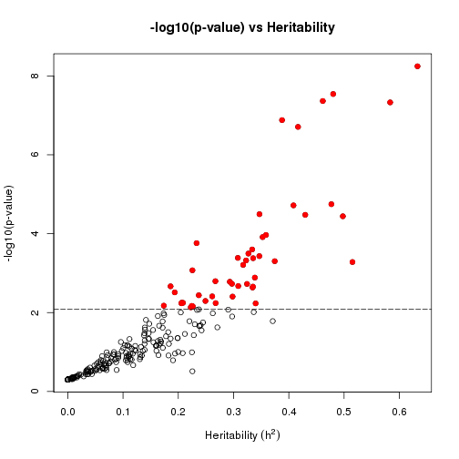
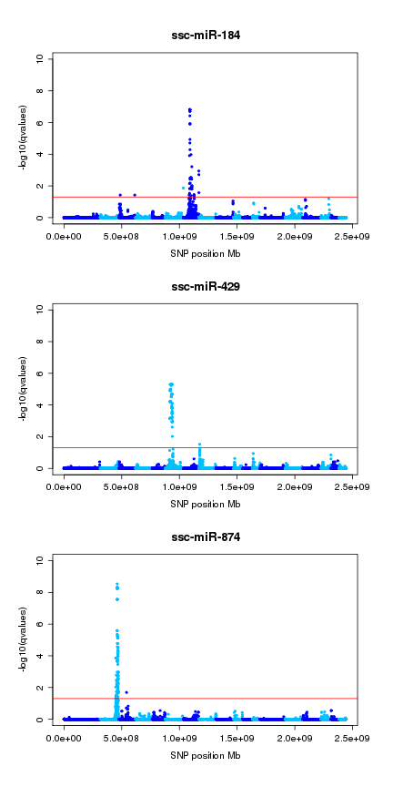
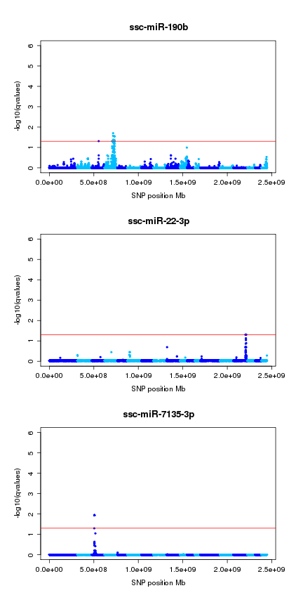

**Script:** `2_miRNA_eqtl_summary.R`

**Directory of Code:**  `/mnt/research/pigeqtl/analyses/microRNA/2_mirna_characterization_expression/4_miRNA_gblup_eqtl_analysis/scripts`

**Date:**  2/25/16 UPDATED 6/29/16

**Input File Directory:**  
1. `/mnt/research/pigeqtl/analyses/microRNA/2_mirna_characterization_expression/4_miRNA_gblup_eqtl_analysis/`

2. `/mnt/research/pigeqtl/analyses/microRNA/2_mirna_characterization_expression/3_build_dge_object_for_eqtl/`

**Input File(s):** 
 
1. `1_gblup_gwa_results_summary_full.Rdata`

2. `5_normalized_dge_object_and_voom_output.Rata`

3. `4_msuprp_mirna_gpdata_pheno_counts.Rdata`

**Output File Directory:** `/mnt/research/pigeqtl/analyses/microRNA/2_mirna_characterization_expression/4_miRNA_gblup_eqtl_analysis/`

**Output File(s):** `2_miRNA_eqtl_summary.Rdata`

**Table of contents:**

1. [Objectives](#objectives)
2. [Install libraries](#install-libraries)
3. [Load data](#load-data)
4. [Analysis](#analysis)
5. [Save data](#save-data)

## Objectives

The objective of this script is to summarize the number of eQTL peaks per miRNA output from the first eQTL analysis of the 174 F2 MSUPRP pig miRNA expression profiles.

## Install libraries


```r
rm(list=ls())
```

Load eqtl function Rdata containing stb function, which will summarize the eQTL results


```r
load("/mnt/research/pigeqtl/analyses/eQTL/paper/output/funct_eqtl.Rdata")

library(limma)
```

```
## Loading required package: methods
```

```r
library(edgeR)
library(gwaR)
library(plyr)

setwd("/mnt/research/pigeqtl/analyses/microRNA/2_mirna_characterization_expression/4_miRNA_gblup_eqtl_analysis/scripts")
```

## Load data

Load the eQTL output:


```r
load("../1_gblup_gwa_results_summary_full.Rdata")
```

Load the dge object to obtain the mature miRNA annotation:


```r
load("../../3_build_dge_object_for_eqtl/5_normalized_dge_object_and_voom_output.Rata")
```

Load the final_MSUPRP_mirna gpdata object for the mapping information:


```r
load("../../3_build_dge_object_for_eqtl/4_msuprp_mirna_gpdata_pheno_counts.Rdata")
ls()
```

```
##  [1] "absmap"                     "add_legend"                
##  [3] "AddPosGene"                 "dge"                       
##  [5] "distance"                   "eqtl"                      
##  [7] "final_MSUPRP_miRNA"         "inrange"                   
##  [9] "manhpt"                     "peakrng"                   
## [11] "plot.GMA"                   "sigpval"                   
## [13] "stb"                        "stb.nm"                    
## [15] "summary_final_MSUPRP_miRNA" "tbpos"                     
## [17] "v"                          "wtcen"                     
## [19] "zstandard"
```

## Analysis

### Summarize the heritability of the miRNAs, output from GBLUP:

The average heritability of all the miRNA expression profiles:


```r
mean(eqtl$gblup$h2)
```

```
## [1] 0.118076
```

```r
summary(eqtl$gblup$h2)
```

```
##      Min.   1st Qu.    Median      Mean   3rd Qu.      Max. 
## 0.0000000 0.0000722 0.0853400 0.1181000 0.1826000 0.6328000
```

The average heritability of the miRNAs found to be significantly heritable at FDR < 0.05:

How many significantly heritable miRNAs found at FDR < 0.05? (Should match from eQTL scan output md file)


```r
sum(eqtl$gblup$qvalue<0.05)
```

```
## [1] 47
```

```r
# #' View the gblup results ordered by p-value
# eqtl$gblup[order(eqtl$gblup$lrtpvalue),]
```

Extract the significantly heritable miRNAs from the eqtl$gblup dataset and calculate mean h2:


```r
sigh2<-eqtl$gblup[eqtl$gblup$qvalue<0.05,]
dim(sigh2)
```

```
## [1] 47 10
```

```r
mean(sigh2$h2)
```

```
## [1] 0.3291513
```

```r
summary(sigh2$h2)
```

```
##    Min. 1st Qu.  Median    Mean 3rd Qu.    Max. 
##  0.1738  0.2431  0.3243  0.3292  0.3666  0.6328
```

Define the minimum p-value that is not significant (based on q-value < 0.05) as the threshold for plotting significant points


```r
eqtl$gblup$lrtpvalue[eqtl$gblup$qvalue >= 0.05]
```

```
##   [1] 0.079575944 0.195011345 0.310281776 0.046973997 0.120285418
##   [6] 0.201656454 0.055674403 0.169433213 0.500000000 0.088420929
##  [11] 0.149130092 0.015383816 0.012246123 0.027119458 0.500000000
##  [16] 0.008456575 0.475318235 0.500000000 0.500000000 0.037644018
##  [21] 0.122447230 0.500000000 0.299732514 0.008577706 0.500000000
##  [26] 0.252678661 0.180576497 0.044426106 0.044426106 0.315074841
##  [31] 0.500000000 0.258413490 0.500000000 0.309096085 0.500000000
##  [36] 0.500000000 0.500000000 0.500000000 0.110497886 0.500000000
##  [41] 0.500000000 0.046936337 0.476882650 0.500000000 0.122873099
##  [46] 0.398074014 0.261931021 0.069983166 0.500000000 0.500000000
##  [51] 0.016712405 0.500000000 0.091301745 0.500000000 0.105236404
##  [56] 0.045718247 0.500000000 0.031378071 0.500000000 0.028271321
##  [61] 0.500000000 0.500000000 0.127075670 0.500000000 0.156203857
##  [66] 0.412744065 0.101667911 0.045809391 0.126511555 0.461005584
##  [71] 0.178623877 0.364914201 0.500000000 0.308416670 0.138962840
##  [76] 0.290021518 0.220794657 0.407326397 0.488503988 0.298939537
##  [81] 0.461324127 0.100284875 0.021855563 0.500000000 0.021848982
##  [86] 0.215661065 0.500000000 0.247934056 0.093766398 0.221005057
##  [91] 0.157158907 0.062233971 0.500000000 0.500000000 0.181401726
##  [96] 0.500000000 0.500000000 0.432077334 0.067327285 0.500000000
## [101] 0.500000000 0.500000000 0.250630088 0.060808424 0.500000000
## [106] 0.364972524 0.011528375 0.500000000 0.500000000 0.065949275
## [111] 0.297687016 0.115044593 0.099640112 0.487571110 0.017844553
## [116] 0.074127926 0.111343774 0.024206731 0.439872112 0.216616223
## [121] 0.500000000 0.258268013 0.159888646 0.500000000 0.500000000
## [126] 0.116063565 0.019818992 0.333979218 0.127001049 0.500000000
## [131] 0.174655111 0.072771864 0.062096073 0.114849628 0.068854681
## [136] 0.500000000 0.094386128 0.437144252 0.009932849 0.415300810
## [141] 0.500000000 0.500000000 0.143671764 0.266748804 0.012579365
## [146] 0.037425135 0.008298287 0.500000000 0.500000000 0.500000000
## [151] 0.132749552 0.152177876 0.023890114 0.081991121 0.460566023
## [156] 0.287309523 0.500000000 0.307732367 0.078328515 0.468320208
## [161] 0.500000000 0.442039228 0.500000000 0.152166394 0.067001585
## [166] 0.500000000 0.500000000 0.119870574 0.162083545 0.194976068
## [171] 0.319815123 0.204968728 0.500000000 0.021604807 0.009728878
## [176] 0.161688412 0.234114088 0.286519598 0.500000000 0.033300449
## [181] 0.016555926 0.010462351 0.019263196 0.366571948 0.034785176
## [186] 0.294986369 0.500000000 0.050945701 0.027668278 0.068210540
## [191] 0.068210540 0.500000000 0.106592680 0.272082062 0.023729719
## [196] 0.052657496 0.010417663 0.366382748 0.088872704 0.113470903
## [201] 0.361967938 0.016456726 0.056700530 0.500000000 0.500000000
## [206] 0.500000000 0.500000000 0.500000000 0.500000000 0.500000000
## [211] 0.500000000 0.500000000 0.101794128 0.500000000 0.039851391
## [216] 0.048825170 0.500000000 0.435301050 0.500000000 0.159818675
## [221] 0.500000000 0.500000000 0.033436160 0.492774268 0.053970022
## [226] 0.269511721 0.180698457 0.113597656 0.197929041 0.109404089
## [231] 0.376972391 0.500000000 0.284216808 0.500000000 0.500000000
## [236] 0.500000000 0.192353740 0.126590987 0.141352949 0.285456876
## [241] 0.020989186 0.420236053 0.093287663 0.500000000 0.500000000
## [246] 0.069949765 0.134913754 0.142756938
```

```r
summary(eqtl$gblup$lrtpvalue[eqtl$gblup$qvalue >= 0.05])
```

```
##     Min.  1st Qu.   Median     Mean  3rd Qu.     Max. 
## 0.008298 0.086810 0.251700 0.270100 0.500000 0.500000
```

```r
sigthresh<-min(eqtl$gblup$lrtpvalue[eqtl$gblup$qvalue >= 0.05])
sigthresh
```

```
## [1] 0.008298287
```

Plot h2 vs -log10(p-value) like before to determine trend in significance and h2:


```r
plot(eqtl$gblup$h2, -log10(eqtl$gblup$lrtpvalue),
	xlab = expression("Heritability"~(h^{2})),
    ylab = "-log10(p-value)",
    main = "-log10(p-value) vs Heritability")
points(eqtl$gblup$h2[-log10(eqtl$gblup$lrtpvalue)>(-log10(sigthresh))],
       -log10(eqtl$gblup$lrtpvalue)[-log10(eqtl$gblup$lrtpvalue)>(-log10(sigthresh))],
       pch=19,col="red")
abline(a = -log10(sigthresh), b = 0, lty = 5)
```

 

---

### The Summary Table of GWAS Results:


Assign the correct names to the different objects:


```r
map <- final_MSUPRP_miRNA$map
colnames(map)
```

```
## [1] "chr" "pos"
```

```r
annotation <- dge$genes
colnames(annotation)
```

```
## [1] "Name"       "chr0"       "start"      "end"        "width"     
## [6] "strand"     "type"       "Alias"      "Precursors"
```

Annotation must contain columns "chr", "start", "end", and "strand"


```r
colnames(annotation)<-c("Name","chr","start","end","width","strand","type","Alias","Precursors")
head(annotation)
```

```
##                        Name   chr     start       end width strand  type
## ssc-let-7a       ssc-let-7a  chr3  44864443  44864464    22      + miRNA
## ssc-let-7c       ssc-let-7c chr13 191559351 191559372    22      + miRNA
## ssc-let-7d-3p ssc-let-7d-3p  chr3  44867331  44867352    22      + miRNA
## ssc-let-7d-5p ssc-let-7d-5p  chr3  44867277  44867298    22      + miRNA
## ssc-let-7e       ssc-let-7e  chr6  51858385  51858406    22      + miRNA
## ssc-let-7f       ssc-let-7f  chr3  44864810  44864831    22      + miRNA
##                      Alias          Precursors
## ssc-let-7a    MIMAT0013865 MI0017984,MI0013085
## ssc-let-7c    MIMAT0002151           MI0002445
## ssc-let-7d-3p MIMAT0025357           MI0022120
## ssc-let-7d-5p MIMAT0025356           MI0022120
## ssc-let-7e    MIMAT0013866           MI0013086
## ssc-let-7f    MIMAT0002152 MI0022121,MI0002446
```

```r
# #' This function (stb) returns a summary table of the eQTL peaks per chromosome/per gene at FDR < 0.01:
# rsumtb1 <- stb(qval=eqtl$gwa.qval, map=map, annotation=annotation, Z=eqtl$gwa, threshold=0.01, gene.name="Precursors", pergene=T)
# dim(rsumtb1)

# #' miR-eQTL peaks at FDR<0.01:
# rsumtb1
```

This function (stb) returns a summary table of the eQTL peaks per chromosome/per gene at FDR < 0.05:


```r
rsumtb5 <- stb(qval=eqtl$gwa.qval, map=map, annotation=annotation, Z=eqtl$gwa, threshold=0.05, gene.name="Precursors", pergene=T)
dim(rsumtb5)
```

```
## [1] 26 11
```

miR-eQTL peaks at FDR<0.05:


```r
rsumtb5
```

```
##               Gene chr.gene start.gene   end.gene strand
## 1    ssc-let-7d-5p     chr3  44.867277  44.867298      +
## 2       ssc-let-7g    chr13  37.599007  37.599028      +
## 3      ssc-miR-128    chr13  22.859239  22.859259      +
## 4  ssc-miR-1306-3p    chr14  55.111005  55.111025      +
## 5   ssc-miR-140-5p     <NA>         NA         NA   <NA>
## 6   ssc-miR-140-5p     <NA>         NA         NA   <NA>
## 7     ssc-miR-1468     chrX  56.757096  56.757117      -
## 8      ssc-miR-184     chr7  53.883677  53.883698      +
## 9      ssc-miR-184     chr7  53.883677  53.883698      +
## 10     ssc-miR-184     chr7  53.883677  53.883698      +
## 11    ssc-miR-190b     chr4 104.457820 104.457841      +
## 12    ssc-miR-190b     chr4 104.457820 104.457841      +
## 13   ssc-miR-22-3p     <NA>         NA         NA   <NA>
## 14  ssc-miR-345-3p     chr7 128.658348 128.658368      +
## 15     ssc-miR-429     chr6  58.044184  58.044205      -
## 16     ssc-miR-429     chr6  58.044184  58.044205      -
## 17 ssc-miR-6782-3p     chr6   0.956806   0.956827      +
## 18 ssc-miR-7135-3p     chr3  29.052303  29.052324      +
## 19     ssc-miR-874     chr2 145.381108 145.381130      -
## 20     ssc-miR-874     chr2 145.381108 145.381130      -
## 21      ssc-miR-95     chr8   4.277286   4.277307      +
## 22 ssc-miR-9785-5p     chr3  22.233456  22.233479      -
## 23 ssc-miR-9785-5p     chr3  22.233456  22.233479      -
## 24 ssc-miR-9785-5p     chr3  22.233456  22.233479      -
## 25 ssc-miR-9810-3p     chr4  90.746075  90.746095      +
## 26 ssc-miR-9843-3p     chr8 122.371914 122.371935      -
##              gene.name         SNP chr.snp   pos.snp snp.effect
## 1            MI0022120 MARC0093624      15 135538479          -
## 2            MI0013087 MARC0093624      15 135538479          -
## 3  MI0013094,MI0002451 ALGA0023517       4  15959123          +
## 4            MI0013148 H3GA0034702      12  54736413          +
## 5                 <NA> ASGA0017748       4   7002305          -
## 6                 <NA> H3GA0055369       6  15626776          +
## 7            MI0022160 MARC0093624      15 135538479          -
## 8            MI0002421 DBWU0000430       3   9121844          -
## 9            MI0002421 M1GA0026172       6 157003423          +
## 10           MI0002421 ALGA0041952       7  55936003          +
## 11           MI0017988 ALGA0102568       3  76844137          +
## 12           MI0017988 ALGA0026452       4  94724175          -
## 13                <NA> MARC0009333      15 134397712          -
## 14           MI0013117 MARC0027291      15 135171935          +
## 15           MI0017991 ASGA0094554       6  41809035          -
## 16           MI0017991 ALGA0046283       8   6551222          +
## 17           MI0031620 ASGA0094215      10  29227834          +
## 18           MI0023568 MARC0056802       3  28401592          -
## 19           MI0022157 ALGA0016550       2 145462524          +
## 20           MI0022157 ALGA0122273       3  64022095          -
## 21           MI0002436 MARC0027291      15 135171935          -
## 22           MI0031545 ASGA0013843       3  21495074          +
## 23           MI0031545 MARC0081878      10    223442          -
## 24           MI0031545 ALGA0121561      17   3681417          +
## 25           MI0031577 MARC0021620       5  16689918          +
## 26           MI0031612 MARC0093624      15 135538479          +
##          qvalue
## 1  1.150336e-02
## 2  5.937313e-03
## 3  4.474533e-02
## 4  6.197482e-03
## 5  1.089555e-02
## 6  2.867644e-04
## 7  2.129363e-02
## 8  3.774307e-02
## 9  1.355902e-02
## 10 1.543732e-07
## 11 4.890582e-02
## 12 1.999064e-02
## 13 4.976423e-02
## 14 2.213197e-02
## 15 5.046088e-06
## 16 2.998539e-02
## 17 1.828363e-04
## 18 1.155505e-02
## 19 2.897624e-09
## 20 2.052799e-02
## 21 3.714473e-02
## 22 3.702342e-02
## 23 3.702342e-02
## 24 3.702342e-02
## 25 3.498560e-02
## 26 2.945101e-03
```

```r
# #' #### Summary of GWAS results at FDR < 0.01
# #' 
# #' Number of eQTL peaks per chromosome:
# table(rsumtb1$chr.snp)

# #' Names of associated miRNAs:
# table(rsumtb1$Gene)

# #' Names of associated markers:
# table(as.character(rsumtb1$SNP))
```

#### Summary of GWAS results at FDR < 0.05

Number of eQTL peaks per chromosome:


```r
table(rsumtb5$chr.snp)
```

```
## 
##  2  3  4  5  6  7  8 10 12 15 17 
##  1  5  3  1  3  1  1  2  1  7  1
```

Names of associated miRNAs:


```r
table(rsumtb5$Gene)
```

```
## 
##   ssc-let-7d-5p      ssc-let-7g     ssc-miR-128 ssc-miR-1306-3p 
##               1               1               1               1 
##  ssc-miR-140-5p    ssc-miR-1468     ssc-miR-184    ssc-miR-190b 
##               2               1               3               2 
##   ssc-miR-22-3p  ssc-miR-345-3p     ssc-miR-429 ssc-miR-6782-3p 
##               1               1               2               1 
## ssc-miR-7135-3p     ssc-miR-874      ssc-miR-95 ssc-miR-9785-5p 
##               1               2               1               3 
## ssc-miR-9810-3p ssc-miR-9843-3p 
##               1               1
```

Names of associated markers:


```r
table(as.character(rsumtb5$SNP))
```

```
## 
## ALGA0016550 ALGA0023517 ALGA0026452 ALGA0041952 ALGA0046283 ALGA0102568 
##           1           1           1           1           1           1 
## ALGA0121561 ALGA0122273 ASGA0013843 ASGA0017748 ASGA0094215 ASGA0094554 
##           1           1           1           1           1           1 
## DBWU0000430 H3GA0034702 H3GA0055369 M1GA0026172 MARC0009333 MARC0021620 
##           1           1           1           1           1           1 
## MARC0027291 MARC0056802 MARC0081878 MARC0093624 
##           2           1           1           4
```

### Determining the ranges of associated SNPs per eQTL peak on SSC15 (for ISAG abstract):

First, create the summary table at FDR 5% again, this time with pergene=F to identify all markers associated with each eQTL peak:


```r
fullrsumtb5 <- stb(qval=eqtl$gwa.qval, map=map, annotation=annotation, Z=eqtl$gwa, threshold=0.05, gene.name="Precursors", pergene=F)
dim(fullrsumtb5)
```

```
## [1] 367  11
```

```r
head(fullrsumtb5)
```

```
##            Gene chr.gene start.gene end.gene strand gene.name         SNP
## 1 ssc-let-7d-5p     chr3   44.86728 44.86730      + MI0022120 MARC0027291
## 2 ssc-let-7d-5p     chr3   44.86728 44.86730      + MI0022120 MARC0047188
## 3 ssc-let-7d-5p     chr3   44.86728 44.86730      + MI0022120 H3GA0052416
## 4 ssc-let-7d-5p     chr3   44.86728 44.86730      + MI0022120 MARC0093624
## 5    ssc-let-7g    chr13   37.59901 37.59903      + MI0013087 MARC0027291
## 6    ssc-let-7g    chr13   37.59901 37.59903      + MI0013087 MARC0093624
##   chr.snp   pos.snp snp.effect      qvalue
## 1      15 135171935          - 0.021319327
## 2      15 135199210          + 0.045298499
## 3      15 135234539          + 0.045298499
## 4      15 135538479          - 0.011503362
## 5      15 135171935          - 0.048491811
## 6      15 135538479          - 0.005937313
```

Summarize the number of SNPs associated with each miRNA eQTL (some have multiple peaks)


```r
numsnps<-by(fullrsumtb5, as.character(fullrsumtb5$Gene), nrow)
numsnps<-ldply(numsnps, fun=NULL, id=names(numsnps))
colnames(numsnps) <- c("miRNA", "numsnps")
numsnps
```

```
##              miRNA numsnps
## 1    ssc-let-7d-5p       4
## 2       ssc-let-7g       2
## 3      ssc-miR-128       1
## 4  ssc-miR-1306-3p       1
## 5   ssc-miR-140-5p       4
## 6     ssc-miR-1468       1
## 7      ssc-miR-184      54
## 8     ssc-miR-190b      24
## 9    ssc-miR-22-3p      13
## 10  ssc-miR-345-3p       4
## 11     ssc-miR-429      94
## 12 ssc-miR-6782-3p       4
## 13 ssc-miR-7135-3p      15
## 14     ssc-miR-874     118
## 15      ssc-miR-95       4
## 16 ssc-miR-9785-5p      18
## 17 ssc-miR-9810-3p       2
## 18 ssc-miR-9843-3p       4
```

Extract from the summary table the markers associated with SSC15


```r
ssc15fullrsumtb5<-fullrsumtb5[fullrsumtb5$chr.snp == "15",]
dim(ssc15fullrsumtb5)
```

```
## [1] 32 11
```

```r
ssc15fullrsumtb5
```

```
##                Gene chr.gene start.gene   end.gene strand gene.name
## 1     ssc-let-7d-5p     chr3  44.867277  44.867298      + MI0022120
## 2     ssc-let-7d-5p     chr3  44.867277  44.867298      + MI0022120
## 3     ssc-let-7d-5p     chr3  44.867277  44.867298      + MI0022120
## 4     ssc-let-7d-5p     chr3  44.867277  44.867298      + MI0022120
## 5        ssc-let-7g    chr13  37.599007  37.599028      + MI0013087
## 6        ssc-let-7g    chr13  37.599007  37.599028      + MI0013087
## 13     ssc-miR-1468     chrX  56.757096  56.757117      - MI0022160
## 92    ssc-miR-22-3p     <NA>         NA         NA   <NA>      <NA>
## 93    ssc-miR-22-3p     <NA>         NA         NA   <NA>      <NA>
## 94    ssc-miR-22-3p     <NA>         NA         NA   <NA>      <NA>
## 95    ssc-miR-22-3p     <NA>         NA         NA   <NA>      <NA>
## 96    ssc-miR-22-3p     <NA>         NA         NA   <NA>      <NA>
## 97    ssc-miR-22-3p     <NA>         NA         NA   <NA>      <NA>
## 98    ssc-miR-22-3p     <NA>         NA         NA   <NA>      <NA>
## 99    ssc-miR-22-3p     <NA>         NA         NA   <NA>      <NA>
## 100   ssc-miR-22-3p     <NA>         NA         NA   <NA>      <NA>
## 101   ssc-miR-22-3p     <NA>         NA         NA   <NA>      <NA>
## 102   ssc-miR-22-3p     <NA>         NA         NA   <NA>      <NA>
## 103   ssc-miR-22-3p     <NA>         NA         NA   <NA>      <NA>
## 104   ssc-miR-22-3p     <NA>         NA         NA   <NA>      <NA>
## 105  ssc-miR-345-3p     chr7 128.658348 128.658368      + MI0013117
## 106  ssc-miR-345-3p     chr7 128.658348 128.658368      + MI0013117
## 107  ssc-miR-345-3p     chr7 128.658348 128.658368      + MI0013117
## 108  ssc-miR-345-3p     chr7 128.658348 128.658368      + MI0013117
## 340      ssc-miR-95     chr8   4.277286   4.277307      + MI0002436
## 341      ssc-miR-95     chr8   4.277286   4.277307      + MI0002436
## 342      ssc-miR-95     chr8   4.277286   4.277307      + MI0002436
## 343      ssc-miR-95     chr8   4.277286   4.277307      + MI0002436
## 364 ssc-miR-9843-3p     chr8 122.371914 122.371935      - MI0031612
## 365 ssc-miR-9843-3p     chr8 122.371914 122.371935      - MI0031612
## 366 ssc-miR-9843-3p     chr8 122.371914 122.371935      - MI0031612
## 367 ssc-miR-9843-3p     chr8 122.371914 122.371935      - MI0031612
##             SNP chr.snp   pos.snp snp.effect      qvalue
## 1   MARC0027291      15 135171935          - 0.021319327
## 2   MARC0047188      15 135199210          + 0.045298499
## 3   H3GA0052416      15 135234539          + 0.045298499
## 4   MARC0093624      15 135538479          - 0.011503362
## 5   MARC0027291      15 135171935          - 0.048491811
## 6   MARC0093624      15 135538479          - 0.005937313
## 13  MARC0093624      15 135538479          - 0.021293627
## 92  MARC0009333      15 134397712          - 0.049764228
## 93  MARC0013934      15 134822402          + 0.049764228
## 94  ASGA0070696      15 134984250          + 0.049764228
## 95  MARC0027291      15 135171935          + 0.049764228
## 96  MARC0047188      15 135199210          - 0.049764228
## 97  H3GA0052416      15 135234539          - 0.049764228
## 98  MARC0093624      15 135538479          + 0.049764228
## 99  ALGA0087194      15 138730529          + 0.049764228
## 100 ASGA0070951      15 139101307          - 0.049764228
## 101 ALGA0087527      15 139144003          - 0.049764228
## 102 ASGA0090643      15 139153506          - 0.049764228
## 103 MARC0003947      15 139163810          - 0.049764228
## 104 ALGA0087594      15 140059667          + 0.049764228
## 105 ALGA0087141      15 133948641          - 0.040233775
## 106 MARC0027291      15 135171935          + 0.022131967
## 107 MARC0047188      15 135199210          - 0.022131967
## 108 H3GA0052416      15 135234539          - 0.022131967
## 340 MARC0027291      15 135171935          - 0.037144727
## 341 MARC0047188      15 135199210          + 0.037144727
## 342 H3GA0052416      15 135234539          + 0.037144727
## 343 MARC0093624      15 135538479          - 0.037144727
## 364 MARC0027291      15 135171935          + 0.005542259
## 365 MARC0047188      15 135199210          - 0.015356316
## 366 H3GA0052416      15 135234539          - 0.015356316
## 367 MARC0093624      15 135538479          + 0.002945101
```

Then, extract the min and max of each miRNA's associated SNPs to determine the range of the eQTL peaks, and check for overlap


```r
ssc15min<-by(ssc15fullrsumtb5$pos.snp, as.character(ssc15fullrsumtb5$Gene), min)
ssc15max<-by(ssc15fullrsumtb5$pos.snp, as.character(ssc15fullrsumtb5$Gene), max)

sum(names(ssc15min) != unique(ssc15fullrsumtb5$Gene))
```

```
## [1] 0
```

```r
sum(names(ssc15max) != unique(ssc15fullrsumtb5$Gene))
```

```
## [1] 0
```

Extract the minimum and maximum SNP positions from the summary table, then merge the two together:


```r
ssc15min<-ldply(ssc15min, fun=NULL, id=names(ssc15min))
colnames(ssc15min) <- c("miRNA", "minpos")
ssc15min
```

```
##             miRNA    minpos
## 1   ssc-let-7d-5p 135171935
## 2      ssc-let-7g 135171935
## 3    ssc-miR-1468 135538479
## 4   ssc-miR-22-3p 134397712
## 5  ssc-miR-345-3p 133948641
## 6      ssc-miR-95 135171935
## 7 ssc-miR-9843-3p 135171935
```

```r
ssc15max<-ldply(ssc15max, fun=NULL, id=names(ssc15max))
colnames(ssc15max) <- c("miRNA", "maxpos")
ssc15max
```

```
##             miRNA    maxpos
## 1   ssc-let-7d-5p 135538479
## 2      ssc-let-7g 135538479
## 3    ssc-miR-1468 135538479
## 4   ssc-miR-22-3p 140059667
## 5  ssc-miR-345-3p 135234539
## 6      ssc-miR-95 135538479
## 7 ssc-miR-9843-3p 135538479
```

```r
ssc15summary<-merge(ssc15min, ssc15max, by="miRNA")
ssc15summary
```

```
##             miRNA    minpos    maxpos
## 1   ssc-let-7d-5p 135171935 135538479
## 2      ssc-let-7g 135171935 135538479
## 3    ssc-miR-1468 135538479 135538479
## 4   ssc-miR-22-3p 134397712 140059667
## 5  ssc-miR-345-3p 133948641 135234539
## 6      ssc-miR-95 135171935 135538479
## 7 ssc-miR-9843-3p 135171935 135538479
```

Extract the associated number of SNPs per miRNA for SSC15 and add that to the data.frame as well:


```r
ssc15snps<-by(ssc15fullrsumtb5, as.character(ssc15fullrsumtb5$Gene), nrow)
ssc15snps<-ldply(ssc15snps, fun=NULL, id=names(ssc15snps))
colnames(ssc15snps) <- c("miRNA", "numsnps")
ssc15snps
```

```
##             miRNA numsnps
## 1   ssc-let-7d-5p       4
## 2      ssc-let-7g       2
## 3    ssc-miR-1468       1
## 4   ssc-miR-22-3p      13
## 5  ssc-miR-345-3p       4
## 6      ssc-miR-95       4
## 7 ssc-miR-9843-3p       4
```

```r
ssc15summary<-merge(ssc15snps, ssc15summary, by = "miRNA")

ssc15summary$range<-ssc15summary$maxpos - ssc15summary$minpos
ssc15summary
```

```
##             miRNA numsnps    minpos    maxpos   range
## 1   ssc-let-7d-5p       4 135171935 135538479  366544
## 2      ssc-let-7g       2 135171935 135538479  366544
## 3    ssc-miR-1468       1 135538479 135538479       0
## 4   ssc-miR-22-3p      13 134397712 140059667 5661955
## 5  ssc-miR-345-3p       4 133948641 135234539 1285898
## 6      ssc-miR-95       4 135171935 135538479  366544
## 7 ssc-miR-9843-3p       4 135171935 135538479  366544
```

### Extract peak range data from all miRNA eQTL peaks

Using Deborah's function "peakrng", I can obtain the same information on the range of each peak based on miRNA:


```r
peakrng
```

```
## function(nmt, sumtb) {
## 
## # Positions of Snps in eQTL peak 
##     nmt <- nmt
##     map.CI <- sumtb[sumtb$Gene == nmt,c("SNP","chr.snp","pos.snp","qvalue")]
## 
## # Number of associated markers by chromosome
##     chr <- table(map.CI$chr.snp)
##     cat("Number of markers per chromosomal peak for",nmt,":")
##     print(chr)
##     idx <- as.numeric(names(chr))
## 
##     min.pos <- unlist(lapply(idx, function(x) min(map.CI[map.CI$chr.snp == x,"pos.snp"])))
##     max.pos <- unlist(lapply(idx, function(x) max(map.CI[map.CI$chr.snp == x,"pos.snp"])))
## 
##     start.gene <- rep(sumtb[sumtb$Gene == nmt,"start.gene"][1], length(idx))
##     end.gene <- rep(sumtb[sumtb$Gene == nmt,"end.gene"][1], length(idx))
## 
##     x <- start.gene >= min.pos & end.gene <= max.pos
##     y <-   
## 
## # Identify the position of marker extreams for each peak 
##     peaks <- data.frame(gene=rep(nmt,length(idx)), 
##                 chr.gene=rep(sumtb[sumtb$Gene == nmt,"chr.gene"][1], length(idx)),
##                 start.gene=start.gene, end.gene=end.gene, range.gene=end.gene-start.gene,
##                 gene.name=rep(sumtb[sumtb$Gene == nmt,"gene.name"][1], length(idx)), 
##                 chr.snp=idx, range.peak=max.pos-min.pos,
##                 min.pos=min.pos, max.pos=max.pos, numb.snp=as.vector(chr))
## 
##     return(peaks)
## }
```

nmt = name transcript (in this case, miRNA); so, make a list of the miRNAs and loop through to get the peak range information for each miRNA with significant eQTL peaks
sumtb = output from the summary table function, with pergene = FALSE


```r
sigmirnames <- unique(as.character(fullrsumtb5$Gene))
sigmirnames
```

```
##  [1] "ssc-let-7d-5p"   "ssc-let-7g"      "ssc-miR-128"    
##  [4] "ssc-miR-1306-3p" "ssc-miR-140-5p"  "ssc-miR-1468"   
##  [7] "ssc-miR-184"     "ssc-miR-190b"    "ssc-miR-22-3p"  
## [10] "ssc-miR-345-3p"  "ssc-miR-429"     "ssc-miR-6782-3p"
## [13] "ssc-miR-7135-3p" "ssc-miR-874"     "ssc-miR-95"     
## [16] "ssc-miR-9785-5p" "ssc-miR-9810-3p" "ssc-miR-9843-3p"
```

```r
mirpeakranges<-lapply(sigmirnames, function(x) peakrng(nmt=x, fullrsumtb5))
```

```
## Number of markers per chromosomal peak for ssc-let-7d-5p :
## 15 
##  4 
## Number of markers per chromosomal peak for ssc-let-7g :
## 15 
##  2 
## Number of markers per chromosomal peak for ssc-miR-128 :
## 4 
## 1 
## Number of markers per chromosomal peak for ssc-miR-1306-3p :
## 12 
##  1 
## Number of markers per chromosomal peak for ssc-miR-140-5p :
## 4 6 
## 1 3 
## Number of markers per chromosomal peak for ssc-miR-1468 :
## 15 
##  1 
## Number of markers per chromosomal peak for ssc-miR-184 :
##  3  6  7 
##  2  1 51 
## Number of markers per chromosomal peak for ssc-miR-190b :
##  3  4 
##  1 23 
## Number of markers per chromosomal peak for ssc-miR-22-3p :
## 15 
## 13 
## Number of markers per chromosomal peak for ssc-miR-345-3p :
## 15 
##  4 
## Number of markers per chromosomal peak for ssc-miR-429 :
##  6  8 
## 93  1 
## Number of markers per chromosomal peak for ssc-miR-6782-3p :
## 10 
##  4 
## Number of markers per chromosomal peak for ssc-miR-7135-3p :
##  3 
## 15 
## Number of markers per chromosomal peak for ssc-miR-874 :
##   2   3 
## 117   1 
## Number of markers per chromosomal peak for ssc-miR-95 :
## 15 
##  4 
## Number of markers per chromosomal peak for ssc-miR-9785-5p :
##  3 10 17 
## 16  1  1 
## Number of markers per chromosomal peak for ssc-miR-9810-3p :
## 5 
## 2 
## Number of markers per chromosomal peak for ssc-miR-9843-3p :
## 15 
##  4
```

```r
mirpeakranges
```

```
## [[1]]
##            gene chr.gene start.gene end.gene range.gene gene.name chr.snp
## 1 ssc-let-7d-5p     chr3   44.86728  44.8673    2.1e-05 MI0022120      15
##   range.peak   min.pos   max.pos numb.snp
## 1     366544 135171935 135538479        4
## 
## [[2]]
##         gene chr.gene start.gene end.gene range.gene gene.name chr.snp
## 1 ssc-let-7g    chr13   37.59901 37.59903    2.1e-05 MI0013087      15
##   range.peak   min.pos   max.pos numb.snp
## 1     366544 135171935 135538479        2
## 
## [[3]]
##          gene chr.gene start.gene end.gene range.gene           gene.name
## 1 ssc-miR-128    chr13   22.85924 22.85926      2e-05 MI0013094,MI0002451
##   chr.snp range.peak  min.pos  max.pos numb.snp
## 1       4          0 15959123 15959123        1
## 
## [[4]]
##              gene chr.gene start.gene end.gene range.gene gene.name
## 1 ssc-miR-1306-3p    chr14     55.111 55.11102      2e-05 MI0013148
##   chr.snp range.peak  min.pos  max.pos numb.snp
## 1      12          0 54736413 54736413        1
## 
## [[5]]
##             gene chr.gene start.gene end.gene range.gene gene.name chr.snp
## 1 ssc-miR-140-5p     <NA>         NA       NA         NA      <NA>       4
## 2 ssc-miR-140-5p     <NA>         NA       NA         NA      <NA>       6
##   range.peak  min.pos  max.pos numb.snp
## 1          0  7002305  7002305        1
## 2     386244 15626776 16013020        3
## 
## [[6]]
##           gene chr.gene start.gene end.gene range.gene gene.name chr.snp
## 1 ssc-miR-1468     chrX    56.7571 56.75712    2.1e-05 MI0022160      15
##   range.peak   min.pos   max.pos numb.snp
## 1          0 135538479 135538479        1
## 
## [[7]]
##          gene chr.gene start.gene end.gene range.gene gene.name chr.snp
## 1 ssc-miR-184     chr7   53.88368  53.8837    2.1e-05 MI0002421       3
## 2 ssc-miR-184     chr7   53.88368  53.8837    2.1e-05 MI0002421       6
## 3 ssc-miR-184     chr7   53.88368  53.8837    2.1e-05 MI0002421       7
##   range.peak   min.pos   max.pos numb.snp
## 1  125903917   9121844 135025761        2
## 2          0 157003423 157003423        1
## 3   84868032  49815607 134683639       51
## 
## [[8]]
##           gene chr.gene start.gene end.gene range.gene gene.name chr.snp
## 1 ssc-miR-190b     chr4   104.4578 104.4578    2.1e-05 MI0017988       3
## 2 ssc-miR-190b     chr4   104.4578 104.4578    2.1e-05 MI0017988       4
##   range.peak  min.pos   max.pos numb.snp
## 1          0 76844137  76844137        1
## 2   29364042 83247658 112611700       23
## 
## [[9]]
##            gene chr.gene start.gene end.gene range.gene gene.name chr.snp
## 1 ssc-miR-22-3p     <NA>         NA       NA         NA      <NA>      15
##   range.peak   min.pos   max.pos numb.snp
## 1    5661955 134397712 140059667       13
## 
## [[10]]
##             gene chr.gene start.gene end.gene range.gene gene.name chr.snp
## 1 ssc-miR-345-3p     chr7   128.6583 128.6584      2e-05 MI0013117      15
##   range.peak   min.pos   max.pos numb.snp
## 1    1285898 133948641 135234539        4
## 
## [[11]]
##          gene chr.gene start.gene end.gene range.gene gene.name chr.snp
## 1 ssc-miR-429     chr6   58.04418  58.0442    2.1e-05 MI0017991       6
## 2 ssc-miR-429     chr6   58.04418  58.0442    2.1e-05 MI0017991       8
##   range.peak  min.pos  max.pos numb.snp
## 1   22928010 38548262 61476272       93
## 2          0  6551222  6551222        1
## 
## [[12]]
##              gene chr.gene start.gene end.gene range.gene gene.name
## 1 ssc-miR-6782-3p     chr6   0.956806 0.956827    2.1e-05 MI0031620
##   chr.snp range.peak  min.pos  max.pos numb.snp
## 1      10   11498076 20485599 31983675        4
## 
## [[13]]
##              gene chr.gene start.gene end.gene range.gene gene.name
## 1 ssc-miR-7135-3p     chr3    29.0523 29.05232    2.1e-05 MI0023568
##   chr.snp range.peak  min.pos  max.pos numb.snp
## 1       3     723613 28401592 29125205       15
## 
## [[14]]
##          gene chr.gene start.gene end.gene range.gene gene.name chr.snp
## 1 ssc-miR-874     chr2   145.3811 145.3811    2.2e-05 MI0022157       2
## 2 ssc-miR-874     chr2   145.3811 145.3811    2.2e-05 MI0022157       3
##   range.peak   min.pos   max.pos numb.snp
## 1   23140264 132997331 156137595      117
## 2          0  64022095  64022095        1
## 
## [[15]]
##         gene chr.gene start.gene end.gene range.gene gene.name chr.snp
## 1 ssc-miR-95     chr8   4.277286 4.277307    2.1e-05 MI0002436      15
##   range.peak   min.pos   max.pos numb.snp
## 1     366544 135171935 135538479        4
## 
## [[16]]
##              gene chr.gene start.gene end.gene range.gene gene.name
## 1 ssc-miR-9785-5p     chr3   22.23346 22.23348    2.3e-05 MI0031545
## 2 ssc-miR-9785-5p     chr3   22.23346 22.23348    2.3e-05 MI0031545
## 3 ssc-miR-9785-5p     chr3   22.23346 22.23348    2.3e-05 MI0031545
##   chr.snp range.peak  min.pos  max.pos numb.snp
## 1       3   14394187 20983778 35377965       16
## 2      10          0   223442   223442        1
## 3      17          0  3681417  3681417        1
## 
## [[17]]
##              gene chr.gene start.gene end.gene range.gene gene.name
## 1 ssc-miR-9810-3p     chr4   90.74608 90.74609      2e-05 MI0031577
##   chr.snp range.peak  min.pos  max.pos numb.snp
## 1       5      86125 16689918 16776043        2
## 
## [[18]]
##              gene chr.gene start.gene end.gene range.gene gene.name
## 1 ssc-miR-9843-3p     chr8   122.3719 122.3719    2.1e-05 MI0031612
##   chr.snp range.peak   min.pos   max.pos numb.snp
## 1      15     366544 135171935 135538479        4
```

---

### Creating Manhattan plots of the six miRNA with the highest numbers of associated SNP markers (for ISAG poster)

First, convert the map positions to absolute map positions using Deborah's function "absmap"


```r
absmap
```

```
## function(map){
##     dims<-dim(map)[2]
##     if (dims!=2){
##         stop ("Dimensions incorrect, map should have only 2 columns")
##     }
## 
##     if(!is.numeric(map[,2])){
##         stop ("Positions must be numeric")
##     }
## 
##     autosomal<-!is.na(as.numeric(as.character(map$chr)))
##     # Warning message:
##     # NAs introduced by coercion
##     chr<-as.numeric(as.character(map$chr[autosomal]))
##     pos<-map$pos[autosomal]
##     nms<-rownames(map)[autosomal]
##     map<-data.frame(chr,pos)
##     rownames(map)<-nms
##     ordermap<-map[order(map[,"chr"],map[,"pos"]),]
##     chrom<-names(table(map$chr))
##     last_pos<-0
##     absolute_map<-rep(0,nrow(map))
##     names(absolute_map)<-rownames(ordermap)
##     
##     for (j in chrom){                         # j comes from 1 to # total of chromosome
##         idx<-ordermap$chr==j                         # index for id column chromosome
##         absolute_map[idx]<-ordermap[idx,2]+last_pos
##         last_pos<-absolute_map[idx][sum(idx)]
##     }
##     return(absolute_map)
## }
```

Notice how the map object's positions are relative to chromosome:


```r
head(map)
```

```
##             chr    pos
## MARC0044150   1 286933
## ASGA0000014   1 342481
## H3GA0000026   1 389876
## ASGA0000021   1 489855
## ALGA0000009   1 538161
## ALGA0000014   1 565627
```

Use the absmap function to convert the chromosomal map positions to absolute map positions:


```r
absposmap<-absmap(map)
head(absposmap)
```

```
## MARC0044150 ASGA0000014 H3GA0000026 ASGA0000021 ALGA0000009 ALGA0000014 
##      286933      342481      389876      489855      538161      565627
```

manhpt function from Deborah Velez:


```r
manhpt
```

```
## function(nm, abspos, rst, map, fdr=0.01, annotation=NULL, pvalues=FALSE, cutoff, pQTL=FALSE, arrow=TRUE, pos=NULL, ...){
##   ifelse(is.vector(rst), x<--log10(rst), x<--log10(rst[,nm]))
##   ifelse(is.vector(rst), snp<-abspos[names(rst)],snp<-abspos[rownames(rst)])
##   tl<-nm
##   cut<-ifelse(pvalues == TRUE, -log10(cutoff), -log10(fdr))
##   mps<-as.numeric(as.factor(map$chr))
## 
##   if(pQTL == FALSE){
##     tran<-abspos[nm]
##     post<-max(x)*1.20-max(x)
##   if(!is.null(annotation)){
##     gene<-as.character(annotation[nm,"genes"])
##     tl<-ifelse(is.na(gene), "Novel", gene)
##     }
##   }
##   plot(snp,x,ylab=ifelse(pvalues==TRUE, "-log10(pvalues)", "-log10(qvalues)"), xlab="SNP position Mb",
##                     pch=20, col=c("deepskyblue","blue")[(mps%%2)+1], main=tl,
##                     cex.main=1.7, cex.lab=1.3, cex.axis=1.3,...)
##   abline(h=cut,col="red")
## 
##   if(pQTL == FALSE){
##     if(arrow == TRUE){
##       arrows(tran, post, tran-(post*0.95), post-(post*0.95), col="red",lwd=3, cex=0.5)
##       return(list(transcript=tl, max=round(max(x),digits=4), num.snp=sum(!x == cut & x > cut)))
## 
##   } else {
##     abline(v=tran, col="red", lty=3, lwd=1.5)
##     abline(v=abspos[pos[1]], col="blue", lty=3, lwd=1.5)
##     abline(v=abspos[pos[2]], col="blue", lty=3, lwd=1.5)
##   }
##   }
## }
```

Create a vector of the names of the six miRNAs with the highest number of associated SNPs for the ISAG poster:


```r
mannmsig10<-sigmirnames[c(7,11,14)]
mannmsig6<-sigmirnames[c(8,9,13)]
```

Then, provide the absposmap object to the manhpt function (also from Deborah's func_eqtl.Rdata) and loop through the vector of miRNA names to create the Manhattan plots:

Manhattan Plots with y-axis 0 - 10:


```r
par(oma=c(2,2,2,2),mfrow=c(3,1))
for (i in 1:length(mannmsig10)){
	manhpt(nm=mannmsig10[[i]], abspos=absposmap, rst=eqtl$gwa.qval[,mannmsig10[[i]]], map=map, fdr=0.05, annotation=NULL, pvalues=FALSE, arrow=TRUE, pQTL=FALSE, ylim=c(0,10))
}
```

 

Manhattan Plots with y-axis 0 - 6


```r
par(oma=c(2,2,2,2),mfrow=c(3,1))
for (i in 1:length(mannmsig6)){
	manhpt(nm=mannmsig6[[i]], abspos=absposmap, rst=eqtl$gwa.qval[,mannmsig6[[i]]], map=map, fdr=0.05, annotation=NULL, pvalues=FALSE, arrow=TRUE, pQTL=FALSE, ylim=c(0,6))
}
```

 

## Save data


```r
# save(rsumtb1, file = "../2_eqtl_summary_table_fdr1.Rdata")
save(rsumtb5, file = "../3_eqtl_summary_table_fdr5.Rdata")
save(fullrsumtb5, file = "../4_eqtl_summary_pergeneF_fdr5.Rdata")
```

