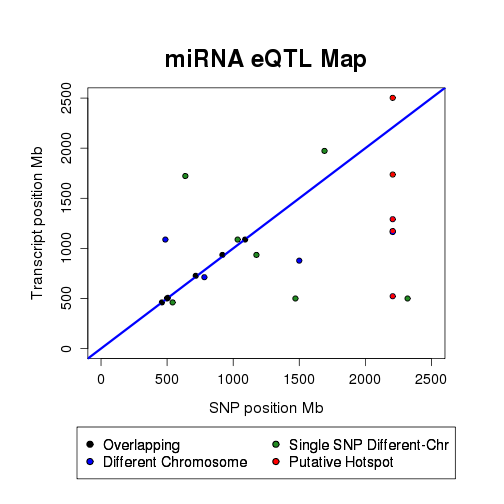
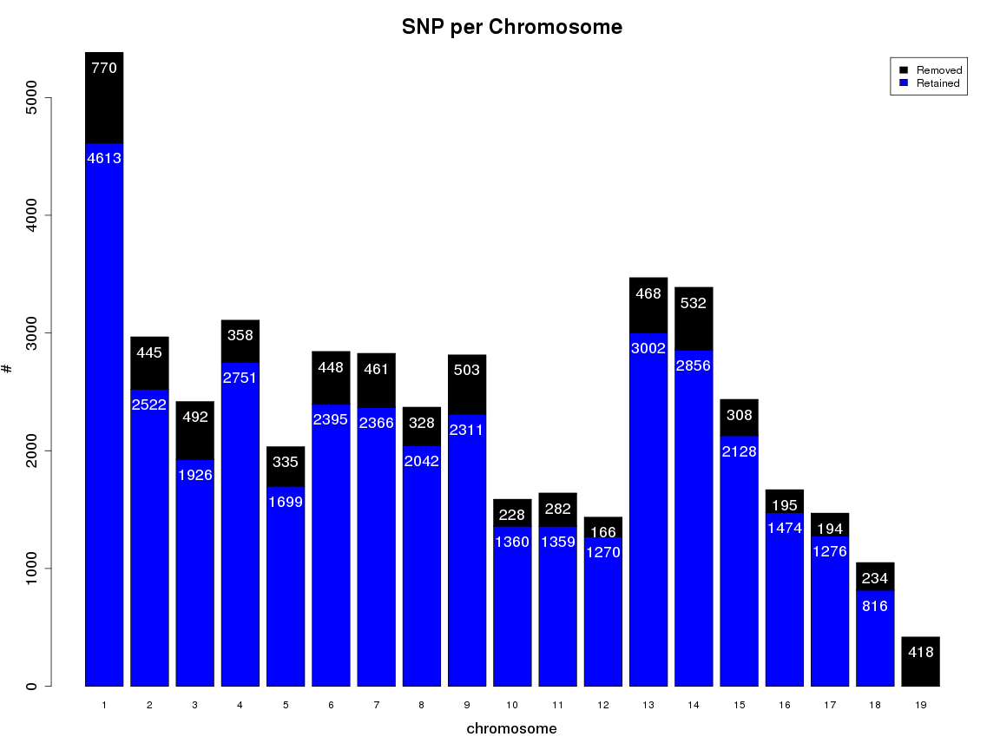

**Script: ** `3_miRNA_eQTL_characterization.R`

**Directory of Code:**  `/mnt/research/pigeqtl/analyses/microRNA/2_mirna_characterization_expression/4_miRNA_gblup_eqtl_analysis/scripts`

**Date:**  `06/14/17`

**Input File Directory:**  

1. `/mnt/research/pigeqtl/analyses/microRNA/2_mirna_characterization_expression/4_miRNA_gblup_eqtl_analysis`

2. `/mnt/research/pigeqtl/analyses/eQTL/paper/output/`

**Input File(s):** 

1. `3_eqtl_summary_tables.Rdata`

2. `MSUPRP_miRNA.Rdata`

3. `funct_eqtl.Rdata`

4. ``

**Output File Directory:** `/mnt/research/pigeqtl/analyses/microRNA/2_mirna_characterization_expression/4_miRNA_gblup_eqtl_analysis`

**Output File(s):** 

1. `4_miReQTL_local-distant-regulators.Rdata`

2. `5_miReQTL_peaks-equal-chr.Rdata`

**Table of contents:**

1. [Objectives](#objectives)
2. [Install libraries](#install-libraries)
3. [Load data](#load-data)
4. [Analysis](#analysis)
5. [Visualize](#visualize)
6. [Save data](#save-data)

## Objectives

The objective of this script is to characterize the miRNA eQTL results. This includes:

Using the summary file from the miRNA eQTL analysis determine the number of miRNA eQTL peaks
that have local regulation and distant regulation.

Looking only at the eQTL peaks on the same chromosome or overlapping with the mapped gene position check how many markers are before and after the gene position.

Create a data frame containing the results of the eQTL scan along with a column
specifying the eQTL regulator type, local (cis), distant (tran)

This analysis will be completed using functions created by DV in directory /mnt/research/pigeqtl/analyses/eQTL/paper/code/corrected-Z`

## Install libraries


```r
library(synbreed)
library(regress)
library(limma)
library(edgeR)
library(gwaR)
library(parallel)
library(qvalue)
```

## Load data


```r
rm(list=ls())
setwd("/mnt/research/pigeqtl/analyses/microRNA/2_mirna_characterization_expression/4_miRNA_gblup_eqtl_analysis/scripts")
```

Load DV's functions:


```r
load("/mnt/research/pigeqtl/analyses/eQTL/paper/output/funct_eqtl.Rdata")
```

Load the gwa results:


```r
load("../2_gwa_results_summary.Rdata")
```

Load the miRNA eQTLsummary tables:


```r
load("../3_eqtl_summary_tables_maps.Rdata")
```

Load the dge object to obtain the mature miRNA annotation:


```r
load("../../3_build_dge_object_for_eqtl/4_normalized_dge_object_and_voom_output.Rdata")
```

Load the MSUPRP_miRNA gpdata object for the mapping information:


```r
load("../../3_build_dge_object_for_eqtl/3_msuprp_mirna_gpdata_pheno_counts.Rdata")
```

Load the miRNA annotation files to obtain info for miRNA eQTL with multiple precursors:


```r
load("../../3_build_dge_object_for_eqtl/1_precursor_mirna_annotation.Rdata")
load("../../3_build_dge_object_for_eqtl/2_mature_mirna_annotation.Rdata")
```

Load the MSUPRP_meat gpdata object:


```r
load("/mnt/research/pigeqtl/analyses/eQTL/paper/code/corrected-Z/PRKAG3_eQTL/gpData_PRKAG3.Rdata")
rm(PRKAG3)
ls()
```

```
##  [1] "absmap"               "absposmap"            "add_legend"          
##  [4] "AddPosGene"           "dge"                  "distance"            
##  [7] "fullsum.eqtl"         "inrange"              "manhpt"              
## [10] "map.full"             "mirpeaks"             "MSUPRP_meat"         
## [13] "MSUPRP_miRNA"         "peakrng"              "plot.GMA"            
## [16] "precursor.mirannot"   "rst.gwa"              "sigpval"             
## [19] "stb"                  "stb.nm"               "sum.eqtl"            
## [22] "summary_MSUPRP_miRNA" "tbpos"                "total.mature.annot2" 
## [25] "v"                    "wtcen"                "zstandard"
```

## Analysis
eQTL peaks


```r
head(sum.eqtl)
```

```
##             miRNA chr.miR start.miR  end.miR  mid.miR strand   miRBase.ID
## 1   ssc-let-7d-5p       3  44867277 44867298 44867288      + MIMAT0025356
## 2      ssc-let-7g      13  37599007 37599028 37599018      + MIMAT0013867
## 3     ssc-miR-128      13  22859239 22859259 22859249      + MIMAT0002157
## 4 ssc-miR-1306-3p      14  55111005 55111025 55111015      + MIMAT0013938
## 5  ssc-miR-140-5p      NA        NA       NA      NaN   <NA>         <NA>
## 6  ssc-miR-140-5p      NA        NA       NA      NaN   <NA>         <NA>
##            precursors         SNP chr.snp   pos.snp snp.sign       qvalue
## 1           MI0022120 MARC0093624      15 135538479        - 0.0117673699
## 2           MI0013087 MARC0093624      15 135538479        - 0.0117673699
## 3 MI0013094,MI0002451 ALGA0023517       4  15959123        + 0.0455542195
## 4           MI0013148 H3GA0034702      12  54736413        + 0.0065172015
## 5                <NA> ASGA0017748       4   7002305        - 0.0109425100
## 6                <NA> H3GA0055369       6  15626776        + 0.0003022932
```

```r
str(sum.eqtl)
```

```
## 'data.frame':	24 obs. of  13 variables:
##  $ miRNA     : Factor w/ 17 levels "ssc-let-7d-5p",..: 1 2 3 4 5 5 6 7 7 7 ...
##  $ chr.miR   : num  3 13 13 14 NA NA 19 7 7 7 ...
##  $ start.miR : int  44867277 37599007 22859239 55111005 NA NA 56757096 53883677 53883677 53883677 ...
##  $ end.miR   : int  44867298 37599028 22859259 55111025 NA NA 56757117 53883698 53883698 53883698 ...
##  $ mid.miR   : num  44867288 37599018 22859249 55111015 NaN ...
##  $ strand    : Factor w/ 3 levels "+","-","*": 1 1 1 1 NA NA 2 1 1 1 ...
##  $ miRBase.ID: Factor w/ 691 levels "MI0002410","MI0002411",..: 554 397 366 455 NA NA 579 340 340 340 ...
##  $ precursors: Factor w/ 16 levels "MI0002421","MI0002436",..: 9 3 4 6 NA NA 11 1 1 1 ...
##  $ SNP       : Factor w/ 38166 levels "ALGA0000009",..: 37142 37142 2437 27839 14369 29280 37142 22700 31625 4341 ...
##  $ chr.snp   : num  15 15 4 12 4 6 15 3 6 7 ...
##  $ pos.snp   : num  1.36e+08 1.36e+08 1.60e+07 5.47e+07 7.00e+06 ...
##  $ snp.sign  : Factor w/ 2 levels "-","+": 1 1 2 2 1 2 1 1 2 2 ...
##  $ qvalue    : num  0.01177 0.01177 0.04555 0.00652 0.01094 ...
```

---

Separate the first column for use in the Target Prediction analysis, substituting the "ssc" for "hsa":


```r
hsamir<-data.frame(V1=unique(gsub("ssc-", "", sum.eqtl$miRNA)))
hsamir
```

```
##             V1
## 1    let-7d-5p
## 2       let-7g
## 3      miR-128
## 4  miR-1306-3p
## 5   miR-140-5p
## 6     miR-1468
## 7      miR-184
## 8     miR-190b
## 9   miR-345-3p
## 10     miR-429
## 11 miR-6782-3p
## 12 miR-7135-3p
## 13     miR-874
## 14      miR-95
## 15 miR-9785-5p
## 16 miR-9810-3p
## 17 miR-9843-3p
```

Save that table for use in target prediction analysis:


```r
write.table(hsamir, file="../../6_miRNA_eQT_target_prediction/1_mirna_names.txt", quote=FALSE, sep="\t", row.names=FALSE, col.names=FALSE)
```

---

eQTL peaks with unknown position


```r
as.character(sum.eqtl$miRNA[is.na(sum.eqtl$chr.miR)])
```

```
## [1] "ssc-miR-140-5p" "ssc-miR-140-5p"
```

Hotspots


```r
tail(sort(table(as.character(fullsum.eqtl$SNP))))
```

```
## 
## MARC0114345 WUR10000071 H3GA0052416 MARC0027291 MARC0047188 MARC0093624 
##           1           1           4           4           4           5
```

```r
mk <- table(as.character(fullsum.eqtl$SNP))

table(mk)
```

```
## mk
##   1   4   5 
## 321   3   1
```

Names of hotspot SNP (SNP associated with at least 4 miRNAs)


```r
nm <- names(mk[mk >= 4])
nm
```

```
## [1] "H3GA0052416" "MARC0027291" "MARC0047188" "MARC0093624"
```

Check map positions of hotspot SNP:


```r
MSUPRP_miRNA$map[nm,]
```

```
##             chr       pos
## H3GA0052416  15 135234539
## MARC0027291  15 135171935
## MARC0047188  15 135199210
## MARC0093624  15 135538479
```

All my hotspot SNP are on chromosome 15; LD?


```r
abspos<-absposmap
abspos[nm]
```

```
## H3GA0052416 MARC0027291 MARC0047188 MARC0093624 
##  2206612781  2206550177  2206577452  2206916721
```

Want to extract the miRNA information for each potential hotspot SNP


```r
htsp.mir<-list()
for(i in nm){
htsp.mir[[i]]<-fullsum.eqtl[grep(i, as.character(fullsum.eqtl$SNP)), c("miRNA", "chr.miR", "precursors")]
}

htsp.mir
```

```
## $H3GA0052416
##               miRNA chr.miR precursors
## 3     ssc-let-7d-5p       3  MI0022120
## 80   ssc-miR-345-3p       7  MI0013117
## 313      ssc-miR-95       8  MI0002436
## 337 ssc-miR-9843-3p       8  MI0031612
## 
## $MARC0027291
##               miRNA chr.miR precursors
## 1     ssc-let-7d-5p       3  MI0022120
## 78   ssc-miR-345-3p       7  MI0013117
## 311      ssc-miR-95       8  MI0002436
## 335 ssc-miR-9843-3p       8  MI0031612
## 
## $MARC0047188
##               miRNA chr.miR precursors
## 2     ssc-let-7d-5p       3  MI0022120
## 79   ssc-miR-345-3p       7  MI0013117
## 312      ssc-miR-95       8  MI0002436
## 336 ssc-miR-9843-3p       8  MI0031612
## 
## $MARC0093624
##               miRNA chr.miR precursors
## 4     ssc-let-7d-5p       3  MI0022120
## 5        ssc-let-7g      13  MI0013087
## 12     ssc-miR-1468      19  MI0022160
## 314      ssc-miR-95       8  MI0002436
## 338 ssc-miR-9843-3p       8  MI0031612
```

Build a matrix of qvalues for all the miRNAs.

This will be used in plotting the eQTL map and determining local vs distal-acting miRNA eQTL


```r
sigmirqval<-do.call(cbind, lapply(unique(as.character(sum.eqtl$miRNA)), function(x) rst.gwa[rst.gwa$miRNA==x, "gwa.qval"]))

colnames(sigmirqval)<-unique(as.character(sum.eqtl$miRNA))
rownames(sigmirqval)<-rownames(MSUPRP_miRNA$map)
dim(sigmirqval)
```

```
## [1] 38166    17
```

```r
head(sigmirqval)
```

```
##             ssc-let-7d-5p ssc-let-7g ssc-miR-128 ssc-miR-1306-3p
## MARC0044150     0.9990272  0.9985332   0.9863106       0.9907282
## ASGA0000014     0.9990272  0.9985332   0.9970173       0.9730241
## H3GA0000026     0.9990272  0.9985332   0.9970173       0.9907282
## ASGA0000021     0.9990272  0.9985332   0.9863106       0.9907282
## ALGA0000009     0.9990272  0.9985332   0.9970173       0.9907282
## ALGA0000014     0.9990272  0.9985332   0.9970173       0.9907282
##             ssc-miR-140-5p ssc-miR-1468 ssc-miR-184 ssc-miR-190b
## MARC0044150      0.9852940    0.9992883   0.9976836    0.9889404
## ASGA0000014      0.9958952    0.9988702   0.9976836    0.9889404
## H3GA0000026      0.9852940    0.9988702   0.9976836    0.9889404
## ASGA0000021      0.9852940    0.9992883   0.9976836    0.9889404
## ALGA0000009      0.9852940    0.9988702   0.9976836    0.9889404
## ALGA0000014      0.9852940    0.9988702   0.9976836    0.9889404
##             ssc-miR-345-3p ssc-miR-429 ssc-miR-6782-3p ssc-miR-7135-3p
## MARC0044150      0.9734981   0.9996721       0.9969353       0.9993543
## ASGA0000014      0.9981852   0.9996721       0.9973742       0.9993543
## H3GA0000026      0.9981852   0.9996918       0.9969353       0.9993543
## ASGA0000021      0.9734981   0.9996721       0.9969353       0.9993543
## ALGA0000009      0.9981852   0.9996918       0.9969353       0.9993543
## ALGA0000014      0.9981852   0.9996918       0.9969353       0.9993543
##             ssc-miR-874 ssc-miR-95 ssc-miR-9785-5p ssc-miR-9810-3p
## MARC0044150    0.999096  0.9980389       0.9997416       0.9951646
## ASGA0000014    0.999096  0.9980389       0.9997416       0.9359541
## H3GA0000026    0.999096  0.9980389       0.9997416       0.9941925
## ASGA0000021    0.999096  0.9980389       0.9997416       0.9951646
## ALGA0000009    0.999096  0.9980389       0.9997416       0.9941925
## ALGA0000014    0.999096  0.9980389       0.9997416       0.9941925
##             ssc-miR-9843-3p
## MARC0044150       0.9475677
## ASGA0000014       0.9939193
## H3GA0000026       0.9939193
## ASGA0000021       0.9475677
## ALGA0000009       0.9939193
## ALGA0000014       0.9939193
```

```r
str(sigmirqval)
```

```
##  num [1:38166, 1:17] 0.999 0.999 0.999 0.999 0.999 ...
##  - attr(*, "dimnames")=List of 2
##   ..$ : chr [1:38166] "MARC0044150" "ASGA0000014" "H3GA0000026" "ASGA0000021" ...
##   ..$ : chr [1:17] "ssc-let-7d-5p" "ssc-let-7g" "ssc-miR-128" "ssc-miR-1306-3p" ...
```

Check for correctness in building this matrix:


```r
names(rst.gwa)
```

```
## [1] "miRNA"    "SNPid"    "gwa.ghat" "gwa.pval" "gwa.qval" "SNP.sign"
```

```r
head(rst.gwa)
```

```
##        miRNA       SNPid      gwa.ghat  gwa.pval  gwa.qval SNP.sign
## 1 ssc-let-7a MARC0044150 -8.149089e-04 0.5496799 0.9987573        -
## 2 ssc-let-7a ASGA0000014  8.574597e-05 0.9574946 0.9987573        +
## 3 ssc-let-7a H3GA0000026  8.757523e-05 0.9483482 0.9987573        +
## 4 ssc-let-7a ASGA0000021  8.149089e-04 0.5496799 0.9987573        +
## 5 ssc-let-7a ALGA0000009  8.757523e-05 0.9483482 0.9987573        +
## 6 ssc-let-7a ALGA0000014  8.757523e-05 0.9483482 0.9987573        +
```

Rownames didn't change between datasets:


```r
if (sum(unique(rst.gwa$SNPid)!=rownames(sigmirqval)) !=0) stop("Rownames changed between datasets")
```

Print the sum of the q-values not equal between the gwa results and the subset matrix:


```r
for (i in colnames(sigmirqval)){
	print(sum(rst.gwa[rst.gwa$miRNA==i,"gwa.qval"] != sigmirqval[,i]))
}
```

```
## [1] 0
## [1] 0
## [1] 0
## [1] 0
## [1] 0
## [1] 0
## [1] 0
## [1] 0
## [1] 0
## [1] 0
## [1] 0
## [1] 0
## [1] 0
## [1] 0
## [1] 0
## [1] 0
## [1] 0
```

Looks good.
Extract the q-values for 17 significant miRNA associations with hotspot SNPs:


```r
htsp.qv <- sigmirqval[nm,]
dim(htsp.qv)
```

```
## [1]  4 17
```

```r
head(htsp.qv)
```

```
##             ssc-let-7d-5p  ssc-let-7g ssc-miR-128 ssc-miR-1306-3p
## H3GA0052416    0.04651464 0.072403363   0.9720462       0.9925551
## MARC0027291    0.02188055 0.051286955   0.9720462       0.9932516
## MARC0047188    0.04651464 0.072403363   0.9720462       0.9925551
## MARC0093624    0.01176737 0.006308766   0.9720462       0.9793748
##             ssc-miR-140-5p ssc-miR-1468 ssc-miR-184 ssc-miR-190b
## H3GA0052416      0.9885746    0.2989705   0.9976836    0.9889404
## MARC0027291      0.9917828    0.1329772   0.9976836    0.9889404
## MARC0047188      0.9885746    0.2989705   0.9976836    0.9889404
## MARC0093624      0.9852940    0.0214697   0.9976836    0.9889404
##             ssc-miR-345-3p ssc-miR-429 ssc-miR-6782-3p ssc-miR-7135-3p
## H3GA0052416     0.02499527   0.9996721       0.9969353       0.9993543
## MARC0027291     0.02499527   0.9996721       0.9969353       0.9993543
## MARC0047188     0.02499527   0.9996721       0.9969353       0.9993543
## MARC0093624     0.06596918   0.9996721       0.8842544       0.9993543
##             ssc-miR-874 ssc-miR-95 ssc-miR-9785-5p ssc-miR-9810-3p
## H3GA0052416    0.999096 0.03853057       0.9997416       0.9941925
## MARC0027291    0.999096 0.03853057       0.9997416       0.9941925
## MARC0047188    0.999096 0.03853057       0.9997416       0.9941925
## MARC0093624    0.999096 0.03853057       0.9997416       0.9941925
##             ssc-miR-9843-3p
## H3GA0052416     0.016862685
## MARC0027291     0.006071584
## MARC0047188     0.016862685
## MARC0093624     0.003271169
```

---

Table of positions for significant miRNA-marker associations within a hotspot using gene-wise FDR

tbpos = table of positions; takes the qvalues and absolute positions of hotspot SNPs & miRNAs (htsp.qv), 
and puts them into a table for use in the eQTL map function later on.


```r
threshold <- 0.05
```

ttp.htsp = table to plot. hotspot


```r
ttp.htsp <- tbpos(qval=htsp.qv, abspos=abspos, threshold=threshold)
dim(ttp.htsp)
```

```
## [1] 17  6
```

```r
ttp.htsp
```

```
##               Gene         SNP    pos.snp   pos.gene       diff
## 1    ssc-let-7d-5p H3GA0052416 2206612781  522379874 1684232907
## 2    ssc-let-7d-5p MARC0027291 2206550177  522379874 1684170303
## 3    ssc-let-7d-5p MARC0047188 2206577452  522379874 1684197578
## 4    ssc-let-7d-5p MARC0093624 2206916721  522379874 1684536847
## 5       ssc-let-7g MARC0093624 2206916721 1736979229  469937492
## 6     ssc-miR-1468 MARC0093624 2206916721 2502317684  295400963
## 7   ssc-miR-345-3p H3GA0052416 2206612781 1162892125 1043720656
## 8   ssc-miR-345-3p MARC0027291 2206550177 1162892125 1043658052
## 9   ssc-miR-345-3p MARC0047188 2206577452 1162892125 1043685327
## 10      ssc-miR-95 H3GA0052416 2206612781 1173194702 1033418079
## 11      ssc-miR-95 MARC0027291 2206550177 1173194702 1033355475
## 12      ssc-miR-95 MARC0047188 2206577452 1173194702 1033382750
## 13      ssc-miR-95 MARC0093624 2206916721 1173194702 1033722019
## 14 ssc-miR-9843-3p H3GA0052416 2206612781 1291289330  915323451
## 15 ssc-miR-9843-3p MARC0027291 2206550177 1291289330  915260847
## 16 ssc-miR-9843-3p MARC0047188 2206577452 1291289330  915288122
## 17 ssc-miR-9843-3p MARC0093624 2206916721 1291289330  915627391
##         qvalue
## 1  0.046514639
## 2  0.021880550
## 3  0.046514639
## 4  0.011767370
## 5  0.006308766
## 6  0.021469698
## 7  0.024995268
## 8  0.024995268
## 9  0.024995268
## 10 0.038530566
## 11 0.038530566
## 12 0.038530566
## 13 0.038530566
## 14 0.016862685
## 15 0.006071584
## 16 0.016862685
## 17 0.003271169
```

Table of positions for all gene-marker associations and for significant eQTL SNPs

Notice, it removed the miRNA that doesn't have assembly information, miR-140-5p.

It can't add it to the eQTL map if it doesn't have mapping information. 


```r
ttp.all <- tbpos(qval=sigmirqval, abspos=abspos, threshold=threshold)
dim(ttp.all)
```

```
## [1] 334   6
```

```r
head(ttp.all)
```

```
##            Gene         SNP    pos.snp   pos.gene       diff      qvalue
## 1 ssc-let-7d-5p MARC0027291 2206550177  522379874 1684170303 0.021880550
## 2 ssc-let-7d-5p MARC0047188 2206577452  522379874 1684197578 0.046514639
## 3 ssc-let-7d-5p H3GA0052416 2206612781  522379874 1684232907 0.046514639
## 4 ssc-let-7d-5p MARC0093624 2206916721  522379874 1684536847 0.011767370
## 5    ssc-let-7g MARC0093624 2206916721 1736979229  469937492 0.006308766
## 6   ssc-miR-128 ALGA0023517  637636934 1722239460 1084602526 0.045554220
```

Also lose 4 SNPs, which are the ones significantly associated to miR-140-5p only:


```r
table(sigmirqval[,"ssc-miR-140-5p"]<threshold)
```

```
## 
## FALSE  TRUE 
## 38162     4
```

```r
names(which(sigmirqval[,"ssc-miR-140-5p"]<threshold))
```

```
## [1] "ASGA0017748" "H3GA0055369" "ASGA0104343" "ALGA0117081"
```

```r
table(ttp.all$SNP %in% names(which(sigmirqval[,"ssc-miR-140-5p"]<threshold)))
```

```
## 
## FALSE 
##   334
```

Build a data.frame of the miRNA eQTL peak positions and their lengths


```r
ttp.peaks <- data.frame(miRNA=sum.eqtl[,"miRNA"], SNP=sum.eqtl[,"SNP"],
	pos.snp=abspos[as.character(sum.eqtl$SNP)],
	pos.miR=abspos[as.character(sum.eqtl$miRNA)],
	diff=abs(abspos[as.character(sum.eqtl$miRNA)] - abspos[as.character(sum.eqtl$SNP)]),
	qvalue=sum.eqtl[,"qvalue"])
head(ttp.peaks)
```

```
##             miRNA         SNP    pos.snp    pos.miR       diff
## 1   ssc-let-7d-5p MARC0093624 2206916721  522379874 1684536847
## 2      ssc-let-7g MARC0093624 2206916721 1736979229  469937492
## 3     ssc-miR-128 ALGA0023517  637636934 1722239460 1084602526
## 4 ssc-miR-1306-3p H3GA0034702 1690616799 1972702496  282085697
## 5  ssc-miR-140-5p ASGA0017748  628680116         NA         NA
## 6  ssc-miR-140-5p H3GA0055369  892126204         NA         NA
##         qvalue
## 1 0.0117673699
## 2 0.0117673699
## 3 0.0455542195
## 4 0.0065172015
## 5 0.0109425100
## 6 0.0003022932
```

Local eQTL (na.omit to remove the miRNA with no assembly data)


```r
local <- na.omit(mirpeaks[mirpeaks$chr.miR == mirpeaks$chr.snp,])
dim(local)
```

```
## [1]  6 13
```

```r
local
```

```
##              miRNA chr.miR start.miR   end.miR range.miR   miRBase.ID
## 10     ssc-miR-184       7  53883677  53883698        21 MIMAT0002127
## 11    ssc-miR-190b       4 104457820 104457841        21 MIMAT0020588
## 13     ssc-miR-429       6  58044184  58044205        21 MIMAT0020591
## 16 ssc-miR-7135-3p       3  29052303  29052324        21 MIMAT0028146
## 17     ssc-miR-874       2 145381108 145381130        22 MIMAT0025384
## 20 ssc-miR-9785-5p       3  22233456  22233479        23 MIMAT0037002
##    chr.snp range.peak   min.pos   max.pos num.snp         SNP   pos.snp
## 10       7   84868032  49815607 134683639      50 ALGA0041952  55936003
## 11       4   16724835  94724175 111449010      11 ALGA0026452  94724175
## 13       6   22928010  38548262  61476272      93 ASGA0094554  41809035
## 16       3     723613  28401592  29125205      15 MARC0056802  28401592
## 17       2   23140264 132997331 156137595     116 ALGA0016550 145462524
## 20       3   14394187  20983778  35377965      16 DRGA0003812  21432908
```

Distant eQTL (na.omit to remove the miRNA with no assembly data)


```r
distant <- na.omit(mirpeaks[mirpeaks$chr.miR != mirpeaks$chr.snp,])
dim(distant)
```

```
## [1] 16 13
```

```r
distant
```

```
##              miRNA chr.miR start.miR   end.miR range.miR   miRBase.ID
## 1    ssc-let-7d-5p       3  44867277  44867298        21 MIMAT0025356
## 2       ssc-let-7g      13  37599007  37599028        21 MIMAT0013867
## 3      ssc-miR-128      13  22859239  22859259        20 MIMAT0002157
## 4  ssc-miR-1306-3p      14  55111005  55111025        20 MIMAT0013938
## 7     ssc-miR-1468      19  56757096  56757117        21 MIMAT0025386
## 8      ssc-miR-184       7  53883677  53883698        21 MIMAT0002127
## 9      ssc-miR-184       7  53883677  53883698        21 MIMAT0002127
## 12  ssc-miR-345-3p       7 128658348 128658368        20 MIMAT0013900
## 14     ssc-miR-429       6  58044184  58044205        21 MIMAT0020591
## 15 ssc-miR-6782-3p       6    956806    956827        21 MIMAT0037064
## 18     ssc-miR-874       2 145381108 145381130        22 MIMAT0025384
## 19      ssc-miR-95       8   4277286   4277307        21 MIMAT0002142
## 21 ssc-miR-9785-5p       3  22233456  22233479        23 MIMAT0037002
## 22 ssc-miR-9785-5p       3  22233456  22233479        23 MIMAT0037002
## 23 ssc-miR-9810-3p       4  90746075  90746095        20 MIMAT0037028
## 24 ssc-miR-9843-3p       8 122371914 122371935        21 MIMAT0037061
##    chr.snp range.peak   min.pos   max.pos num.snp         SNP   pos.snp
## 1       15     366544 135171935 135538479       4 MARC0093624 135538479
## 2       15          0 135538479 135538479       1 MARC0093624 135538479
## 3        4          0  15959123  15959123       1 ALGA0023517  15959123
## 4       12          0  54736413  54736413       1 H3GA0034702  54736413
## 7       15          0 135538479 135538479       1 MARC0093624 135538479
## 8        3  125903917   9121844 135025761       2 DBWU0000430   9121844
## 9        6          0 157003423 157003423       1 M1GA0026172 157003423
## 12      15    1285898 133948641 135234539       4 MARC0027291 135171935
## 14       8          0   6551222   6551222       1 ALGA0046283   6551222
## 15      10   11498076  20485599  31983675       4 ASGA0094215  29227834
## 18       3          0  64022095  64022095       1 ALGA0122273  64022095
## 19      15     366544 135171935 135538479       4 MARC0093624 135538479
## 21      10          0    223442    223442       1 MARC0081878    223442
## 22      17          0   3681417   3681417       1 ALGA0121561   3681417
## 23       5      86125  16689918  16776043       2 MARC0021620  16689918
## 24      15     366544 135171935 135538479       4 MARC0093624 135538479
```

Compute the distance between the mapped position of the gene expression and the position of the peak


```r
distancemir<-function(peaks){
    dist <- data.frame(start.min=peaks$start.miR - peaks$min.pos, max.end=peaks$max.pos - peaks$end.miR, diff=abs(peaks$pos.snp - ((peaks$end.miR + peaks$start.miR)/2)))
    return(dist)
}
```

Identify the local regulators:


```r
distL <- distancemir(local)
dim(distL)
```

```
## [1] 6 3
```

```r
distL
```

```
##   start.min  max.end       diff
## 1   4068070 80799941  2052315.5
## 2   9733645  6991169  9733655.5
## 3  19495922  3432067 16235159.5
## 4    650711    72881   650721.5
## 5  12383777 10756465    81405.0
## 6   1249678 13144486   800559.5
```

Make sure the correct amount of miRNAs are in the "distant" category (distD not used downstream):


```r
distD <- distancemir(distant)
dim(distD)
```

```
## [1] 16  3
```

```r
distD
```

```
##     start.min   max.end      diff
## 1   -90304658  90671181  90671192
## 2   -97939472  97939451  97939462
## 3     6900116  -6900136   6900126
## 4      374592   -374612    374602
## 5   -78781383  78781362  78781372
## 6    44761833  81142063  44761844
## 7  -103119746 103119725 103119736
## 8    -5290293   6576171   6513577
## 9    51492962 -51492983  51492972
## 10  -19528793  31026848  28271018
## 11   81359013 -81359035  81359024
## 12 -130894649 131261172 131261182
## 13   22010014 -22010037  22010026
## 14   18552039 -18552062  18552050
## 15   74056157 -73970052  74056167
## 16  -12800021  13166544  13166554
```

miRNA expression mapped within the eQTL peak


```r
cisI <- local[distL$start.min > 0 & distL$max.end > 0,]
nrow(cisI)
```

```
## [1] 6
```

```r
cisI
```

```
##              miRNA chr.miR start.miR   end.miR range.miR   miRBase.ID
## 10     ssc-miR-184       7  53883677  53883698        21 MIMAT0002127
## 11    ssc-miR-190b       4 104457820 104457841        21 MIMAT0020588
## 13     ssc-miR-429       6  58044184  58044205        21 MIMAT0020591
## 16 ssc-miR-7135-3p       3  29052303  29052324        21 MIMAT0028146
## 17     ssc-miR-874       2 145381108 145381130        22 MIMAT0025384
## 20 ssc-miR-9785-5p       3  22233456  22233479        23 MIMAT0037002
##    chr.snp range.peak   min.pos   max.pos num.snp         SNP   pos.snp
## 10       7   84868032  49815607 134683639      50 ALGA0041952  55936003
## 11       4   16724835  94724175 111449010      11 ALGA0026452  94724175
## 13       6   22928010  38548262  61476272      93 ASGA0094554  41809035
## 16       3     723613  28401592  29125205      15 MARC0056802  28401592
## 17       2   23140264 132997331 156137595     116 ALGA0016550 145462524
## 20       3   14394187  20983778  35377965      16 DRGA0003812  21432908
```

eQTL peak within the mapped position of the miRNA expression (only one marker within peak)


```r
cisII <- local[distL$start.min < 0 & distL$max.end < 0,]
nrow(cisII)
```

```
## [1] 0
```

miRNA expressions mapped in close proximity to the eQTL peak (less than 10MB)


```r
# miRNA maps to the right hand side of its peak
cisIIIa <- local[distL$start.min > 0 & distL$max.end < 0,]
cisIIIa <- data.frame(cisIIIa, dist=abs(ifelse(cisIIIa$max.pos - cisIIIa$start.miR < 0,
	cisIIIa$max.pos - cisIIIa$start.miR, cisIIIa$pos.snp - cisIIIa$start.miR)),
	contained=ifelse(cisIIIa$max.pos - cisIIIa$start.miR < 0, "No", "Yes"))
cisIIIa<-data.frame(cisIIIa,position=rep("right",nrow(cisIIIa)))
nrow(cisIIIa)
```

```
## [1] 0
```

```r
# miRNA maps to the left hand side of its peak
cisIIIb <- local[distL$start.min < 0 & distL$max.end > 0,]
cisIIIb <- data.frame(cisIIIb, dist=abs(ifelse(cisIIIb$end.miR - cisIIIb$min.pos < 0,
	cisIIIb$end.miR - cisIIIb$min.pos, cisIIIb$end.miR - cisIIIb$pos.snp)),
	contained=ifelse(cisIIIb$end.miR - cisIIIb$min.pos < 0, "No", "Yes"))
cisIIIb<-data.frame(cisIIIb,position=rep("left",nrow(cisIIIb)))
nrow(cisIIIb)
```

```
## [1] 0
```

miRNA overlapping peak region


```r
cisIII <- rbind(cisIIIa,cisIIIb)
cisIII <- cisIII[cisIII$contained == "Yes",]
nrow(cisIII)
```

```
## [1] 0
```

miRNAs on the same chromosome as peak


```r
cisIV <- rbind(cisIIIa,cisIIIb)
cisIV <- cisIV[!cisIV$contained == "Yes",]
nrow(cisIV)
```

```
## [1] 0
```

eQTL mapped less than 5Mb from miRNA


```r
idx <- abs(cisIV$dist) < 5
nrow(cisIV[idx,])
```

```
## [1] 0
```

eQTL mapped on same chromosome but at a distance greater than 5MB


```r
idx <- abs(cisIV$dist) > 5
nrow(cisIV[idx,])
```

```
## [1] 0
```

```r
tranI <- cisIV[idx,]
cisIV <- cisIV[!idx,]
tranI
```

```
##  [1] miRNA      chr.miR    start.miR  end.miR    range.miR  miRBase.ID
##  [7] chr.snp    range.peak min.pos    max.pos    num.snp    SNP       
## [13] pos.snp    dist       contained  position  
## <0 rows> (or 0-length row.names)
```

eQTL mapped on a different chromosome than the mapped position of the miRNA expression


```r
tranII <- distant[distant$range.peak > 0 & distant$chr.miR %in% 1:19,]
nrow(tranII)
```

```
## [1] 7
```

```r
tranII
```

```
##              miRNA chr.miR start.miR   end.miR range.miR   miRBase.ID
## 1    ssc-let-7d-5p       3  44867277  44867298        21 MIMAT0025356
## 8      ssc-miR-184       7  53883677  53883698        21 MIMAT0002127
## 12  ssc-miR-345-3p       7 128658348 128658368        20 MIMAT0013900
## 15 ssc-miR-6782-3p       6    956806    956827        21 MIMAT0037064
## 19      ssc-miR-95       8   4277286   4277307        21 MIMAT0002142
## 23 ssc-miR-9810-3p       4  90746075  90746095        20 MIMAT0037028
## 24 ssc-miR-9843-3p       8 122371914 122371935        21 MIMAT0037061
##    chr.snp range.peak   min.pos   max.pos num.snp         SNP   pos.snp
## 1       15     366544 135171935 135538479       4 MARC0093624 135538479
## 8        3  125903917   9121844 135025761       2 DBWU0000430   9121844
## 12      15    1285898 133948641 135234539       4 MARC0027291 135171935
## 15      10   11498076  20485599  31983675       4 ASGA0094215  29227834
## 19      15     366544 135171935 135538479       4 MARC0093624 135538479
## 23       5      86125  16689918  16776043       2 MARC0021620  16689918
## 24      15     366544 135171935 135538479       4 MARC0093624 135538479
```

eQTL mapped on a different chromosome than the mapped position of the miRNA expression but with only one marker in peak


```r
tranIII <- distant[distant$range.peak == 0 & distant$chr.miR %in% 1:19,]
nrow(tranIII)
```

```
## [1] 9
```

```r
tranIII
```

```
##              miRNA chr.miR start.miR   end.miR range.miR   miRBase.ID
## 2       ssc-let-7g      13  37599007  37599028        21 MIMAT0013867
## 3      ssc-miR-128      13  22859239  22859259        20 MIMAT0002157
## 4  ssc-miR-1306-3p      14  55111005  55111025        20 MIMAT0013938
## 7     ssc-miR-1468      19  56757096  56757117        21 MIMAT0025386
## 9      ssc-miR-184       7  53883677  53883698        21 MIMAT0002127
## 14     ssc-miR-429       6  58044184  58044205        21 MIMAT0020591
## 18     ssc-miR-874       2 145381108 145381130        22 MIMAT0025384
## 21 ssc-miR-9785-5p       3  22233456  22233479        23 MIMAT0037002
## 22 ssc-miR-9785-5p       3  22233456  22233479        23 MIMAT0037002
##    chr.snp range.peak   min.pos   max.pos num.snp         SNP   pos.snp
## 2       15          0 135538479 135538479       1 MARC0093624 135538479
## 3        4          0  15959123  15959123       1 ALGA0023517  15959123
## 4       12          0  54736413  54736413       1 H3GA0034702  54736413
## 7       15          0 135538479 135538479       1 MARC0093624 135538479
## 9        6          0 157003423 157003423       1 M1GA0026172 157003423
## 14       8          0   6551222   6551222       1 ALGA0046283   6551222
## 18       3          0  64022095  64022095       1 ALGA0122273  64022095
## 21      10          0    223442    223442       1 MARC0081878    223442
## 22      17          0   3681417   3681417       1 ALGA0121561   3681417
```

---
 
Function to plot eQTL peaks


```r
plot.GMA <-
function (ttp, abspos, ...) {
    plot(ttp[,"pos.snp"],ttp[,"pos.miR"],ylim=c(min(abspos),
         max(abspos)),xlim=c(min(abspos),max(abspos)), pch=19,
         cex.main=2,cex.lab=1.3,
         cex.axis=1.2, ...)
    abline(0,1, col="blue", lwd=3)
}
```

eQTL Plot

Change map positions to Mb for mapping


```r
absposmb<-abspos/1e6
head(absposmb)
```

```
## MARC0044150 ASGA0000014 H3GA0000026 ASGA0000021 ALGA0000009 ALGA0000014 
##    0.286933    0.342481    0.389876    0.489855    0.538161    0.565627
```

```r
ttp.peaks$pos.snp<-ttp.peaks$pos.snp/1e6
ttp.peaks$pos.miR<-ttp.peaks$pos.miR/1e6
head(ttp.peaks)
```

```
##             miRNA         SNP   pos.snp   pos.miR       diff       qvalue
## 1   ssc-let-7d-5p MARC0093624 2206.9167  522.3799 1684536847 0.0117673699
## 2      ssc-let-7g MARC0093624 2206.9167 1736.9792  469937492 0.0117673699
## 3     ssc-miR-128 ALGA0023517  637.6369 1722.2395 1084602526 0.0455542195
## 4 ssc-miR-1306-3p H3GA0034702 1690.6168 1972.7025  282085697 0.0065172015
## 5  ssc-miR-140-5p ASGA0017748  628.6801        NA         NA 0.0109425100
## 6  ssc-miR-140-5p H3GA0055369  892.1262        NA         NA 0.0003022932
```

```r
par(oma=c(5,2,2,2))
plot.GMA(ttp=ttp.peaks, abspos=absposmb, xlab="SNP position Mb",
		ylab="Transcript position Mb", main="miRNA eQTL Map")

points(ttp.peaks[rownames(cisI),"pos.snp"],
	ttp.peaks[rownames(cisI),"pos.miR"],
	col="black", pch=20)

points(ttp.peaks[rownames(tranII),"pos.snp"], ttp.peaks[rownames(tranII),"pos.miR"],
	col="blue", pch=20)

points(ttp.peaks[rownames(tranIII),"pos.snp"], ttp.peaks[rownames(tranIII),"pos.miR"],
	col="forestgreen", pch=20)

points(ttp.peaks[ttp.peaks$SNP %in% nm[4],"pos.snp"], ttp.peaks[ttp.peaks$SNP %in% nm[4],"pos.miR"],
	col="red", pch=20)


add_legend(-0.75,-0.75, legend=c("Overlapping",
	"Different Chromosome", "Single SNP Different-Chr", "Putative Hotspot"),
	pch=c(19,19,19,19,19), bty="o",ncol=2, cex=1.2)
	add_legend(-0.75,-0.75, legend=c("Overlapping",
	"Different Chromosome", "Single SNP Different-Chr", "Putative Hotspot"),
	pch=c(20,20,20,20,20), col=c("black",
	"blue", "forestgreen", "red"), bty="n",ncol=2, cex=1.2)
```



Save maps for markers_around_peaks.R analysis

Complete map (unfiltered SNPs)


```r
comp.snp.map <- data.frame(chr=MSUPRP_meat$map[[1]],pos=MSUPRP_meat$map[[2]])
rownames(comp.snp.map)<-colnames(MSUPRP_meat$geno)
dim(comp.snp.map)
```

```
## [1] 45331     2
```

```r
head(comp.snp.map)
```

```
##             chr    pos
## MARC0044150   1 286933
## ASGA0000014   1 342481
## H3GA0000026   1 389876
## ASGA0000021   1 489855
## ALGA0000009   1 538161
## ALGA0000014   1 565627
```

Reduced map (SNPs used in this eQTL analysis)


```r
snp.map <- MSUPRP_miRNA$map
dim(snp.map)
```

```
## [1] 38166     2
```

```r
head(snp.map)
```

```
##             chr    pos
## MARC0044150   1 286933
## ASGA0000014   1 342481
## H3GA0000026   1 389876
## ASGA0000021   1 489855
## ALGA0000009   1 538161
## ALGA0000014   1 565627
```

Change the scale of the snp position to Mb


```r
snp.map$pos <- snp.map$pos /1e6
comp.snp.map$pos <- comp.snp.map$pos /1e6
```

## Save data

Save local and distant peaks, and SNP maps:


```r
save(cisI, tranII, tranIII, snp.map, comp.snp.map,
	file="../4_prelim_miRNA_eQTL_local-distant-regulators.Rdata")
```

----

Looking only at the eQTL peaks on the same chromosome or overlapping with the mapped gene position check how many markers are before and after the gene position.

Add rownames to peaks


```r
rownames(cisIII) <- cisIII$gene
```

Number of snp per chromosome


```r
# Complete map
nsnpall <- c(table(comp.snp.map[,"chr"]))
nsnpall
```

```
##    1    2    3    4    5    6    7    8    9   10   11   12   13   14   15 
## 5383 2967 2418 3109 2034 2843 2827 2370 2814 1588 1641 1436 3470 3388 2436 
##   16   17   18   19 
## 1669 1470 1050  418
```

```r
# Filtered map
nsnpred <- c(table(snp.map[,"chr"]),0)
names(nsnpred) <- 1:19
nsnpred
```

```
##    1    2    3    4    5    6    7    8    9   10   11   12   13   14   15 
## 4613 2522 1926 2751 1699 2395 2366 2042 2311 1360 1359 1270 3002 2856 2128 
##   16   17   18   19 
## 1474 1276  816    0
```

```r
# Percent
perc <- round(nsnpred / nsnpall * 100)
perc
```

```
##  1  2  3  4  5  6  7  8  9 10 11 12 13 14 15 16 17 18 19 
## 86 85 80 88 84 84 84 86 82 86 83 88 87 84 87 88 87 78  0
```

Plot number of snp per chromosome


```r
nsnp <- rbind(nsnpred, nsnpall=nsnpall - nsnpred)
bp <- barplot(nsnp, col=c("blue","black"), ylim=c(0,max(nsnpall)+10),
	main="SNP per Chromosome", xlab="chromosome", ylab="#", cex.main=2,
	cex.axis=1.5, cex.lab=1.5, legend=c("Retained", "Removed"))
text(bp, nsnp[1,]-130, labels=nsnp[1,], col="white", cex=1.5)
text(bp, colSums(nsnp)-130, labels=nsnp[2,], col="white", cex=1.5)
```



--------

Classify eQTL Peaks

Local eQTL


```r
cis <- rbind(cisI, cisII, cisIII[cisIII$contained == "Yes",1:13])
cis$miRNA <- as.character(cis$miRNA)
cis$SNP <- as.character(cis$SNP)
nrow(cis)
```

```
## [1] 6
```

```r
cisIII <- cisIII[!cisIII$contained == "Yes",]

cis <- data.frame(cis, regulator=rep("cis", nrow(cis)))
```

Distant eQTL


```r
# Different chromosome
tran <- rbind(tranII, tranIII)
tran$miRNA <- as.character(tran$miRNA)
tran$SNP <- as.character(tran$SNP)
nrow(tran)
```

```
## [1] 16
```

```r
tran <- data.frame(tran, regulator=rep("tran", nrow(tran)))
tran
```

```
##              miRNA chr.miR start.miR   end.miR range.miR   miRBase.ID
## 1    ssc-let-7d-5p       3  44867277  44867298        21 MIMAT0025356
## 8      ssc-miR-184       7  53883677  53883698        21 MIMAT0002127
## 12  ssc-miR-345-3p       7 128658348 128658368        20 MIMAT0013900
## 15 ssc-miR-6782-3p       6    956806    956827        21 MIMAT0037064
## 19      ssc-miR-95       8   4277286   4277307        21 MIMAT0002142
## 23 ssc-miR-9810-3p       4  90746075  90746095        20 MIMAT0037028
## 24 ssc-miR-9843-3p       8 122371914 122371935        21 MIMAT0037061
## 2       ssc-let-7g      13  37599007  37599028        21 MIMAT0013867
## 3      ssc-miR-128      13  22859239  22859259        20 MIMAT0002157
## 4  ssc-miR-1306-3p      14  55111005  55111025        20 MIMAT0013938
## 7     ssc-miR-1468      19  56757096  56757117        21 MIMAT0025386
## 9      ssc-miR-184       7  53883677  53883698        21 MIMAT0002127
## 14     ssc-miR-429       6  58044184  58044205        21 MIMAT0020591
## 18     ssc-miR-874       2 145381108 145381130        22 MIMAT0025384
## 21 ssc-miR-9785-5p       3  22233456  22233479        23 MIMAT0037002
## 22 ssc-miR-9785-5p       3  22233456  22233479        23 MIMAT0037002
##    chr.snp range.peak   min.pos   max.pos num.snp         SNP   pos.snp
## 1       15     366544 135171935 135538479       4 MARC0093624 135538479
## 8        3  125903917   9121844 135025761       2 DBWU0000430   9121844
## 12      15    1285898 133948641 135234539       4 MARC0027291 135171935
## 15      10   11498076  20485599  31983675       4 ASGA0094215  29227834
## 19      15     366544 135171935 135538479       4 MARC0093624 135538479
## 23       5      86125  16689918  16776043       2 MARC0021620  16689918
## 24      15     366544 135171935 135538479       4 MARC0093624 135538479
## 2       15          0 135538479 135538479       1 MARC0093624 135538479
## 3        4          0  15959123  15959123       1 ALGA0023517  15959123
## 4       12          0  54736413  54736413       1 H3GA0034702  54736413
## 7       15          0 135538479 135538479       1 MARC0093624 135538479
## 9        6          0 157003423 157003423       1 M1GA0026172 157003423
## 14       8          0   6551222   6551222       1 ALGA0046283   6551222
## 18       3          0  64022095  64022095       1 ALGA0122273  64022095
## 21      10          0    223442    223442       1 MARC0081878    223442
## 22      17          0   3681417   3681417       1 ALGA0121561   3681417
##    regulator
## 1       tran
## 8       tran
## 12      tran
## 15      tran
## 19      tran
## 23      tran
## 24      tran
## 2       tran
## 3       tran
## 4       tran
## 7       tran
## 9       tran
## 14      tran
## 18      tran
## 21      tran
## 22      tran
```

```r
regul <- rbind(cis, tran)
rownames(regul) <- NULL
```

Add eQTL peaks lacking assembly information:


```r
regul <- rbind(regul, data.frame(mirpeaks[!mirpeaks$miRNA %in% regul$miRNA,],
	regulator=rep(NA, sum(!mirpeaks$miRNA %in% regul$miRNA))))
```

eQTL plot with updated classifications:


```r
par(oma=c(5,2,2,2))
plot.GMA(ttp=ttp.peaks, abspos=absposmb, xlab="SNP position Mb",
		ylab="Transcript position Mb", main="miRNA eQTL Map")

points(ttp.peaks[rownames(cis),"pos.snp"],
	ttp.peaks[rownames(cis),"pos.miR"],
	col="black", pch=20)

points(ttp.peaks[rownames(tran),"pos.snp"], ttp.peaks[rownames(tran),"pos.miR"],
	col="forestgreen", pch=20)

points(ttp.peaks[ttp.peaks$SNP %in% nm[4],"pos.snp"], ttp.peaks[ttp.peaks$SNP %in% nm[4],"pos.miR"],
	col="red", pch=20)

add_legend(-0.75,-0.75, legend=c("Local",
	"Distant", "Putative Hotspot"),
	pch=c(19,19,19), bty="o",ncol=3, cex=1.2)
	add_legend(-0.75,-0.75, legend=c("Local",
	"Distant", "Putative Hotspot"),
	pch=c(20,20,20), col=c("black",
	"forestgreen", "red"), bty="n",ncol=3, cex=1.2)
```


## Save data

Save the data frame containing all the regulators, defining them as cis or trans (local or distant)


```r
save(regul, file="../5_miRNA_eQTL_local_distal_regulators.Rdata")
```

