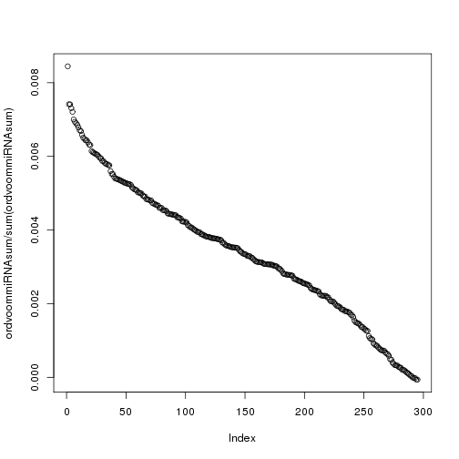
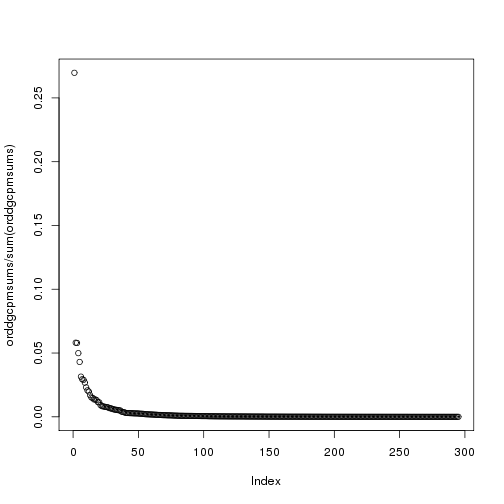

**Script:** `1_mirna_abundance.R`

**Directory of Code:**  `/mnt/research/pigeqtl/analyses/microRNA/2_mirna_characterization_expression/5_mirna_abundance_variance/scripts`

**Date:**  03/15/16

**Input File Directory:**  

1. `/mnt/research/pigeqtl/analyses/microRNA/2_mirna_characterization_expression/3_build_dge_object_for_eqtl/`

**Input File(s):** 

1. `4_msuprp_mirna_gpdata_pheno_counts.Rdata`

2. `5_normalized_dge_object_and_voom_output.Rata` 

**Output File Directory:** `/mnt/research/pigeqtl/analyses/microRNA/2_mirna_characterization_expression/5_mirna_abundance_variance`

**Output File(s):** `1_mirna_abundance_normreadcounts_dgecpm_summary.Rdata`

**Table of contents:**

1. [Objectives](#objectives)
2. [Install libraries](#install-libraries)
3. [Load data](#load-data)
4. [Analysis](#analysis)
5. [Visualize](#visualize)
6. [Save data](#save-data)

## Objectives

The objective of this script is to determine the overall abundance of each of the 295 miRNA expression profiles in the 174 F2 MSUPRP population.

A comparison will be made between the voom output and the dge object output to see which is the more appropriate miRNA abundance to report. 
The counts used to determine total miRNA abundance will be from the dge object, filtered for expression 
(at least 1 cpm in at least 1/4 of the samples) and normalized relative to library size (calcNormFactors()).
A simple rowSums will calculate the total normalized read counts for each of the 295 miRNAs, and the variance of each miRNA can also be calculated from this data.

THIS ANALYSIS COMPLETED IN R/3.2.0
## Install libraries


```r
setwd("/mnt/research/pigeqtl/analyses/microRNA/2_mirna_characterization_expression/5_mirna_abundance_variance/scripts")
library(limma)
```

```
## Loading required package: methods
```

```r
library(edgeR)
```

## Load data

Voom-adjusted log-cpm from gpdata pheno object:


```r
load("../../3_build_dge_object_for_eqtl/4_msuprp_mirna_gpdata_pheno_counts.Rdata")
```

Filtered miRNA expression profiles (not normalized read counts)


```r
load("../../3_build_dge_object_for_eqtl/5_normalized_dge_object_and_voom_output.Rata")
ls()
```

```
## [1] "args"                       "dge"                       
## [3] "file_name"                  "final_MSUPRP_miRNA"        
## [5] "summary_final_MSUPRP_miRNA" "v"                         
## [7] "wtcen"
```

## Analysis


```r
dim(final_MSUPRP_miRNA$pheno)
```

```
## [1] 174 295   1
```

```r
str(final_MSUPRP_miRNA$pheno)
```

```
##  num [1:174, 1:295, 1] 14.9 14.7 14.8 14.6 14.7 ...
##  - attr(*, "dimnames")=List of 3
##   ..$ : chr [1:174] "1034" "1036" "1041" "1049" ...
##   ..$ : chr [1:295] "ssc-let-7a" "ssc-let-7c" "ssc-let-7d-3p" "ssc-let-7d-5p" ...
##   ..$ : NULL
```

```r
final_MSUPRP_miRNA$pheno[1:10,1:10,1]
```

```
##      ssc-let-7a ssc-let-7c ssc-let-7d-3p ssc-let-7d-5p ssc-let-7e
## 1034   14.92228   14.36657      7.943100      11.63362   10.82469
## 1036   14.69825   14.05380      7.771047      11.10306   10.52940
## 1041   14.79043   14.14161      7.627356      11.28869   10.50957
## 1049   14.61269   13.93607      7.820885      11.33382   10.46998
## 1058   14.71832   14.47000      9.008064      11.16527   10.69842
## 1060   15.04296   14.08306      8.086214      11.86027   10.64432
## 1080   14.75727   14.28782      9.110643      11.36897   10.63603
## 1082   14.81453   14.12538      8.346979      11.56218   10.49670
## 1085   15.04741   14.21274      8.109381      11.77709   10.75478
## 1091   14.66553   13.89693      7.664071      11.29906   10.24107
##      ssc-let-7f ssc-let-7g ssc-let-7i ssc-miR-1 ssc-miR-100
## 1034   14.48035   13.39516   12.78838  17.59759    12.58726
## 1036   14.18572   13.15001   12.31692  17.98221    11.82371
## 1041   14.29375   13.24917   12.36791  17.99065    11.57674
## 1049   14.23524   13.15911   12.39004  17.86146    11.33053
## 1058   13.41478   12.88285   11.99258  16.14855    13.49647
## 1060   14.76144   13.64016   12.60084  18.29000    11.41445
## 1080   13.74050   13.13345   12.05425  16.35309    13.12495
## 1082   14.30467   13.39359   12.49315  17.92977    11.26961
## 1085   14.63452   13.59965   12.53572  18.12496    11.31699
## 1091   14.29343   13.14685   12.47158  18.23440    11.28293
```

Calculate the total normalized abundance of each miRNA across all samples (colSums):


```r
miRNAsum<-colSums(final_MSUPRP_miRNA$pheno)
head(miRNAsum)
```

```
##                   [,1]
## ssc-let-7a    2596.627
## ssc-let-7c    2479.538
## ssc-let-7d-3p 1429.890
## ssc-let-7d-5p 2002.412
## ssc-let-7e    1850.577
## ssc-let-7f    2516.467
```

Reorder them by most abundant to least abundant for easy identification:


```r
ordvoommiRNAsum<-miRNAsum[order(miRNAsum, decreasing = TRUE),]
head(ordvoommiRNAsum)
```

```
##       ssc-miR-1 ssc-miR-133a-3p     ssc-miR-378     ssc-miR-206 
##        3132.504        2750.059        2749.121        2711.152 
##     ssc-miR-10b      ssc-let-7a 
##        2674.026        2596.627
```

```r
tail(ordvoommiRNAsum)
```

```
##     ssc-miR-187     ssc-miR-137 ssc-miR-7857-3p ssc-miR-9820-5p 
##       12.380436       -2.604572       -4.713732       -8.192109 
##    ssc-miR-551a    ssc-miR-219a 
##      -22.494739      -22.605770
```

This is the vector of the 30 most abundant miRNAs in the dataset (~16% of all miRNAs)


```r
ordvoommiRNAsum[1:30]
```

```
##       ssc-miR-1 ssc-miR-133a-3p     ssc-miR-378     ssc-miR-206 
##        3132.504        2750.059        2749.121        2711.152 
##     ssc-miR-10b      ssc-let-7a  ssc-miR-143-3p     ssc-miR-26a 
##        2674.026        2596.627        2573.536        2559.399 
##     ssc-miR-486      ssc-let-7f      ssc-miR-21      ssc-let-7c 
##        2542.236        2516.467        2488.705        2479.538 
##  ssc-miR-126-3p  ssc-miR-30a-5p  ssc-miR-30e-5p ssc-miR-199b-3p 
##        2441.731        2414.189        2402.731        2387.243 
## ssc-miR-199a-3p    ssc-miR-181a     ssc-miR-30d      ssc-let-7g 
##        2387.240        2365.875        2344.097        2338.838 
##     ssc-miR-101      ssc-miR-16  ssc-miR-30c-5p  ssc-miR-27b-3p 
##        2279.048        2267.172        2260.498        2252.539 
##   ssc-miR-24-3p ssc-miR-374a-5p   ssc-miR-22-3p  ssc-miR-151-5p 
##        2247.050        2239.275        2225.512        2209.762 
##  ssc-miR-126-5p    ssc-miR-125b 
##        2205.125        2179.708
```

Notice, many of the expected skeletal muscle miRNAs are in the most abundant miRNAs. 


```r
names(ordvoommiRNAsum[1:30])
```

```
##  [1] "ssc-miR-1"       "ssc-miR-133a-3p" "ssc-miR-378"    
##  [4] "ssc-miR-206"     "ssc-miR-10b"     "ssc-let-7a"     
##  [7] "ssc-miR-143-3p"  "ssc-miR-26a"     "ssc-miR-486"    
## [10] "ssc-let-7f"      "ssc-miR-21"      "ssc-let-7c"     
## [13] "ssc-miR-126-3p"  "ssc-miR-30a-5p"  "ssc-miR-30e-5p" 
## [16] "ssc-miR-199b-3p" "ssc-miR-199a-3p" "ssc-miR-181a"   
## [19] "ssc-miR-30d"     "ssc-let-7g"      "ssc-miR-101"    
## [22] "ssc-miR-16"      "ssc-miR-30c-5p"  "ssc-miR-27b-3p" 
## [25] "ssc-miR-24-3p"   "ssc-miR-374a-5p" "ssc-miR-22-3p"  
## [28] "ssc-miR-151-5p"  "ssc-miR-126-5p"  "ssc-miR-125b"
```

Look also at the most abundant miRNAs based on just cpm read counts (filtered; output from dge object):

First, take cpm of dge read counts (normalization factors included)


```r
dge$samples[1:5,]
```

```
##      group lib.size norm.factors
## 1034     1  1462358     1.060057
## 1036     1   830436     1.061221
## 1041     1   944837     1.062527
## 1049     1  1081483     1.102092
## 1058     1  1257197     1.202700
```

```r
dge$counts[1:5,1:5]
```

```
##                1034  1036  1041  1049  1058
## ssc-let-7a    48132 23427 28448 29860 40758
## ssc-let-7c    32745 14987 18144 18681 34313
## ssc-let-7d-3p   381   192   198   269   778
## ssc-let-7d-5p  4925  1938  2511  3076  3472
## ssc-let-7e     2811  1302  1463  1690  2512
```

```r
dgcpm<-cpm(dge)
dgcpm[1:5,1:5]
```

```
##                     1034       1036       1041       1049       1058
## ssc-let-7a    31049.2440 26583.0463 28337.0565 25052.5693 26955.7954
## ssc-let-7c    21123.3170 17006.0236 18073.2408 15673.3774 22693.3168
## ssc-let-7d-3p   245.7775   217.8659   197.2278   225.6913   514.5397
## ssc-let-7d-5p  3177.0449  2199.0841  2501.2074  2580.7670  2296.2491
## ssc-let-7e     1813.3347  1477.4033  1457.2945  1417.9117  1661.3415
```

Then, do a similar rowSums of the cpm-adjusted dge object (normalization factors included) to get the abundance there (see the difference in distribution)


```r
dgcpmsums<-rowSums(dgcpm)
head(dgcpmsums)
```

```
##    ssc-let-7a    ssc-let-7c ssc-let-7d-3p ssc-let-7d-5p    ssc-let-7e 
##    5504771.00    3468041.13      58688.45     522959.00     289201.57 
##    ssc-let-7f 
##    4034459.25
```

```r
orddgcpmsums<-dgcpmsums[order(dgcpmsums, decreasing = TRUE)]
head(orddgcpmsums)
```

```
##       ssc-miR-1 ssc-miR-133a-3p     ssc-miR-378     ssc-miR-206 
##        47162588        10161913        10123136         8726177 
##     ssc-miR-10b      ssc-let-7a 
##         7520559         5504771
```

```r
orddgcpmsums[1:30]
```

```
##       ssc-miR-1 ssc-miR-133a-3p     ssc-miR-378     ssc-miR-206 
##        47162588        10161913        10123136         8726177 
##     ssc-miR-10b      ssc-let-7a     ssc-miR-486  ssc-miR-143-3p 
##         7520559         5504771         5149792         5064749 
##     ssc-miR-26a      ssc-let-7f      ssc-miR-21      ssc-let-7c 
##         4680769         4034459         3624224         3468041 
##  ssc-miR-126-3p  ssc-miR-30a-5p  ssc-miR-30e-5p ssc-miR-199b-3p 
##         2970101         2653634         2590472         2380396 
## ssc-miR-199a-3p    ssc-miR-181a     ssc-miR-30d      ssc-let-7g 
##         2380361         2285322         2011554         1978503 
##     ssc-miR-101      ssc-miR-16  ssc-miR-30c-5p  ssc-miR-27b-3p 
##         1603243         1463300         1424870         1387666 
##   ssc-miR-24-3p ssc-miR-374a-5p   ssc-miR-22-3p  ssc-miR-126-5p 
##         1351921         1331162         1264202         1174639 
##  ssc-miR-151-5p    ssc-miR-125b 
##         1172223         1058542
```

```r
names(orddgcpmsums[1:30])
```

```
##  [1] "ssc-miR-1"       "ssc-miR-133a-3p" "ssc-miR-378"    
##  [4] "ssc-miR-206"     "ssc-miR-10b"     "ssc-let-7a"     
##  [7] "ssc-miR-486"     "ssc-miR-143-3p"  "ssc-miR-26a"    
## [10] "ssc-let-7f"      "ssc-miR-21"      "ssc-let-7c"     
## [13] "ssc-miR-126-3p"  "ssc-miR-30a-5p"  "ssc-miR-30e-5p" 
## [16] "ssc-miR-199b-3p" "ssc-miR-199a-3p" "ssc-miR-181a"   
## [19] "ssc-miR-30d"     "ssc-let-7g"      "ssc-miR-101"    
## [22] "ssc-miR-16"      "ssc-miR-30c-5p"  "ssc-miR-27b-3p" 
## [25] "ssc-miR-24-3p"   "ssc-miR-374a-5p" "ssc-miR-22-3p"  
## [28] "ssc-miR-126-5p"  "ssc-miR-151-5p"  "ssc-miR-125b"
```

```r
sum(orddgcpmsums[1:5])
```

```
## [1] 83694372
```

```r
sum(orddgcpmsums)
```

```
## [1] 174886875
```

```r
sum(orddgcpmsums[1:5])/sum(orddgcpmsums)
```

```
## [1] 0.4785629
```

Check that the top 30 miRNAs are the same: 


```r
match(names(orddgcpmsums[1:30]), names(ordvoommiRNAsum[1:30]))
```

```
##  [1]  1  2  3  4  5  6  9  7  8 10 11 12 13 14 15 16 17 18 19 20 21 22 23
## [24] 24 25 26 27 29 28 30
```

Notice slight shift in order of abundance between voom and normalized cpm, but essentially the same order.
## Visualize

Distribution of reads output from voom adjustment (adjusted for statistical accuracy in GBLUP and GWA analysis)


```r
plot(ordvoommiRNAsum/sum(ordvoommiRNAsum))
```



Distribution of normalized cpm for the read counts: (MUCH cooler to look at, and a more relatable picture of the output from sequencing)

Here you can actually see the contribution of each miRNA to the total number of reads in the dataset. Notice the high variability of a few miRNA being highly expressed while most have low expression


```r
plot(orddgcpmsums/sum(orddgcpmsums))
```



## Save data


```r
save(orddgcpmsums, file="../1_mirna_abundance_normreadcounts_dgecpm_summary.Rdata")
write.table(orddgcpmsums, file="../1_mirna_abundance_normreadcounts_dgecpm_summary.txt", quote=FALSE, col.names=FALSE)
```

