**Script:** `4_mRNA_miRNA_correlation_analysis.R`

**Directory of Code:**  `/mnt/research/pigeqtl/analyses/microRNA/2_mirna_characterization_expression/6_miRNA_eQT_target_prediction/scripts`

**Date:**  06/27/17

**Input File Directory:**  

1. `/mnt/research/pigeqtl/analyses/eQTL/paper/output/corrected-Z/`

2. `/mnt/research/pigeqtl/analyses/eQTL/paper/code/corrected-Z/PRKAG3_eQTL/`

3. `/mnt/research/pigeqtl/analyses/microRNA/2_mirna_characterization_expression/6_miRNA_eQT_target_prediction/`

4. `/mnt/research/pigeqtl/analyses/microRNA/2_mirna_characterization_expression/3_build_dge_object_for_eqtl/`

5. `/mnt/research/pigeqtl/analyses/microRNA/2_mirna_characterization_expression/6_miRNA_eQT_target_prediction/`

**Input File(s):** 

1. `data.Rdata`

2. `classified_peaks.Rdata`

3. `gpData_PRKAG3.Rdata`

4. `PRKAG3_eqtl.Rdata`

5. `5_filtered_targets_expression_results.Rdata`

6. `3_msuprp_mirna_gpdata_pheno_counts.Rdata`

7. `4_normalized_dge_object_and_voom_output.Rdata`

8. `5_Z_G_miRNA_gblup_gwas.Rdata`

9. `1_hsa_mirna_names.txt`, `1_mirna_names.txt`

**Output File Directory:** 

1. `/mnt/research/pigeqtl/analyses/microRNA/2_mirna_characterization_expression/6_miRNA_eQT_target_prediction/`

**Output File(s):** 

1. `1.5_ssc.hsa.hom.mir.txt`

1. `8_DAVID_cor_target_mRNA_names.txt`

1. `9_DAVID_neg_cor_target_mRNA_names.txt`

1. `10_mRNA_miRNA_correlation_output.Rdata`

1. `11_mRNA_miRNA_correlation_characterization_data.Rdata`

**Table of contents:**

1. [Objectives](#objectives)
2. [Install libraries](#install-libraries)
3. [Load data](#load-data)
4. [Analysis](#analysis)
5. [Visualize](#visualize)
6. [Save data](#save-data)

## Objectives

The objective of this script is to correlate the expression of the miR-eQTL miRNAs with their putative target mRNAs. 
The mRNA and miRNA expression data will separately be adjusted for the same fixed (sex, selection criteria) and random (population stratification) effects as in the eQTL analysis, accounting for the mean-variance relationship, as well. 
The adjusted expression data will then be correlated between the miRNA and its putative target mRNAs, utilizing the residual expression data (see Ponsuksili et al. 2013 [BMC Genomics] for details). 
Correlations found to be significant will then be characterized for their overlap with mRNA-eQTLs, and pQTLs in this dataset.

## Install libraries


```r
rm(list=ls())

library(regress)
library(gwaR)
library(limma)
library(edgeR)
library(parallel)
library(qvalue)
library(corrplot)
```

## Load data


```r
load("/mnt/research/pigeqtl/analyses/eQTL/paper/output/corrected-Z/data.Rdata")
load("/mnt/research/pigeqtl/analyses/eQTL/paper/code/corrected-Z/PRKAG3_eQTL/gpData_PRKAG3.Rdata")
load("/mnt/research/pigeqtl/analyses/eQTL/paper/output/corrected-Z/PRKAG3_eqtl.Rdata")
```

Rename R object to differentiate between mRNA and microRNA


```r
Mdge <- dge
Mv <- v
Mwcen <- wcen
MG <- G2 
```

Remove R objects that will not be used in this analysis


```r
rm(list=setdiff(ls(), c("Mdge","Mv","Mwcen","MG","PRKAG3")))
ls()
```

```
## [1] "Mdge"   "MG"     "Mv"     "Mwcen"  "PRKAG3"
```

Load miroRNA targets


```r
load("/mnt/research/pigeqtl/analyses/microRNA/2_mirna_characterization_expression/6_miRNA_eQT_target_prediction/5_filtered_targets_expression_results.Rdata")
ls()
```

```
## [1] "Mdge"            "MG"              "Mv"              "Mwcen"          
## [5] "PRKAG3"          "targets.exp"     "targets.exp.sum"
```

Summary of target genes per microRNA


```r
do.call(rbind, lapply(targets.exp.sum, function(x) x[[1]]))
```

```
##                  gene.input gene.output gene.prop
## miR-200-3p/429         2301        1297 0.5636680
## let-7-5p/98-5p         1398         768 0.5493562
## miR-128-3p             2982        1558 0.5224681
## miR-140-5p             1518         812 0.5349144
## miR-6821-3p            1118         593 0.5304114
## miR-6888-3p            2816        1481 0.5259233
## miR-874-3p             2175        1119 0.5144828
## miR-345-3p             1950        1052 0.5394872
## miR-6072/6891-3p       1680         901 0.5363095
## miR-1306-3p             264         141 0.5340909
## miR-184                 365         179 0.4904110
## miR-190-5p              979         520 0.5311542
## miR-1468-5p             394         198 0.5025381
## miR-95-3p               196         105 0.5357143
```

mRNA annotation


```r
annot <- Mdge$genes
```

List of mRNA target genes per microRNA

Some genes have more than one transcript expressed per target gene, meaning the number of potential 'target' transcripts will increase.


```r
targets.mrna <- lapply(targets.exp, function(x) 
	rownames(annot)[as.character(annot$genes) %in% x$external_gene_name])
names(targets.mrna) <- names(targets.exp)
head(targets.mrna[[1]])
```

```
## [1] "XLOC_000021" "XLOC_000023" "XLOC_000026" "XLOC_000038" "XLOC_000041"
## [6] "XLOC_000050"
```

```r
str(targets.mrna)
```

```
## List of 14
##  $ miR-200-3p/429  : chr [1:1309] "XLOC_000021" "XLOC_000023" "XLOC_000026" "XLOC_000038" ...
##  $ let-7-5p/98-5p  : chr [1:798] "XLOC_000050" "XLOC_000117" "XLOC_000210" "XLOC_000256" ...
##  $ miR-128-3p      : chr [1:1564] "XLOC_000021" "XLOC_000035" "XLOC_000038" "XLOC_000050" ...
##  $ miR-140-5p      : chr [1:835] "XLOC_000038" "XLOC_000078" "XLOC_000113" "XLOC_000153" ...
##  $ miR-6821-3p     : chr [1:604] "XLOC_000023" "XLOC_000038" "XLOC_000132" "XLOC_000153" ...
##  $ miR-6888-3p     : chr [1:1481] "XLOC_000021" "XLOC_000023" "XLOC_000069" "XLOC_000070" ...
##  $ miR-874-3p      : chr [1:1105] "XLOC_000038" "XLOC_000061" "XLOC_000085" "XLOC_000094" ...
##  $ miR-345-3p      : chr [1:1062] "XLOC_000023" "XLOC_000038" "XLOC_000062" "XLOC_000074" ...
##  $ miR-6072/6891-3p: chr [1:899] "XLOC_000074" "XLOC_000117" "XLOC_000177" "XLOC_000205" ...
##  $ miR-1306-3p     : chr [1:156] "XLOC_000038" "XLOC_000201" "XLOC_000786" "XLOC_000977" ...
##  $ miR-184         : chr [1:185] "XLOC_000038" "XLOC_000268" "XLOC_000327" "XLOC_000388" ...
##  $ miR-190-5p      : chr [1:547] "XLOC_000050" "XLOC_000085" "XLOC_000108" "XLOC_000141" ...
##  $ miR-1468-5p     : chr [1:203] "XLOC_000035" "XLOC_000086" "XLOC_000181" "XLOC_000435" ...
##  $ miR-95-3p       : chr [1:109] "XLOC_000411" "XLOC_000645" "XLOC_001116" "XLOC_001185" ...
```

Load microRNA expression data


```r
load("/mnt/research/pigeqtl/analyses/microRNA/2_mirna_characterization_expression/3_build_dge_object_for_eqtl/3_msuprp_mirna_gpdata_pheno_counts.Rdata")
load("/mnt/research/pigeqtl/analyses/microRNA/2_mirna_characterization_expression/3_build_dge_object_for_eqtl/4_normalized_dge_object_and_voom_output.Rdata")
load("/mnt/research/pigeqtl/analyses/microRNA/2_mirna_characterization_expression/3_build_dge_object_for_eqtl/5_Z_G_miRNA_gblup_gwas.Rdata")
```

Rename R object to differentiate microRNA data from mRNA data


```r
dge.mi <- dge
v.mi <- v
wcen.mi <- wtcen
G.mi <- G
```

Retain only the objects needed for the analysis


```r
rm(list=setdiff(ls(), c("Mdge","Mv","Mwcen","MG","PRKAG3",
	"dge.mi","v.mi","wcen.mi","G.mi","MSUPRP_miRNA",
	"targets.mrna","targets.exp")))
ls()
```

```
##  [1] "dge.mi"       "G.mi"         "Mdge"         "MG"          
##  [5] "MSUPRP_miRNA" "Mv"           "Mwcen"        "PRKAG3"      
##  [9] "targets.exp"  "targets.mrna" "v.mi"         "wcen.mi"
```

## Analysis

miRNA human-pig homologs


```r
hsa.mirna <- as.character(read.table("/mnt/research/pigeqtl/analyses/microRNA/2_mirna_characterization_expression/6_miRNA_eQT_target_prediction/1_hsa_mirna_names.txt")[,1])
hsa.mirna <- c(hsa.mirna[1], hsa.mirna)
ssc.mirna <- apply(read.table("/mnt/research/pigeqtl/analyses/microRNA/2_mirna_characterization_expression/6_miRNA_eQT_target_prediction/1_mirna_names.txt"), 1, function(x) paste("ssc-", x, sep=""))
ssc.hsa.hom.mir <- data.frame(ssc=ssc.mirna[1:15], hsa=hsa.mirna)
```

Save miRNA human-pig homologes table


```r
write.table(ssc.hsa.hom.mir, "/mnt/research/pigeqtl/analyses/microRNA/2_mirna_characterization_expression/6_miRNA_eQT_target_prediction/1.5_ssc_hsa_hom_mir.txt", col.names=TRUE, quote=FALSE, row.names=FALSE, sep="\t")
```

Reorder targets.mrna to match order in ssc.hsa.hom.mir


```r
targets.mrna <- targets.mrna[as.character(ssc.hsa.hom.mir[-1,"hsa"])]
```

Rename targets.mrna R object to match ssc miRNA id (currently has hsa id names)


```r
x <- unlist(sapply(names(targets.mrna), 
	function(x) as.character(ssc.hsa.hom.mir[as.character(ssc.hsa.hom.mir$hsa) %in% x,"ssc"])))
x
```

```
##   let-7-5p/98-5p1   let-7-5p/98-5p2        miR-128-3p       miR-1306-3p 
##   "ssc-let-7d-5p"      "ssc-let-7g"     "ssc-miR-128" "ssc-miR-1306-3p" 
##        miR-140-5p       miR-1468-5p           miR-184        miR-190-5p 
##  "ssc-miR-140-5p"    "ssc-miR-1468"     "ssc-miR-184"    "ssc-miR-190b" 
##        miR-345-3p    miR-200-3p/429       miR-6821-3p       miR-6888-3p 
##  "ssc-miR-345-3p"     "ssc-miR-429" "ssc-miR-6782-3p" "ssc-miR-7135-3p" 
##        miR-874-3p         miR-95-3p  miR-6072/6891-3p 
##     "ssc-miR-874"      "ssc-miR-95" "ssc-miR-9785-5p"
```

Add ssc names to targets.mrna and duplicate let-7-5p/98-5p target genes to account for the two ssc miRNA 


```r
targets.mrna <- c(targets.mrna[1], targets.mrna)
names(targets.mrna) <- x
str(targets.mrna)
```

```
## List of 15
##  $ ssc-let-7d-5p  : chr [1:798] "XLOC_000050" "XLOC_000117" "XLOC_000210" "XLOC_000256" ...
##  $ ssc-let-7g     : chr [1:798] "XLOC_000050" "XLOC_000117" "XLOC_000210" "XLOC_000256" ...
##  $ ssc-miR-128    : chr [1:1564] "XLOC_000021" "XLOC_000035" "XLOC_000038" "XLOC_000050" ...
##  $ ssc-miR-1306-3p: chr [1:156] "XLOC_000038" "XLOC_000201" "XLOC_000786" "XLOC_000977" ...
##  $ ssc-miR-140-5p : chr [1:835] "XLOC_000038" "XLOC_000078" "XLOC_000113" "XLOC_000153" ...
##  $ ssc-miR-1468   : chr [1:203] "XLOC_000035" "XLOC_000086" "XLOC_000181" "XLOC_000435" ...
##  $ ssc-miR-184    : chr [1:185] "XLOC_000038" "XLOC_000268" "XLOC_000327" "XLOC_000388" ...
##  $ ssc-miR-190b   : chr [1:547] "XLOC_000050" "XLOC_000085" "XLOC_000108" "XLOC_000141" ...
##  $ ssc-miR-345-3p : chr [1:1062] "XLOC_000023" "XLOC_000038" "XLOC_000062" "XLOC_000074" ...
##  $ ssc-miR-429    : chr [1:1309] "XLOC_000021" "XLOC_000023" "XLOC_000026" "XLOC_000038" ...
##  $ ssc-miR-6782-3p: chr [1:604] "XLOC_000023" "XLOC_000038" "XLOC_000132" "XLOC_000153" ...
##  $ ssc-miR-7135-3p: chr [1:1481] "XLOC_000021" "XLOC_000023" "XLOC_000069" "XLOC_000070" ...
##  $ ssc-miR-874    : chr [1:1105] "XLOC_000038" "XLOC_000061" "XLOC_000085" "XLOC_000094" ...
##  $ ssc-miR-95     : chr [1:109] "XLOC_000411" "XLOC_000645" "XLOC_001116" "XLOC_001185" ...
##  $ ssc-miR-9785-5p: chr [1:899] "XLOC_000074" "XLOC_000117" "XLOC_000177" "XLOC_000205" ...
```

Function to extract residual values from regress function after correcting for sex, growth group, population structure and mean variance relationship


```r
fit.vals <- function(rsp, data, design, G, vdata = NULL, wt = NULL, ...){
	x <- gblup(rsp=rsp, data=dataM, design=design, G=G, vdata=vdata, wt=wt, ...)
	ehat <- x$ehat
	rownames(ehat) <- names(x$model$y)
	colnames(ehat) <- rsp
	return(ehat)
}
```

Estimate the **miRNA** expression (log-cpm) after correcting for 
sex, selection criteria, population structure and mean variance relationship


```r
idx <- as.character(ssc.hsa.hom.mir$ssc)
length(idx)
```

```
## [1] 15
```

```r
str(MSUPRP_miRNA$covar[,c("sex","growth_group")])
```

```
## 'data.frame':	174 obs. of  2 variables:
##  $ sex         : Factor w/ 2 levels "F","M": 1 1 2 2 1 1 1 1 2 2 ...
##  $ growth_group: Factor w/ 4 levels "lma-L","bf-H",..: 4 1 4 1 4 1 4 1 4 1 ...
```

```r
X <- MSUPRP_miRNA$covar[,c("sex","growth_group")]
rownames(X) <- MSUPRP_miRNA$covar$id

dataM <- cbind(t(v.mi$E[idx,]), X[colnames(v.mi$E),])

design <- c(~ sex + growth_group)

fit.mi <- do.call(cbind, lapply(idx, function(x) fit.vals(rsp=x, data=dataM, design=design, G=G.mi, 
	vdata = NULL, wt = wcen.mi, pos=c(T,T))))
```

```
## Warning: solution lies close to zero for some positive variance components, their standard errors may not be valid
## Warning: solution lies close to zero for some positive variance components, their standard errors may not be valid
```

```r
dim(fit.mi)
```

```
## [1] 174  15
```

Estimate the **mRNA** expression (log-cpm) after correcting for 
sex, selection criteria, population structure and mean variance relationship


```r
# Target mRNA
idx <- unique(unlist(targets.mrna))
length(idx)
```

```
## [1] 5692
```

```r
# All expressed mRNA
#idx <- rownames(Mv$E)
#length(idx)

str(PRKAG3$covar[,c("sex","selcrit")])
```

```
## 'data.frame':	168 obs. of  2 variables:
##  $ sex    : Factor w/ 2 levels "F","M": 1 1 2 2 1 1 1 1 2 1 ...
##  $ selcrit: Factor w/ 2 levels "bf","lma": 2 2 2 2 2 2 2 2 2 2 ...
```

```r
X <- PRKAG3$covar[,c("sex","selcrit")]
rownames(X) <- PRKAG3$covar$id

dataM <- cbind(t(Mv$E[idx,]), X[colnames(Mv$E),])

design <- c(~ sex + selcrit)

Mfit <- do.call(cbind, mclapply(idx, function(x) fit.vals(rsp=x, data=dataM, design=design, G=MG, 
	vdata = NULL, wt = Mwcen, pos=c(T,T)), mc.cores=10))
dim(Mfit)
```

```
## [1]  168 5692
```

Correlate adjusted miRNA expression with adjusted mRNA expression


```r
# Reduced fitted matrices for animals with both mRNA and miRNA fitted values
anim <- rownames(Mfit)[rownames(Mfit) %in% rownames(fit.mi)]
# miRNA
rfit.mi <- fit.mi[anim,]
dim(rfit.mi)
```

```
## [1] 166  15
```

```r
# mRNA
rMfit <- Mfit[anim,]
dim(rMfit)
```

```
## [1]  166 5692
```

Function to perform correlation analysis of mRNA and miRNA espression and export a summary of correlation analysis


```r
cor.exp <- function(target, mRNA, miRNA, ...){
	x <- cor.test(mRNA, miRNA, ...)
	rst <- data.frame(cor=x$estimate, 
		z=x$statistic, 
		pvalue=x$p.value)
	rownames(rst) <- target
	return(rst)
}
```

---
Run corrlation analysis

Correlation between miRNA and their target mRNA


```r
rst.corR <- lapply(names(targets.mrna), function(x) do.call(rbind,mclapply(targets.mrna[[x]], 
		function(y) cor.exp(target=y, mRNA=rMfit[,y], 
		miRNA=rfit.mi[,x], alternative="two.sided", method="kendall"), mc.cores=10)))
names(rst.corR) <- names(targets.mrna)
```

False discovering rate multiple test correction


```r
for (i in names(rst.corR)){
	rst.corR[[i]] <- data.frame(rst.corR[[i]], qvalue=qvalue(rst.corR[[i]]$pvalue)$qvalue, pi0=qvalue(rst.corR[[i]]$pvalue)$pi0)
}
```

Summary of significantly correlated targets at FDR < 0.05:


```r
thres <- 0.05
summary.sigR <- do.call(rbind, lapply(rst.corR, function(x) data.frame(tot=nrow(x), 
	sig=sum(x$qvalue < thres), prop.sig=sum(x$qvalue < thres)/nrow(x) * 100, 
	neg=sum(x$cor < 0), prop.neg=sum(x$cor < 0)/nrow(x) *100,
	sig.neg=sum(x$cor < 0 & x$qvalue < thres),
	prop.sig.neg=sum(x$cor < 0 & x$qvalue < thres)/nrow(x) * 100,
	pi0=unique(x$pi0))))
summary.sigR
```

```
##                  tot sig   prop.sig neg prop.neg sig.neg prop.sig.neg
## ssc-let-7d-5p    798   2  0.2506266 402 50.37594       1    0.1253133
## ssc-let-7g       798   0  0.0000000 371 46.49123       0    0.0000000
## ssc-miR-128     1564   0  0.0000000 942 60.23018       0    0.0000000
## ssc-miR-1306-3p  156   0  0.0000000  65 41.66667       0    0.0000000
## ssc-miR-140-5p   835 146 17.4850299 482 57.72455      72    8.6227545
## ssc-miR-1468     203   0  0.0000000  89 43.84236       0    0.0000000
## ssc-miR-184      185   0  0.0000000  93 50.27027       0    0.0000000
## ssc-miR-190b     547   0  0.0000000 331 60.51188       0    0.0000000
## ssc-miR-345-3p  1062   0  0.0000000 573 53.95480       0    0.0000000
## ssc-miR-429     1309   0  0.0000000 605 46.21849       0    0.0000000
## ssc-miR-6782-3p  604 142 23.5099338 226 37.41722      44    7.2847682
## ssc-miR-7135-3p 1481   0  0.0000000 614 41.45847       0    0.0000000
## ssc-miR-874     1105 566 51.2217195 461 41.71946     236   21.3574661
## ssc-miR-95       109   4  3.6697248  40 36.69725       1    0.9174312
## ssc-miR-9785-5p  899   0  0.0000000 369 41.04561       0    0.0000000
##                       pi0
## ssc-let-7d-5p   0.9184883
## ssc-let-7g      0.7050877
## ssc-miR-128     0.9834098
## ssc-miR-1306-3p 0.4209410
## ssc-miR-140-5p  0.3804096
## ssc-miR-1468    0.9939524
## ssc-miR-184     0.8824150
## ssc-miR-190b    0.6033659
## ssc-miR-345-3p  1.0000000
## ssc-miR-429     0.9977902
## ssc-miR-6782-3p 0.3269734
## ssc-miR-7135-3p 0.5438709
## ssc-miR-874     0.3209061
## ssc-miR-95      0.8008795
## ssc-miR-9785-5p 0.5780690
```

Observe the histogram of p-values for the correlation analysis:


```r
tst<-lapply(rst.corR, function(x) hist(x$pvalue))
```

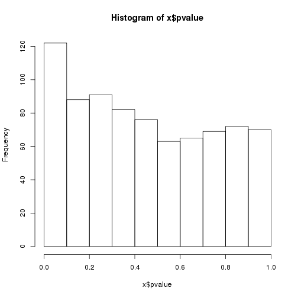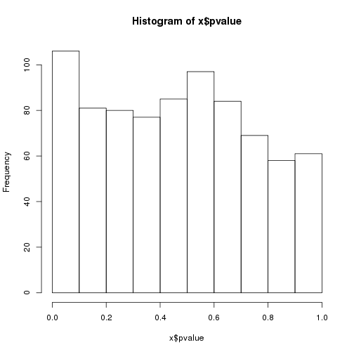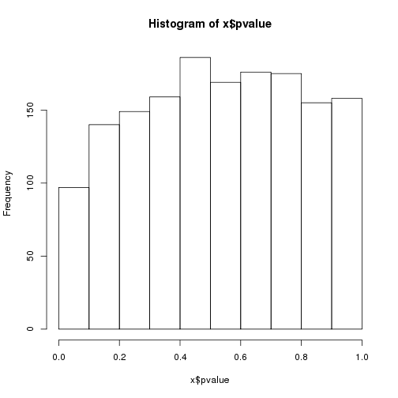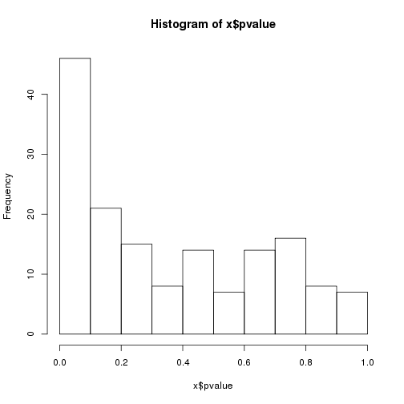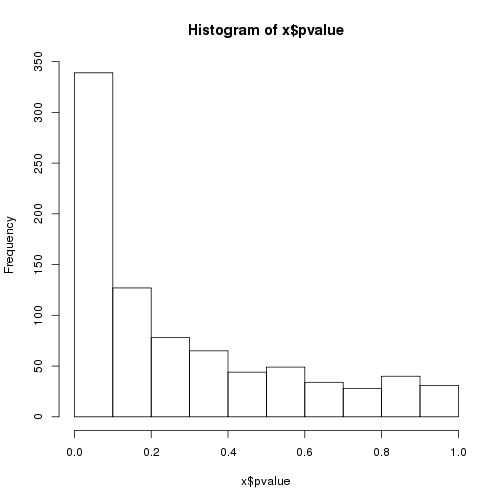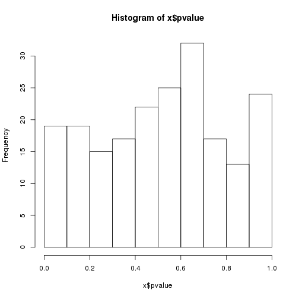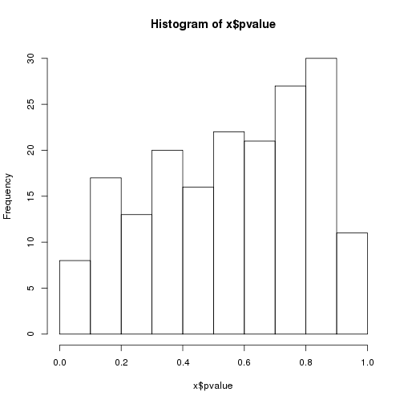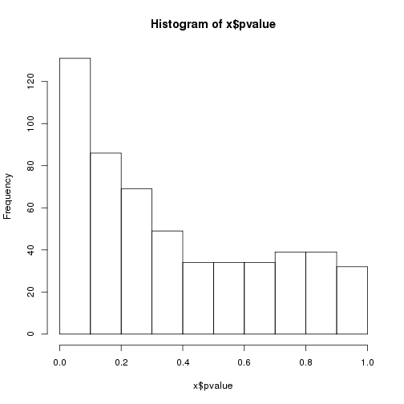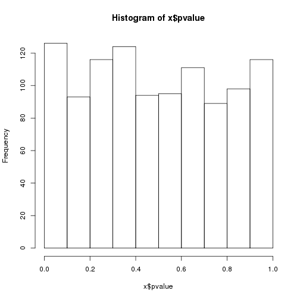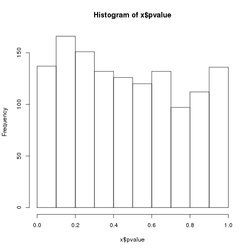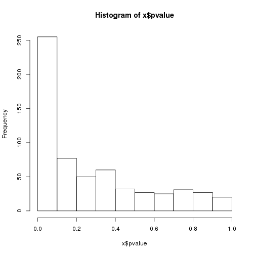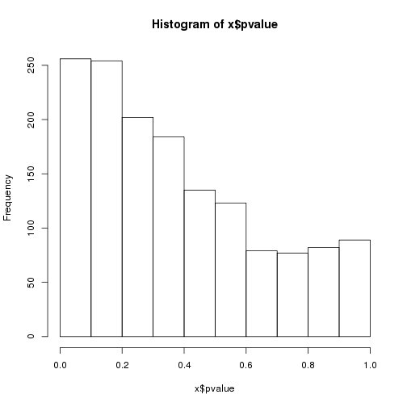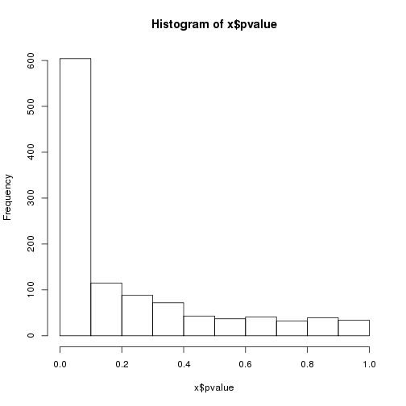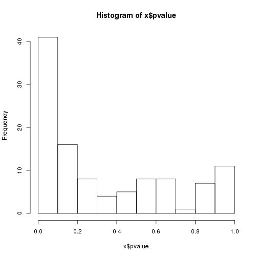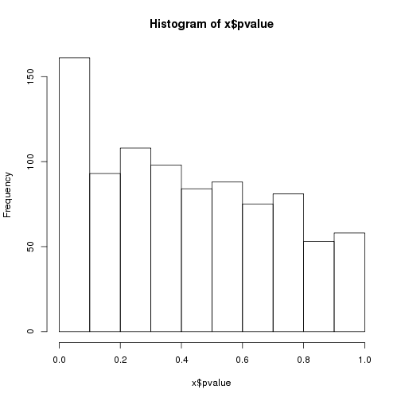

```r
lapply(tst, function(x) x$counts)
```

```
## $`ssc-let-7d-5p`
##  [1] 122  88  91  82  76  63  65  69  72  70
## 
## $`ssc-let-7g`
##  [1] 106  81  80  77  85  97  84  69  58  61
## 
## $`ssc-miR-128`
##  [1]  97 140 149 159 186 169 176 175 155 158
## 
## $`ssc-miR-1306-3p`
##  [1] 46 21 15  8 14  7 14 16  8  7
## 
## $`ssc-miR-140-5p`
##  [1] 339 127  78  65  44  49  34  28  40  31
## 
## $`ssc-miR-1468`
##  [1] 19 19 15 17 22 25 32 17 13 24
## 
## $`ssc-miR-184`
##  [1]  8 17 13 20 16 22 21 27 30 11
## 
## $`ssc-miR-190b`
##  [1] 131  86  69  49  34  34  34  39  39  32
## 
## $`ssc-miR-345-3p`
##  [1] 126  93 116 124  94  95 111  89  98 116
## 
## $`ssc-miR-429`
##  [1] 137 166 151 132 126 120 132  97 112 136
## 
## $`ssc-miR-6782-3p`
##  [1] 255  77  50  60  32  27  25  31  27  20
## 
## $`ssc-miR-7135-3p`
##  [1] 256 254 202 184 135 123  79  77  82  89
## 
## $`ssc-miR-874`
##  [1] 604 115  88  72  43  37  41  32  39  34
## 
## $`ssc-miR-95`
##  [1] 41 16  8  4  5  8  8  1  7 11
## 
## $`ssc-miR-9785-5p`
##  [1] 161  93 108  98  84  88  75  81  53  58
```

Recognize that the correlations may not be incredibly strong: many miRNAs can target one gene, 
and the effect of the miRNA on a given target varies. 

List of mRNA XLOC IDs that are significantly correlated per miRNA


```r
sig.mrnaR <- lapply(rst.corR, function(x) rownames(x)[x$qvalue < thres])

head(as.character(Mdge$genes$geneID))
```

```
## [1] "XLOC_000001" "XLOC_000003" "XLOC_000005" "XLOC_000007" "XLOC_000011"
## [6] "XLOC_000012"
```

```r
rst.corR[[2]][sig.mrnaR[[1]],]
```

```
##                    cor         z       pvalue    qvalue       pi0
## XLOC_002754 -0.1731289 -3.310982 0.0009296914 0.2615501 0.7050877
## XLOC_018827  0.1788244  3.419905 0.0006264296 0.2615501 0.7050877
```

```r
rst.corR[[1]][sig.mrnaR[[1]],]
```

```
##                    cor         z       pvalue     qvalue       pi0
## XLOC_002754 -0.2302300 -4.403006 1.067613e-05 0.00782511 0.9184883
## XLOC_018827  0.2128514  4.070651 4.688199e-05 0.01718116 0.9184883
```

Extract the correlations for those significant miRNA-mRNA pairs


```r
sig.mrnacorR <- lapply(rst.corR, function(x) x[x$qvalue < thres, "cor"])
```

Extract the names of the significant target mRNAs for use with DAVID:


```r
sig.mrnaR.names <- do.call(rbind, lapply(names(sig.mrnaR), function(x) data.frame(miRNA=rep(x, length(sig.mrnaR[[x]])), 
    Mdge$genes[sig.mrnaR[[x]], c("geneID", "genes")])))
rownames(sig.mrnaR.names) <- NULL
dim(sig.mrnaR.names)
```

```
## [1] 860   3
```

These sums should match the summary.sigR "sig.neg" column


```r
unlist(lapply(sig.mrnacorR, function(x) sum(x < 0)))
```

```
##   ssc-let-7d-5p      ssc-let-7g     ssc-miR-128 ssc-miR-1306-3p 
##               1               0               0               0 
##  ssc-miR-140-5p    ssc-miR-1468     ssc-miR-184    ssc-miR-190b 
##              72               0               0               0 
##  ssc-miR-345-3p     ssc-miR-429 ssc-miR-6782-3p ssc-miR-7135-3p 
##               0               0              44               0 
##     ssc-miR-874      ssc-miR-95 ssc-miR-9785-5p 
##             236               1               0
```

Extract the significant negatively-correlated miRNA-mRNA pairs:


```r
sig.neg.mrnaR <- lapply(rst.corR, function(x) rownames(x)[x$qvalue < thres & x$cor<0])
```

Extract the names of those genes for use in DAVID analysis:


```r
sig.neg.mrnaR.names <- do.call(rbind, lapply(names(sig.neg.mrnaR), function(x) data.frame(miRNA=rep(x, length(sig.neg.mrnaR[[x]])), 
    Mdge$genes[sig.neg.mrnaR[[x]], c("geneID", "genes")])))
rownames(sig.neg.mrnaR.names) <- NULL
dim(sig.neg.mrnaR.names)
```

```
## [1] 354   3
```

```r
# cat(as.character(sig.mrnaR.names[sig.mrnaR.names$miRNA=="ssc-miR-95","genes"]), sep="\n")
```

----

Code received from DV 6/29/17

Correlation among miRNA expression 


```r
cor.mirna <- cor(t(v.mi$E[names(targets.mrna),]))
```

```r
corrplot(cor.mirna, method="number", mar=c(2,2,2,2), number.cex=0.7, tl.cex=0.8, tl.col="black", tl.srt=45, title="Correlation of microRNA Expression")
```


Xloc IDs of common targets per miRNA


```r
com.targets <- lapply(names(targets.mrna), function(x) lapply(targets.mrna, 
    function(y) targets.mrna[[x]][targets.mrna[[x]] %in% y]))
names(com.targets)<-names(targets.mrna)
```

Number of common targets per miRNA


```r
comM <- do.call(cbind, lapply(com.targets, 
    function(x) unlist(lapply(x, function(y) length(y)))))
colnames(comM) <- rownames(comM)
```

Proportion of common targets per miRNA


```r
comMperc <- do.call(cbind, lapply(names(targets.mrna), function(x) unlist(lapply(targets.mrna, 
    function(y) sum(targets.mrna[[x]] %in% y)/length(targets.mrna[[x]])))))
colnames(comMperc) <- rownames(comMperc)
```

```r
corrplot(comMperc, method="number", mar=c(2,2,2,2), number.cex=0.7, tl.cex=0.8, tl.col="black", tl.srt=45, title="Proportion of microRNA Targets in Common")
```


---
Number of times a single mRNA target is found significantly correlated to a miRNA


```r
idx <- rownames(summary.sigR)[summary.sigR$sig > 0]
sort(table(unlist(lapply(idx, function(x) rownames(rst.corR[[x]])[rst.corR[[x]]$qvalue < thres]))))
```

```
## 
## XLOC_000061 XLOC_000085 XLOC_000094 XLOC_000117 XLOC_000218 XLOC_000225 
##           1           1           1           1           1           1 
## XLOC_000336 XLOC_000404 XLOC_000502 XLOC_000544 XLOC_000548 XLOC_000566 
##           1           1           1           1           1           1 
## XLOC_000573 XLOC_000700 XLOC_000765 XLOC_000930 XLOC_000937 XLOC_000957 
##           1           1           1           1           1           1 
## XLOC_000977 XLOC_001038 XLOC_001040 XLOC_001051 XLOC_001089 XLOC_001113 
##           1           1           1           1           1           1 
## XLOC_001118 XLOC_001124 XLOC_001137 XLOC_001146 XLOC_001147 XLOC_001161 
##           1           1           1           1           1           1 
## XLOC_001179 XLOC_001188 XLOC_001212 XLOC_001300 XLOC_001319 XLOC_001340 
##           1           1           1           1           1           1 
## XLOC_001367 XLOC_001447 XLOC_001469 XLOC_001513 XLOC_001543 XLOC_001614 
##           1           1           1           1           1           1 
## XLOC_001657 XLOC_001672 XLOC_001686 XLOC_001772 XLOC_001796 XLOC_001813 
##           1           1           1           1           1           1 
## XLOC_001866 XLOC_001896 XLOC_002007 XLOC_002010 XLOC_002032 XLOC_002034 
##           1           1           1           1           1           1 
## XLOC_002059 XLOC_002069 XLOC_002118 XLOC_002146 XLOC_002159 XLOC_002165 
##           1           1           1           1           1           1 
## XLOC_002206 XLOC_002209 XLOC_002212 XLOC_002270 XLOC_002281 XLOC_002355 
##           1           1           1           1           1           1 
## XLOC_002387 XLOC_002418 XLOC_002425 XLOC_002433 XLOC_002443 XLOC_002445 
##           1           1           1           1           1           1 
## XLOC_002450 XLOC_002454 XLOC_002471 XLOC_002522 XLOC_002524 XLOC_002534 
##           1           1           1           1           1           1 
## XLOC_002637 XLOC_002681 XLOC_002757 XLOC_002808 XLOC_002849 XLOC_002904 
##           1           1           1           1           1           1 
## XLOC_002958 XLOC_003002 XLOC_003029 XLOC_003086 XLOC_003106 XLOC_003398 
##           1           1           1           1           1           1 
## XLOC_003400 XLOC_003419 XLOC_003422 XLOC_003452 XLOC_003481 XLOC_003529 
##           1           1           1           1           1           1 
## XLOC_003535 XLOC_003572 XLOC_003611 XLOC_003624 XLOC_003683 XLOC_003764 
##           1           1           1           1           1           1 
## XLOC_003775 XLOC_003819 XLOC_003893 XLOC_003931 XLOC_003948 XLOC_004014 
##           1           1           1           1           1           1 
## XLOC_004015 XLOC_004022 XLOC_004029 XLOC_004030 XLOC_004058 XLOC_004059 
##           1           1           1           1           1           1 
## XLOC_004066 XLOC_004071 XLOC_004100 XLOC_004236 XLOC_004251 XLOC_004316 
##           1           1           1           1           1           1 
## XLOC_004367 XLOC_004396 XLOC_004418 XLOC_004469 XLOC_004475 XLOC_004477 
##           1           1           1           1           1           1 
## XLOC_004502 XLOC_004520 XLOC_004522 XLOC_004552 XLOC_004580 XLOC_004618 
##           1           1           1           1           1           1 
## XLOC_004632 XLOC_004660 XLOC_004675 XLOC_004683 XLOC_004690 XLOC_004694 
##           1           1           1           1           1           1 
## XLOC_004789 XLOC_004811 XLOC_004852 XLOC_004960 XLOC_004986 XLOC_004995 
##           1           1           1           1           1           1 
## XLOC_005009 XLOC_005022 XLOC_005072 XLOC_005095 XLOC_005233 XLOC_005347 
##           1           1           1           1           1           1 
## XLOC_005354 XLOC_005362 XLOC_005380 XLOC_005408 XLOC_005577 XLOC_005605 
##           1           1           1           1           1           1 
## XLOC_005900 XLOC_006112 XLOC_006117 XLOC_006163 XLOC_006186 XLOC_006195 
##           1           1           1           1           1           1 
## XLOC_006226 XLOC_006249 XLOC_006277 XLOC_006281 XLOC_006283 XLOC_006284 
##           1           1           1           1           1           1 
## XLOC_006295 XLOC_006320 XLOC_006357 XLOC_006359 XLOC_006393 XLOC_006396 
##           1           1           1           1           1           1 
## XLOC_006423 XLOC_006454 XLOC_006490 XLOC_006491 XLOC_006528 XLOC_006556 
##           1           1           1           1           1           1 
## XLOC_006613 XLOC_006618 XLOC_006718 XLOC_006719 XLOC_006727 XLOC_006784 
##           1           1           1           1           1           1 
## XLOC_006819 XLOC_006938 XLOC_006986 XLOC_006990 XLOC_007081 XLOC_007097 
##           1           1           1           1           1           1 
## XLOC_007108 XLOC_007116 XLOC_007169 XLOC_007185 XLOC_007191 XLOC_007219 
##           1           1           1           1           1           1 
## XLOC_007231 XLOC_007270 XLOC_007311 XLOC_007312 XLOC_007326 XLOC_007334 
##           1           1           1           1           1           1 
## XLOC_007371 XLOC_007375 XLOC_007376 XLOC_007377 XLOC_007426 XLOC_007447 
##           1           1           1           1           1           1 
## XLOC_007465 XLOC_007482 XLOC_007508 XLOC_007526 XLOC_007532 XLOC_007545 
##           1           1           1           1           1           1 
## XLOC_007635 XLOC_007655 XLOC_007665 XLOC_007726 XLOC_007737 XLOC_007743 
##           1           1           1           1           1           1 
## XLOC_007785 XLOC_007807 XLOC_007903 XLOC_007905 XLOC_007965 XLOC_007978 
##           1           1           1           1           1           1 
## XLOC_008018 XLOC_008044 XLOC_008053 XLOC_008121 XLOC_008146 XLOC_008149 
##           1           1           1           1           1           1 
## XLOC_008157 XLOC_008159 XLOC_008254 XLOC_008257 XLOC_008281 XLOC_008286 
##           1           1           1           1           1           1 
## XLOC_008324 XLOC_008426 XLOC_008452 XLOC_008460 XLOC_008469 XLOC_008475 
##           1           1           1           1           1           1 
## XLOC_008547 XLOC_008626 XLOC_008629 XLOC_008666 XLOC_008676 XLOC_008696 
##           1           1           1           1           1           1 
## XLOC_008767 XLOC_008772 XLOC_008973 XLOC_009109 XLOC_009139 XLOC_009141 
##           1           1           1           1           1           1 
## XLOC_009176 XLOC_009183 XLOC_009220 XLOC_009221 XLOC_009283 XLOC_009284 
##           1           1           1           1           1           1 
## XLOC_009309 XLOC_009313 XLOC_009357 XLOC_009361 XLOC_009419 XLOC_009467 
##           1           1           1           1           1           1 
## XLOC_009495 XLOC_009507 XLOC_009511 XLOC_009584 XLOC_009614 XLOC_009656 
##           1           1           1           1           1           1 
## XLOC_009701 XLOC_009703 XLOC_009735 XLOC_009741 XLOC_009828 XLOC_009833 
##           1           1           1           1           1           1 
## XLOC_009923 XLOC_009933 XLOC_009988 XLOC_010015 XLOC_010076 XLOC_010191 
##           1           1           1           1           1           1 
## XLOC_010267 XLOC_010298 XLOC_010336 XLOC_010361 XLOC_010373 XLOC_010377 
##           1           1           1           1           1           1 
## XLOC_010382 XLOC_010460 XLOC_010466 XLOC_010560 XLOC_010568 XLOC_010582 
##           1           1           1           1           1           1 
## XLOC_010596 XLOC_010597 XLOC_010614 XLOC_010615 XLOC_010646 XLOC_010663 
##           1           1           1           1           1           1 
## XLOC_010683 XLOC_010838 XLOC_010856 XLOC_010862 XLOC_010903 XLOC_010908 
##           1           1           1           1           1           1 
## XLOC_010957 XLOC_010962 XLOC_010977 XLOC_010990 XLOC_011050 XLOC_011095 
##           1           1           1           1           1           1 
## XLOC_011135 XLOC_011177 XLOC_011200 XLOC_011328 XLOC_011343 XLOC_011376 
##           1           1           1           1           1           1 
## XLOC_011395 XLOC_011400 XLOC_011404 XLOC_011420 XLOC_011499 XLOC_011504 
##           1           1           1           1           1           1 
## XLOC_011517 XLOC_011537 XLOC_011545 XLOC_011567 XLOC_011594 XLOC_011636 
##           1           1           1           1           1           1 
## XLOC_011686 XLOC_011689 XLOC_011694 XLOC_011700 XLOC_011701 XLOC_011707 
##           1           1           1           1           1           1 
## XLOC_011754 XLOC_011761 XLOC_011803 XLOC_011808 XLOC_011809 XLOC_011813 
##           1           1           1           1           1           1 
## XLOC_011821 XLOC_011840 XLOC_011863 XLOC_011868 XLOC_011874 XLOC_011903 
##           1           1           1           1           1           1 
## XLOC_011914 XLOC_011931 XLOC_011944 XLOC_011977 XLOC_012008 XLOC_012011 
##           1           1           1           1           1           1 
## XLOC_012046 XLOC_012078 XLOC_012114 XLOC_012200 XLOC_012226 XLOC_012288 
##           1           1           1           1           1           1 
## XLOC_012309 XLOC_012357 XLOC_012370 XLOC_012381 XLOC_012391 XLOC_012429 
##           1           1           1           1           1           1 
## XLOC_012441 XLOC_012442 XLOC_012466 XLOC_012472 XLOC_012506 XLOC_012514 
##           1           1           1           1           1           1 
## XLOC_012521 XLOC_012525 XLOC_012527 XLOC_012581 XLOC_012619 XLOC_012665 
##           1           1           1           1           1           1 
## XLOC_012702 XLOC_012724 XLOC_012738 XLOC_012831 XLOC_012854 XLOC_012860 
##           1           1           1           1           1           1 
## XLOC_012925 XLOC_012926 XLOC_012970 XLOC_012974 XLOC_012991 XLOC_013003 
##           1           1           1           1           1           1 
## XLOC_013007 XLOC_013009 XLOC_013022 XLOC_013023 XLOC_013149 XLOC_013198 
##           1           1           1           1           1           1 
## XLOC_013243 XLOC_013246 XLOC_013339 XLOC_013340 XLOC_013370 XLOC_013385 
##           1           1           1           1           1           1 
## XLOC_013403 XLOC_013456 XLOC_013467 XLOC_013519 XLOC_013535 XLOC_013538 
##           1           1           1           1           1           1 
## XLOC_013543 XLOC_013602 XLOC_013611 XLOC_013620 XLOC_013645 XLOC_013703 
##           1           1           1           1           1           1 
## XLOC_013742 XLOC_013772 XLOC_013799 XLOC_013813 XLOC_013814 XLOC_013842 
##           1           1           1           1           1           1 
## XLOC_013851 XLOC_013932 XLOC_013940 XLOC_013959 XLOC_013961 XLOC_013994 
##           1           1           1           1           1           1 
## XLOC_013998 XLOC_014161 XLOC_014165 XLOC_014212 XLOC_014257 XLOC_014295 
##           1           1           1           1           1           1 
## XLOC_014405 XLOC_014427 XLOC_014428 XLOC_014454 XLOC_014467 XLOC_014483 
##           1           1           1           1           1           1 
## XLOC_014500 XLOC_014546 XLOC_014567 XLOC_014614 XLOC_014631 XLOC_014660 
##           1           1           1           1           1           1 
## XLOC_014691 XLOC_014712 XLOC_014864 XLOC_014873 XLOC_014966 XLOC_014979 
##           1           1           1           1           1           1 
## XLOC_014986 XLOC_014994 XLOC_014997 XLOC_015073 XLOC_015093 XLOC_015111 
##           1           1           1           1           1           1 
## XLOC_015117 XLOC_015132 XLOC_015245 XLOC_015391 XLOC_015459 XLOC_015490 
##           1           1           1           1           1           1 
## XLOC_015518 XLOC_015546 XLOC_015649 XLOC_015732 XLOC_015944 XLOC_015948 
##           1           1           1           1           1           1 
## XLOC_016055 XLOC_016101 XLOC_016141 XLOC_016204 XLOC_016300 XLOC_016309 
##           1           1           1           1           1           1 
## XLOC_016326 XLOC_016402 XLOC_016407 XLOC_016447 XLOC_016472 XLOC_016497 
##           1           1           1           1           1           1 
## XLOC_016498 XLOC_016550 XLOC_016575 XLOC_016593 XLOC_016599 XLOC_016612 
##           1           1           1           1           1           1 
## XLOC_016740 XLOC_016792 XLOC_016815 XLOC_016972 XLOC_016989 XLOC_017141 
##           1           1           1           1           1           1 
## XLOC_017143 XLOC_017162 XLOC_017259 XLOC_017274 XLOC_017331 XLOC_017345 
##           1           1           1           1           1           1 
## XLOC_017349 XLOC_017366 XLOC_017466 XLOC_017506 XLOC_017564 XLOC_017666 
##           1           1           1           1           1           1 
## XLOC_017752 XLOC_017825 XLOC_017838 XLOC_017867 XLOC_017889 XLOC_017993 
##           1           1           1           1           1           1 
## XLOC_017999 XLOC_018031 XLOC_018032 XLOC_018122 XLOC_018123 XLOC_018200 
##           1           1           1           1           1           1 
## XLOC_018265 XLOC_018329 XLOC_018424 XLOC_018440 XLOC_018454 XLOC_018518 
##           1           1           1           1           1           1 
## XLOC_018557 XLOC_018571 XLOC_018662 XLOC_018704 XLOC_018711 XLOC_018724 
##           1           1           1           1           1           1 
## XLOC_018735 XLOC_018784 XLOC_018812 XLOC_018827 XLOC_018885 XLOC_018906 
##           1           1           1           1           1           1 
## XLOC_018913 XLOC_018925 XLOC_018965 XLOC_018969 XLOC_018970 XLOC_018981 
##           1           1           1           1           1           1 
## XLOC_019166 XLOC_019280 XLOC_019287 XLOC_019294 XLOC_019341 XLOC_019370 
##           1           1           1           1           1           1 
## XLOC_019380 XLOC_019381 XLOC_019472 XLOC_019496 XLOC_019526 XLOC_019616 
##           1           1           1           1           1           1 
## XLOC_019636 XLOC_019712 XLOC_019714 XLOC_019734 XLOC_019777 XLOC_019801 
##           1           1           1           1           1           1 
## XLOC_019815 XLOC_019846 XLOC_019902 XLOC_019947 XLOC_019995 XLOC_019999 
##           1           1           1           1           1           1 
## XLOC_020070 XLOC_020121 XLOC_020124 XLOC_020160 XLOC_020171 XLOC_020184 
##           1           1           1           1           1           1 
## XLOC_020232 XLOC_020287 XLOC_020371 XLOC_020377 XLOC_020389 XLOC_020411 
##           1           1           1           1           1           1 
## XLOC_020414 XLOC_020431 XLOC_020439 XLOC_020442 XLOC_020465 XLOC_020476 
##           1           1           1           1           1           1 
## XLOC_020489 XLOC_020499 XLOC_020507 XLOC_020519 XLOC_020527 XLOC_020567 
##           1           1           1           1           1           1 
## XLOC_020607 XLOC_020625 XLOC_020639 XLOC_020650 XLOC_020776 XLOC_020849 
##           1           1           1           1           1           1 
## XLOC_020850 XLOC_021210 XLOC_021219 XLOC_021224 XLOC_021280 XLOC_021297 
##           1           1           1           1           1           1 
## XLOC_021315 XLOC_021362 XLOC_021378 XLOC_021385 XLOC_021404 XLOC_021427 
##           1           1           1           1           1           1 
## XLOC_021432 XLOC_021474 XLOC_021500 XLOC_021682 XLOC_021683 XLOC_021691 
##           1           1           1           1           1           1 
## XLOC_021759 XLOC_021769 XLOC_021788 XLOC_021839 XLOC_021847 XLOC_021856 
##           1           1           1           1           1           1 
## XLOC_021869 XLOC_021877 XLOC_021893 XLOC_021894 XLOC_022087 XLOC_022094 
##           1           1           1           1           1           1 
## XLOC_022095 XLOC_022111 XLOC_022131 XLOC_022163 XLOC_022240 XLOC_022281 
##           1           1           1           1           1           1 
## XLOC_022288 XLOC_022291 XLOC_022318 XLOC_022328 XLOC_022386 XLOC_022579 
##           1           1           1           1           1           1 
## XLOC_022593 XLOC_022607 XLOC_022631 XLOC_022680 XLOC_022690 XLOC_022763 
##           1           1           1           1           1           1 
## XLOC_022824 XLOC_022826 XLOC_022833 XLOC_022853 XLOC_022859 XLOC_022922 
##           1           1           1           1           1           1 
## XLOC_023131 XLOC_023135 XLOC_023205 XLOC_023223 XLOC_023251 XLOC_023321 
##           1           1           1           1           1           1 
## XLOC_023325 XLOC_023327 XLOC_023334 XLOC_023342 XLOC_023382 XLOC_023408 
##           1           1           1           1           1           1 
## XLOC_023459 XLOC_023542 XLOC_023663 XLOC_023969 XLOC_023974 XLOC_023983 
##           1           1           1           1           1           1 
## XLOC_023988 XLOC_023995 XLOC_024000 XLOC_024013 XLOC_024133 XLOC_024144 
##           1           1           1           1           1           1 
## XLOC_024161 XLOC_024181 XLOC_024277 XLOC_024312 XLOC_024351 XLOC_024362 
##           1           1           1           1           1           1 
## XLOC_024403 XLOC_024575 XLOC_024581 XLOC_024606 XLOC_024666 XLOC_024785 
##           1           1           1           1           1           1 
## XLOC_024794 XLOC_024801 XLOC_024947 XLOC_024950 XLOC_024952 XLOC_024972 
##           1           1           1           1           1           1 
## XLOC_025105 XLOC_025151 XLOC_025325 XLOC_025359 XLOC_025554 XLOC_025625 
##           1           1           1           1           1           1 
## XLOC_025699 XLOC_025896 XLOC_026298 XLOC_026444 XLOC_026447 XLOC_026752 
##           1           1           1           1           1           1 
## XLOC_026798 XLOC_026811 XLOC_026824 XLOC_026923 XLOC_027010 XLOC_027117 
##           1           1           1           1           1           1 
## XLOC_027156 XLOC_027375 XLOC_027411 XLOC_027448 XLOC_027531 XLOC_027543 
##           1           1           1           1           1           1 
## XLOC_027636 XLOC_027937 XLOC_028027 XLOC_028046 XLOC_028098 XLOC_028162 
##           1           1           1           1           1           1 
## XLOC_028178 XLOC_028202 XLOC_028218 XLOC_028296 XLOC_028305 XLOC_028450 
##           1           1           1           1           1           1 
## XLOC_028758 XLOC_029242 XLOC_029470 XLOC_029481 XLOC_029501 XLOC_029514 
##           1           1           1           1           1           1 
## XLOC_029535 XLOC_029643 XLOC_029682 XLOC_029757 XLOC_029819 XLOC_029900 
##           1           1           1           1           1           1 
## XLOC_029974 XLOC_030012 XLOC_030018 XLOC_030062 XLOC_030089 XLOC_030097 
##           1           1           1           1           1           1 
## XLOC_030133 XLOC_030171 XLOC_030181 XLOC_030234 XLOC_030347 XLOC_030551 
##           1           1           1           1           1           1 
## XLOC_030566 XLOC_030605 XLOC_030631 XLOC_030652 XLOC_030674 XLOC_030717 
##           1           1           1           1           1           1 
## XLOC_001311 XLOC_002754 XLOC_003087 XLOC_003088 XLOC_005318 XLOC_005584 
##           2           2           2           2           2           2 
## XLOC_005839 XLOC_005853 XLOC_006165 XLOC_006709 XLOC_008129 XLOC_008201 
##           2           2           2           2           2           2 
## XLOC_008448 XLOC_008685 XLOC_009022 XLOC_009720 XLOC_009996 XLOC_010489 
##           2           2           2           2           2           2 
## XLOC_010842 XLOC_011678 XLOC_012338 XLOC_012628 XLOC_013827 XLOC_013937 
##           2           2           2           2           2           2 
## XLOC_014325 XLOC_014395 XLOC_014418 XLOC_014568 XLOC_015910 XLOC_017019 
##           2           2           2           2           2           2 
## XLOC_017376 XLOC_017995 XLOC_020491 XLOC_020740 XLOC_021599 XLOC_022304 
##           2           2           2           2           2           2 
## XLOC_022306 XLOC_022329 XLOC_022380 XLOC_022509 XLOC_023074 XLOC_024398 
##           2           2           2           2           2           2 
## XLOC_025066 XLOC_026438 XLOC_028270 XLOC_028623 XLOC_028968 XLOC_029774 
##           2           2           2           2           2           2 
## XLOC_030166 
##           2
```

Identify target mRNAs that have significant correlation with multiple miRNAs:


```r
com.sig <- lapply(idx, function(x) lapply(com.targets[[x]][idx], 
    function(y) y[y %in% rownames(rst.corR[[x]])[rst.corR[[x]]$qvalue < thres]]))
names(com.sig) <- idx
com.sig <- lapply(com.sig, function(x) lapply(names(x), 
    function(y) x[[y]][x[[y]] %in% rownames(rst.corR[[y]])[rst.corR[[y]]$qvalue < thres]]))
for (i in idx){
    names(com.sig[[i]]) <- idx 
    com.sig[[i]] <- com.sig[[i]][-grep(i, names(com.sig[[i]]))]
}
```

Check that this function worked correctly:


```r
rst.corR[["ssc-miR-874"]][grep("XLOC_003088", rownames(rst.corR[["ssc-miR-874"]])),]
```

```
##                   cor        z      pvalue      qvalue       pi0
## XLOC_003088 0.1719606 3.288639 0.001006731 0.006487452 0.3209061
```

```r
rst.corR[["ssc-miR-6782-3p"]][grep("XLOC_003088", rownames(rst.corR[["ssc-miR-6782-3p"]])),]
```

```
##                   cor        z     pvalue     qvalue       pi0
## XLOC_003088 0.1290252 2.467527 0.01360501 0.04128243 0.3269734
```

List of mRNA significantly correlated to miRNA and also have an associated eQTL


```r
load("/mnt/research/pigeqtl/analyses/eQTL/paper/output/corrected-Z/classified_peaks.Rdata")
sig.mrna.eqtlR<-lapply(sig.mrnaR, function(x) regul[regul$gene %in% x,])
sig.mrna.eqtlR
```

```
## $`ssc-let-7d-5p`
##  [1] chr.snp          SNP              pos.snp          snp.effect      
##  [5] pval.snp         qval.snp         min.pos          max.pos         
##  [9] range.peak       numb.snp         gene             chr.gene        
## [13] start.gene       end.gene         range.gene       gene.name       
## [17] h2               pvalue           qvalue           regulator       
## [21] colocalized.pqtl
## <0 rows> (or 0-length row.names)
## 
## $`ssc-let-7g`
##  [1] chr.snp          SNP              pos.snp          snp.effect      
##  [5] pval.snp         qval.snp         min.pos          max.pos         
##  [9] range.peak       numb.snp         gene             chr.gene        
## [13] start.gene       end.gene         range.gene       gene.name       
## [17] h2               pvalue           qvalue           regulator       
## [21] colocalized.pqtl
## <0 rows> (or 0-length row.names)
## 
## $`ssc-miR-128`
##  [1] chr.snp          SNP              pos.snp          snp.effect      
##  [5] pval.snp         qval.snp         min.pos          max.pos         
##  [9] range.peak       numb.snp         gene             chr.gene        
## [13] start.gene       end.gene         range.gene       gene.name       
## [17] h2               pvalue           qvalue           regulator       
## [21] colocalized.pqtl
## <0 rows> (or 0-length row.names)
## 
## $`ssc-miR-1306-3p`
##  [1] chr.snp          SNP              pos.snp          snp.effect      
##  [5] pval.snp         qval.snp         min.pos          max.pos         
##  [9] range.peak       numb.snp         gene             chr.gene        
## [13] start.gene       end.gene         range.gene       gene.name       
## [17] h2               pvalue           qvalue           regulator       
## [21] colocalized.pqtl
## <0 rows> (or 0-length row.names)
## 
## $`ssc-miR-140-5p`
##  [1] chr.snp          SNP              pos.snp          snp.effect      
##  [5] pval.snp         qval.snp         min.pos          max.pos         
##  [9] range.peak       numb.snp         gene             chr.gene        
## [13] start.gene       end.gene         range.gene       gene.name       
## [17] h2               pvalue           qvalue           regulator       
## [21] colocalized.pqtl
## <0 rows> (or 0-length row.names)
## 
## $`ssc-miR-1468`
##  [1] chr.snp          SNP              pos.snp          snp.effect      
##  [5] pval.snp         qval.snp         min.pos          max.pos         
##  [9] range.peak       numb.snp         gene             chr.gene        
## [13] start.gene       end.gene         range.gene       gene.name       
## [17] h2               pvalue           qvalue           regulator       
## [21] colocalized.pqtl
## <0 rows> (or 0-length row.names)
## 
## $`ssc-miR-184`
##  [1] chr.snp          SNP              pos.snp          snp.effect      
##  [5] pval.snp         qval.snp         min.pos          max.pos         
##  [9] range.peak       numb.snp         gene             chr.gene        
## [13] start.gene       end.gene         range.gene       gene.name       
## [17] h2               pvalue           qvalue           regulator       
## [21] colocalized.pqtl
## <0 rows> (or 0-length row.names)
## 
## $`ssc-miR-190b`
##  [1] chr.snp          SNP              pos.snp          snp.effect      
##  [5] pval.snp         qval.snp         min.pos          max.pos         
##  [9] range.peak       numb.snp         gene             chr.gene        
## [13] start.gene       end.gene         range.gene       gene.name       
## [17] h2               pvalue           qvalue           regulator       
## [21] colocalized.pqtl
## <0 rows> (or 0-length row.names)
## 
## $`ssc-miR-345-3p`
##  [1] chr.snp          SNP              pos.snp          snp.effect      
##  [5] pval.snp         qval.snp         min.pos          max.pos         
##  [9] range.peak       numb.snp         gene             chr.gene        
## [13] start.gene       end.gene         range.gene       gene.name       
## [17] h2               pvalue           qvalue           regulator       
## [21] colocalized.pqtl
## <0 rows> (or 0-length row.names)
## 
## $`ssc-miR-429`
##  [1] chr.snp          SNP              pos.snp          snp.effect      
##  [5] pval.snp         qval.snp         min.pos          max.pos         
##  [9] range.peak       numb.snp         gene             chr.gene        
## [13] start.gene       end.gene         range.gene       gene.name       
## [17] h2               pvalue           qvalue           regulator       
## [21] colocalized.pqtl
## <0 rows> (or 0-length row.names)
## 
## $`ssc-miR-6782-3p`
##  [1] chr.snp          SNP              pos.snp          snp.effect      
##  [5] pval.snp         qval.snp         min.pos          max.pos         
##  [9] range.peak       numb.snp         gene             chr.gene        
## [13] start.gene       end.gene         range.gene       gene.name       
## [17] h2               pvalue           qvalue           regulator       
## [21] colocalized.pqtl
## <0 rows> (or 0-length row.names)
## 
## $`ssc-miR-7135-3p`
##  [1] chr.snp          SNP              pos.snp          snp.effect      
##  [5] pval.snp         qval.snp         min.pos          max.pos         
##  [9] range.peak       numb.snp         gene             chr.gene        
## [13] start.gene       end.gene         range.gene       gene.name       
## [17] h2               pvalue           qvalue           regulator       
## [21] colocalized.pqtl
## <0 rows> (or 0-length row.names)
## 
## $`ssc-miR-874`
##               chr.snp         SNP  pos.snp snp.effect     pval.snp
## XLOC_011914         2 ALGA0011799  9646443   5.814000 6.099740e-09
## XLOC_023131.1       2 ASGA0102209 18563413  -4.512404 6.409708e-06
## XLOC_020377         6 ASGA0094554 41809035  -5.669371 1.433223e-08
## XLOC_023131         8 ALGA0048544 91931519   7.521197 5.427705e-14
##                   qval.snp  min.pos   max.pos range.peak numb.snp
## XLOC_011914   1.205158e-04  9575182   9736754     161572        3
## XLOC_023131.1 4.122844e-03 18563413  18563413          0        1
## XLOC_020377   2.950003e-04 41809035  59653636   17844601        2
## XLOC_023131   1.117184e-09 38400400 138355794   99955394       42
##                      gene chr.gene start.gene end.gene range.gene
## XLOC_011914   XLOC_011914        2    9634270  9658041      23771
## XLOC_023131.1 XLOC_023131        8   92674040 92868472     194432
## XLOC_020377   XLOC_020377        6   58128553 58134275       5722
## XLOC_023131   XLOC_023131        8   92674040 92868472     194432
##               gene.name        h2       pvalue     qvalue regulator
## XLOC_011914       CPSF7 0.3369677 0.0003190641 0.03488635       cis
## XLOC_023131.1     MAML3 0.3134325 0.0057524492 0.21042794      tran
## XLOC_020377       MXRA8 0.1474053 0.0459506177 0.50000000       cis
## XLOC_023131       MAML3 0.3134325 0.0057524492 0.21042794       cis
##               colocalized.pqtl
## XLOC_011914         tenderness
## XLOC_023131.1                 
## XLOC_020377                   
## XLOC_023131                   
## 
## $`ssc-miR-95`
##  [1] chr.snp          SNP              pos.snp          snp.effect      
##  [5] pval.snp         qval.snp         min.pos          max.pos         
##  [9] range.peak       numb.snp         gene             chr.gene        
## [13] start.gene       end.gene         range.gene       gene.name       
## [17] h2               pvalue           qvalue           regulator       
## [21] colocalized.pqtl
## <0 rows> (or 0-length row.names)
## 
## $`ssc-miR-9785-5p`
##  [1] chr.snp          SNP              pos.snp          snp.effect      
##  [5] pval.snp         qval.snp         min.pos          max.pos         
##  [9] range.peak       numb.snp         gene             chr.gene        
## [13] start.gene       end.gene         range.gene       gene.name       
## [17] h2               pvalue           qvalue           regulator       
## [21] colocalized.pqtl
## <0 rows> (or 0-length row.names)
```

List of correlation results only for mRNA corrlelated to miRNA and have an associated eQTL


```r
lapply(1:length(sig.mrnaR), function(x) rst.corR[[x]][sig.mrnaR[[x]][sig.mrnaR[[x]] %in% regul$gene],])
```

```
## [[1]]
## [1] cor    z      pvalue qvalue pi0   
## <0 rows> (or 0-length row.names)
## 
## [[2]]
## [1] cor    z      pvalue qvalue pi0   
## <0 rows> (or 0-length row.names)
## 
## [[3]]
## [1] cor    z      pvalue qvalue pi0   
## <0 rows> (or 0-length row.names)
## 
## [[4]]
## [1] cor    z      pvalue qvalue pi0   
## <0 rows> (or 0-length row.names)
## 
## [[5]]
## [1] cor    z      pvalue qvalue pi0   
## <0 rows> (or 0-length row.names)
## 
## [[6]]
## [1] cor    z      pvalue qvalue pi0   
## <0 rows> (or 0-length row.names)
## 
## [[7]]
## [1] cor    z      pvalue qvalue pi0   
## <0 rows> (or 0-length row.names)
## 
## [[8]]
## [1] cor    z      pvalue qvalue pi0   
## <0 rows> (or 0-length row.names)
## 
## [[9]]
## [1] cor    z      pvalue qvalue pi0   
## <0 rows> (or 0-length row.names)
## 
## [[10]]
## [1] cor    z      pvalue qvalue pi0   
## <0 rows> (or 0-length row.names)
## 
## [[11]]
## [1] cor    z      pvalue qvalue pi0   
## <0 rows> (or 0-length row.names)
## 
## [[12]]
## [1] cor    z      pvalue qvalue pi0   
## <0 rows> (or 0-length row.names)
## 
## [[13]]
##                    cor         z      pvalue      qvalue       pi0
## XLOC_011914 -0.1453815 -2.780331 0.005430347 0.011327105 0.3209061
## XLOC_020377  0.1820372  3.481349 0.000498895 0.006487452 0.3209061
## XLOC_023131 -0.1163198 -2.224544 0.026111844 0.024757468 0.3209061
## 
## [[14]]
## [1] cor    z      pvalue qvalue pi0   
## <0 rows> (or 0-length row.names)
## 
## [[15]]
## [1] cor    z      pvalue qvalue pi0   
## <0 rows> (or 0-length row.names)
```

## Visualize

Plot the correlation vs the significance of the miRNA with its putative targets:


```r
# plot(rst.corR$"ssc-miR-874"$cor, 
# 	-log10(rst.corR$"ssc-miR-874"$qvalue),
# 	pch=20, 
# 	xlab="miRNA-mRNA Correlation",
# 	ylab="Significance (-log10(qvalue))", 
# 	main="ssc-miR-874", 
# 	cex.main=1.7,
# 	cex.lab=1.3,
# 	cex.axis=1.3)
# points(rst.corR$"ssc-miR-874"$cor[-log10(rst.corR$"ssc-miR-874"$qvalue)>(-log10(thres))], 
# 	-log10(rst.corR$"ssc-miR-874"$qvalue)[-log10(rst.corR$"ssc-miR-874"$qvalue)>(-log10(thres))], 
# 	pch=20,
# 	col="red")
# abline(a=-log10(thres), b=0, lty=5)
# text(rst.corR$"ssc-miR-874"["XLOC_011914","cor"], 
# 	-log10(rst.corR$"ssc-miR-874"["XLOC_011914","qvalue"]), 
# 	labels=paste(sig.mrna.eqtlR$"ssc-miR-874"$gene.name,
# 		format(round(rst.corR$"ssc-miR-874"["XLOC_011914","cor"], 3))),
# 	pos=4,
# 	col="blue")
```


Code to run with DV's "runR" hack:


```r
# 4_mRNA_miRNA_correlation_analysis.R nodes=1:ppn=11,walltime=00:30:00,mem=12G
```

## Save Data


```r
write.table(sig.mrnaR.names, file="/mnt/research/pigeqtl/analyses/microRNA/2_mirna_characterization_expression/6_miRNA_eQT_target_prediction/8_DAVID_cor_target_mRNA_names.txt", quote=FALSE, row.names=FALSE, col.names=FALSE)
write.table(sig.neg.mrnaR.names, file="/mnt/research/pigeqtl/analyses/microRNA/2_mirna_characterization_expression/6_miRNA_eQT_target_prediction/9_DAVID_neg_cor_target_mRNA_names.txt", quote=FALSE, row.names=FALSE, col.names=FALSE)
save(rst.corR, summary.sigR, sig.mrnaR, sig.mrna.eqtlR, file="/mnt/research/pigeqtl/analyses/microRNA/2_mirna_characterization_expression/6_miRNA_eQT_target_prediction/10_mRNA_miRNA_correlation_output.Rdata")
save(cor.mirna, com.targets, comM, comMperc, com.sig, file="/mnt/research/pigeqtl/analyses/microRNA/2_mirna_characterization_expression/6_miRNA_eQT_target_prediction/11_mRNA_miRNA_correlation_characterization_data.Rdata")
```

