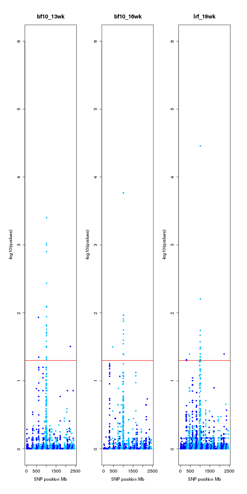
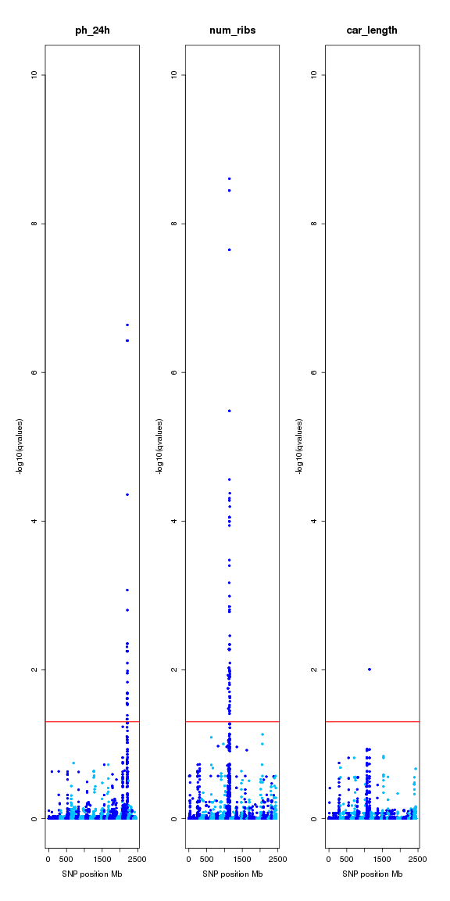
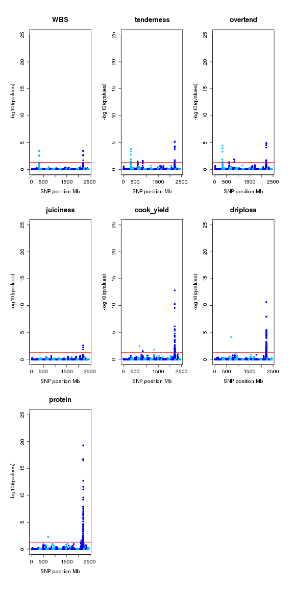

**Script:** `1_miRNA_eQTL_colocalization.R`

**Directory of Code:**  `/mnt/research/pigeqtl/analyses/microRNA/2_mirna_characterization_expression/7_miRNA_eQTL_colocalization/scripts`

**Date:**  07/14/17 - 7/18/17

**Input File Directory:**  

1. `/mnt/research/pigeqtl/analyses/eQTL/paper/output/corrected-Z/`

2. `/mnt/research/pigeqtl/analyses/eQTL/paper/code/corrected-Z/PRKAG3_eQTL/`

3. `/mnt/research/pigeqtl/analyses/microRNA/3_build_dge_object_for_eqtl/`

4. `/mnt/research/pigeqtl/analyses/microRNA/4_miRNA_gblup_eqtl_analysis/`

**Input File(s):** 

1. `pQTL_ALL.Rdata`, `inrange_function.Rdata`

2. `gpData_PRKAG3.Rdata`

3. `2_mature_mirna_annotation.Rdata`, `3_msuprp_mirna_gpdata_pheno_counts.Rdata`, `4_normalized_dge_object_and_voom_output.Rdata`, `5_Z_G_miRNA_gblup_gwas.Rdata`

4. `1_gblup_results_summary.Rdata`, `2_gwa_results_summary.Rdata`, `5_miRNA_eQTL_local_distal_regulators.Rdata`

**Output File Directory:** 

1. `/mnt/research/pigeqtl/analyses/microRNA/2_mirna_characterization_expression/7_miRNA_eQTL_colocalization/`

**Output File(s):** 

1. `1_miRNA_eQTL_pQTL_colocalized_peaks.Rdata`

2. `2_miRNA_eQTL_pQTL_colocalized_peaks.txt`

3. `3_pQTL_summary.txt`

4. `4_summary_phenotypes_174.txt`

**Table of contents:**

1. [Objectives](#objectives)
2. [Install libraries](#install-libraries)
3. [Load data](#load-data)
4. [Analysis](#analysis)
5. [Visualize](#visualize)
6. [Save data](#save-data)

## Objectives

The objective of this script is to investigate if any miRNA eQTL co-localize with pQTL and/or mRNA eQTL.

## Install libraries


```r
setwd("/mnt/research/pigeqtl/analyses/microRNA/2_mirna_characterization_expression/7_miRNA_eQTL_colocalization/scripts")

rm(list=ls())

library(methods)
library(limma)
library(edgeR)
```

## Load data


```r
load("/mnt/research/pigeqtl/analyses/eQTL/paper/output/corrected-Z/pQTL_ALL.Rdata")
load("/mnt/research/pigeqtl/analyses/eQTL/paper/code/corrected-Z/PRKAG3_eQTL/gpData_PRKAG3.Rdata")
load("/mnt/research/pigeqtl/analyses/eQTL/paper/output/corrected-Z/inrange_function.Rdata")
```

Load DV functions:


```r
load("/mnt/research/pigeqtl/analyses/eQTL/paper/output/funct_eqtl.Rdata")

load("../../3_build_dge_object_for_eqtl/2_mature_mirna_annotation.Rdata")
load("../../3_build_dge_object_for_eqtl/3_msuprp_mirna_gpdata_pheno_counts.Rdata")
load("../../3_build_dge_object_for_eqtl/4_normalized_dge_object_and_voom_output.Rdata")
load("../../3_build_dge_object_for_eqtl/5_Z_G_miRNA_gblup_gwas.Rdata")
load("../../4_miRNA_gblup_eqtl_analysis/1_gblup_results_summary.Rdata")
load("../../4_miRNA_gblup_eqtl_analysis/2_gwa_results_summary.Rdata")
load("../../4_miRNA_gblup_eqtl_analysis/5_miRNA_eQTL_local_distal_regulators.Rdata")

ls()
```

```
##  [1] "absmap"               "add_legend"           "AddPosGene"          
##  [4] "dge"                  "distance"             "G"                   
##  [7] "inrange"              "manhpt"               "MSUPRP_meat"         
## [10] "MSUPRP_miRNA"         "peakrng"              "plot.GMA"            
## [13] "pqtl"                 "PRKAG3"               "regul"               
## [16] "rst.gwa"              "sigpval"              "stb"                 
## [19] "stb.nm"               "summary_MSUPRP_miRNA" "summary.rst.gblup"   
## [22] "tbpos"                "total.mature.annot2"  "v"                   
## [25] "wtcen"                "Z"                    "zstandard"
```

## Analysis

q-values pQTL GWAS


```r
qval <- pqtl$gwa.qval
dim(qval)
```

```
## [1] 44911    67
```

p-values pQTL GWAS


```r
pval <- pqtl$gwa.pval
dim(pval)
```

```
## [1] 44911    67
```

Standardized SNP effects pQTL GWA


```r
sdEff <- pqtl$gwa
dim(sdEff)
```

```
## [1] 44911    67
```

Marker Map


```r
map <- data.frame(chr=MSUPRP_meat$map[[1]], pos=MSUPRP_meat$map[[2]])
rownames(map) <- colnames(MSUPRP_meat$geno)
dim(map)
```

```
## [1] 45331     2
```

Retain marker information for all pQTL


```r
sig <- apply(qval, 2, function(x) x[x < 0.05])
sig <- lapply(names(sig), function(x) data.frame(map[names(sig[[x]]),],
        std.eff=sdEff[names(sig[[x]]),x], pvalue=pval[names(sig[[x]]),x], qvalue=sig[[x]]))
names(sig) <- colnames(qval)
sig <- sig[unlist(lapply(sig, nrow)) > 0]
length(sig)
```

```
## [1] 27
```

```r
names(sig)
```

```
##  [1] "bf10_10wk"  "lrf_10wk"   "bf10_13wk"  "lrf_13wk"   "bf10_16wk" 
##  [6] "lma_16wk"   "lrf_16wk"   "bf10_19wk"  "lrf_19wk"   "bf10_22wk" 
## [11] "lrf_22wk"   "dress_ptg"  "cook_yield" "WBS"        "juiciness" 
## [16] "tenderness" "overtend"   "driploss"   "ph_24h"     "car_length"
## [21] "num_ribs"   "last_lum"   "car_bf10"   "car_lma"    "loin"      
## [26] "belly"      "protein"
```

If a pQTL contains more than one peak split each peak


```r
idx <- lapply(sig, function(x) as.numeric(names(table(x$chr))))
idx <- idx[unlist(lapply(idx, function(x) length(x) > 1))]

mp <- lapply(1:length(idx), function(x) lapply(1:length(idx[[x]]), function(y) sig[[names(idx)[x]]][sig[[names(idx)[x]]]$chr == idx[[x]][y],]))
names(mp) <- names(idx)

for (i in 1:length(mp)){
names(mp[[i]]) <- paste(names(mp)[[i]], 1:length(mp[[i]]), sep=".")
}

qtl <- sig[!names(sig) %in% names(mp)]
for (i in 1:length(mp)){
qtl <- c(qtl, mp[[i]])
}

# Number of associated markers per QTL peak
length(qtl)
```

```
## [1] 58
```

```r
unlist(lapply(qtl, nrow))
```

```
##     lrf_13wk     lma_16wk    bf10_19wk    bf10_22wk    juiciness 
##           49            4            3           21            6 
##       ph_24h   car_length     num_ribs        belly  bf10_10wk.1 
##           37            2           98            1           25 
##  bf10_10wk.2   lrf_10wk.1   lrf_10wk.2   lrf_10wk.3  bf10_13wk.1 
##            1          121            1            1            2 
##  bf10_13wk.2  bf10_13wk.3  bf10_16wk.1  bf10_16wk.2   lrf_16wk.1 
##           24            1            1           15            2 
##   lrf_16wk.2   lrf_16wk.3   lrf_19wk.1   lrf_19wk.2   lrf_19wk.3 
##           40            1            1            1           39 
##   lrf_19wk.4   lrf_22wk.1   lrf_22wk.2  dress_ptg.1  dress_ptg.2 
##            1           56            1           95            4 
## cook_yield.1 cook_yield.2 cook_yield.3 cook_yield.4        WBS.1 
##            1            2            1           77            7 
##        WBS.2 tenderness.1 tenderness.2 tenderness.3 tenderness.4 
##            7           10            2            5           17 
##   overtend.1   overtend.2   overtend.3   overtend.4   driploss.1 
##           12            2            8           27            1 
##   driploss.2   last_lum.1   last_lum.2   car_bf10.1   car_bf10.2 
##           93            2           13            9          153 
##   car_bf10.3    car_lma.1    car_lma.2       loin.1       loin.2 
##            1            1           10           49            1 
##       loin.3    protein.1    protein.2 
##            1            1          115
```

Co-localization eQTL with pQTL


```r
# Check all eQTL peaks within a pQTL
sig <- cbind(regul[,c(7:14)], regul[,c(1:6)])
# sig[,c(2:4,7,11:13)] <- sig[,c(2:4,7,11:13)] * 1e6

eqtl.pqtl <- lapply(qtl, function(x) inrange(chr=unique(x$chr), start=min(x$pos),
        end=max(x$pos), map=sig, single="pos.snp", range=NULL))
unlist(lapply(eqtl.pqtl, nrow))[unlist(lapply(eqtl.pqtl, nrow)) > 0]
```

```
##    juiciness       ph_24h cook_yield.4        WBS.2 tenderness.4 
##            6            6            6            6            6 
##   overtend.4   driploss.2    protein.2 
##            6            6            6
```

```r
# Check all pQTL peaks within a eQTL
rqtl <- do.call(rbind,lapply(qtl, function(x) data.frame(chr=unique(x$chr),
        min=min(x$pos), max=max(x$pos))))

PinE <- lapply(1:nrow(sig), function(x) inrange(chr=sig[x, "chr.snp"], start=sig[x, "min.pos"],
        end=sig[x, "max.pos"], map=rqtl, single=NULL, range=c(start="min", end="max")))
names(PinE) <- 1:nrow(sig)
unlist(lapply(PinE, nrow))[unlist(lapply(PinE, nrow)) > 0]
```

```
## 1 2 5 8 
## 2 1 2 1
```

```r
PinE <- do.call(rbind, lapply(names(PinE), function(x)
        data.frame(pqtl=rownames(PinE[[x]]), PinE[[x]], eqtl=rep(x, nrow(PinE[[x]])))))
rownames(PinE) <- NULL

PinE <- lapply(names(qtl), function(x) sig[as.character(PinE$eqtl[grep(x, PinE$pqtl)]),])
names(PinE) <- names(qtl)
unlist(lapply(PinE, nrow))[unlist(lapply(PinE, nrow)) > 0]
```

```
##  car_length    num_ribs bf10_13wk.1 bf10_16wk.1  lrf_19wk.2  last_lum.1 
##           1           1           1           1           1           1
```

```r
# pQTL peaks overlaping left side of eQTL
left <- lapply(qtl, function(x) inrange(chr=unique(x$chr), start=min(x$pos),
        end=max(x$pos), map=sig, single="min.pos", range=NULL))
unlist(lapply(left, nrow))[unlist(lapply(left, nrow)) > 0]
```

```
##    juiciness       ph_24h cook_yield.4        WBS.2 tenderness.4 
##            6            6            6            6            6 
##   overtend.4   driploss.2    protein.2 
##            6            6            6
```

```r
# pQTL peaks overlaping right side of eQTL
right <- lapply(qtl, function(x) inrange(chr=unique(x$chr), start=min(x$pos),
        end=max(x$pos), map=sig, single="max.pos", range=NULL))
unlist(lapply(right, nrow))[unlist(lapply(right, nrow)) > 0]
```

```
##    juiciness       ph_24h cook_yield.4        WBS.2 tenderness.4 
##            6            6            6            6            6 
##   overtend.4   driploss.2    protein.2 
##            6            6            6
```

Merge all pQTL co-localizing with eQTL


```r
coloc <- lapply(names(eqtl.pqtl), function(x) rbind(eqtl.pqtl[[x]],
        PinE[[x]][!rownames(PinE[[x]]) %in% rownames(eqtl.pqtl[[x]]),]))
names(coloc) <- names(eqtl.pqtl)

coloc <- lapply(names(coloc), function(x) rbind(coloc[[x]],
        left[[x]][!rownames(left[[x]]) %in% rownames(coloc[[x]]),]))
names(coloc) <- names(eqtl.pqtl)

coloc <- lapply(names(coloc), function(x) rbind(coloc[[x]],
        right[[x]][!rownames(right[[x]]) %in% rownames(coloc[[x]]),]))
names(coloc) <- names(eqtl.pqtl)

# Matrix of pQTL and colocalized eQTL
qtlM <- do.call(rbind, lapply(names(qtl), function(x)
        data.frame(chr=unique(qtl[[x]]$chr), lowb=min(qtl[[x]]$pos), upperb=max(qtl[[x]]$pos),
                eQTL=nrow(coloc[[x]]))))
rownames(qtlM) <- names(qtl)

# Number of pQTL with co-localized eQTL
sum(qtlM$eQTL > 0)
```

```
## [1] 14
```

```r
# Summary colocalized QTL
coloc <- coloc[unlist(lapply(coloc, nrow)) > 0]
unlist(lapply(coloc, nrow))
```

```
##    juiciness       ph_24h   car_length     num_ribs  bf10_13wk.1 
##            6            6            1            1            1 
##  bf10_16wk.1   lrf_19wk.2 cook_yield.4        WBS.2 tenderness.4 
##            1            1            6            6            6 
##   overtend.4   driploss.2   last_lum.1    protein.2 
##            6            6            1            6
```

Create table with pQTL information


```r
sum.qtl <- do.call(rbind, lapply(qtl, function(x) data.frame(chr=unique(x$chr), start=min(x$pos), end=max(x$pos),
        SNP=rownames(x)[min(x$pvalue) == x$pvalue][1], x[min(x$pvalue) == x$pvalue,][1,
        c("pos", "std.eff", "pvalue", "qvalue")], nSNP=nrow(x))))
sum.qtl <- sum.qtl[order(sum.qtl$chr),]

# Add heritability of each pQTL and number of co-localized eQTL
idx <- unlist(lapply(rownames(sum.qtl), function(x) strsplit(x, "[.]")[[1]][1]))
sum.qtl <- data.frame(sum.qtl, h2=pqtl$gblup[idx,"h2"], pval.h2=pqtl$gblup[idx,"pvalue"],
        qval.h2=pqtl$gblup[idx,"qvalue"], eQTL=unlist(lapply(rownames(sum.qtl),
        function(x) ifelse(x %in% names(coloc), nrow(coloc[[x]]), 0))))
dim(sum.qtl)
```

```
## [1] 58 13
```

---
Order colocalized eQTL per chromosome


```r
coloc <- coloc[rownames(sum.qtl)]
coloc <- coloc[!is.na(names(coloc))]

# Number of eQTL co-localized with pQTL
length(unlist(lapply(coloc,rownames)))
```

```
## [1] 54
```

```r
# Number of unique eQTL co-localized with pQTL
length(unique(unlist(lapply(coloc,rownames))))
```

```
## [1] 10
```

Add colocalized eQTL-pQTL infomation to eQTL table (regul R object)


```r
lst <- do.call(rbind,lapply(names(coloc), function(x)
        data.frame(eqtl=rownames(coloc[[x]]), pqtl=strsplit(x,"[.]")[[1]][1])))

regul <- cbind(regul,
        # snp.effect=unlist(lapply(1:nrow(regul),
        #         function(x) eqtl$gwa[regul$SNP[x], regul$miRNA[x]])),
        qval.snp=unlist(lapply(1:nrow(regul),
               function(x) rst.gwa[(rst.gwa$miRNA==regul$miRNA[x] & rst.gwa$SNPid==regul$SNP[x]),"gwa.qval"])),
        pval.snp=unlist(lapply(1:nrow(regul),
               function(x) rst.gwa[(rst.gwa$miRNA==regul$miRNA[x] & rst.gwa$SNPid==regul$SNP[x]),"gwa.pval"])),
        summary.rst.gblup[regul$miRNA,c("h2","lrtpvalue","qvalue")],
        colocalized.pqtl=unlist(lapply(rownames(regul),
                function(x) paste(as.character(lst[lst$eqtl == x, "pqtl"]), collapse=', '))))

head(regul)
```

```
##             miRNA chr.miR start.miR   end.miR range.miR   miRBase.ID
## 1     ssc-miR-184       7  53883677  53883698        21 MIMAT0002127
## 2    ssc-miR-190b       4 104457820 104457841        21 MIMAT0020588
## 3     ssc-miR-429       6  58044184  58044205        21 MIMAT0020591
## 4 ssc-miR-7135-3p       3  29052303  29052324        21 MIMAT0028146
## 5     ssc-miR-874       2 145381108 145381130        22 MIMAT0025384
## 6 ssc-miR-9785-5p       3  22233456  22233479        23 MIMAT0037002
##   chr.snp range.peak   min.pos   max.pos num.snp         SNP   pos.snp
## 1       7   84868032  49815607 134683639      50 ALGA0041952  55936003
## 2       4   16724835  94724175 111449010      11 ALGA0026452  94724175
## 3       6   22928010  38548262  61476272      93 ASGA0094554  41809035
## 4       3     723613  28401592  29125205      15 MARC0056802  28401592
## 5       2   23140264 132997331 156137595     116 ALGA0016550 145462524
## 6       3   14394187  20983778  35377965      16 DRGA0003812  21432908
##   regulator     qval.snp     pval.snp           h2    lrtpvalue
## 1       cis 1.645128e-07 3.448363e-11 6.324227e-01 5.573325e-09
## 2       cis 1.898190e-02 4.973511e-07 5.048971e-01 3.196365e-05
## 3       cis 5.415319e-06 2.956361e-09 3.427617e-01 1.189558e-03
## 4       cis 1.150891e-02 4.523232e-06 4.586444e-08 5.000000e-01
## 5       cis 2.900787e-09 7.600449e-14 3.003786e-01 1.576781e-03
## 6       cis 3.557354e-02 1.477807e-05 2.374707e-01 2.201045e-02
##         qvalue     colocalized.pqtl
## 1 1.644131e-06 car_length, num_ribs
## 2 8.572069e-04             last_lum
## 3 1.403678e-02                     
## 4 5.000000e-01                     
## 5 1.722779e-02  bf10_16wk, lrf_19wk
## 6 9.825224e-02
```

Reorder columns in regul data frame


```r
regul <- regul[,c("chr.snp", "SNP", "pos.snp", "pval.snp", "qval.snp", "min.pos", "max.pos", "range.peak", "num.snp",
        "miRNA", "chr.miR", "start.miR", "end.miR", "range.miR", "h2", "lrtpvalue", "qvalue", "regulator", "colocalized.pqtl")]

head(regul)
```

```
##   chr.snp         SNP   pos.snp     pval.snp     qval.snp   min.pos
## 1       7 ALGA0041952  55936003 3.448363e-11 1.645128e-07  49815607
## 2       4 ALGA0026452  94724175 4.973511e-07 1.898190e-02  94724175
## 3       6 ASGA0094554  41809035 2.956361e-09 5.415319e-06  38548262
## 4       3 MARC0056802  28401592 4.523232e-06 1.150891e-02  28401592
## 5       2 ALGA0016550 145462524 7.600449e-14 2.900787e-09 132997331
## 6       3 DRGA0003812  21432908 1.477807e-05 3.557354e-02  20983778
##     max.pos range.peak num.snp           miRNA chr.miR start.miR   end.miR
## 1 134683639   84868032      50     ssc-miR-184       7  53883677  53883698
## 2 111449010   16724835      11    ssc-miR-190b       4 104457820 104457841
## 3  61476272   22928010      93     ssc-miR-429       6  58044184  58044205
## 4  29125205     723613      15 ssc-miR-7135-3p       3  29052303  29052324
## 5 156137595   23140264     116     ssc-miR-874       2 145381108 145381130
## 6  35377965   14394187      16 ssc-miR-9785-5p       3  22233456  22233479
##   range.miR           h2    lrtpvalue       qvalue regulator
## 1        21 6.324227e-01 5.573325e-09 1.644131e-06       cis
## 2        21 5.048971e-01 3.196365e-05 8.572069e-04       cis
## 3        21 3.427617e-01 1.189558e-03 1.403678e-02       cis
## 4        21 4.586444e-08 5.000000e-01 5.000000e-01       cis
## 5        22 3.003786e-01 1.576781e-03 1.722779e-02       cis
## 6        23 2.374707e-01 2.201045e-02 9.825224e-02       cis
##       colocalized.pqtl
## 1 car_length, num_ribs
## 2             last_lum
## 3                     
## 4                     
## 5  bf10_16wk, lrf_19wk
## 6
```

```r
# Change megabase positions to base positions
# idx <- c("min.pos", "max.pos", "range.peak", "pos.snp", "start.miR", "end.miR", "range.miR")
# regul[,idx] <- regul[,idx]
```

Order regul matrix by peak chromosome and position


```r
tmp <- lapply(1:18, function(x) regul[regul$chr.snp == x,])
regul <- do.call(rbind, lapply(tmp, function(x) x[order(x$pos.snp),]))

head(regul)
```

```
##    chr.snp         SNP   pos.snp     pval.snp     qval.snp   min.pos
## 5        2 ALGA0016550 145462524 7.600449e-14 2.900787e-09 132997331
## 8        3 DBWU0000430   9121844 4.257496e-05 3.806704e-02   9121844
## 6        3 DRGA0003812  21432908 1.477807e-05 3.557354e-02  20983778
## 4        3 MARC0056802  28401592 4.523232e-06 1.150891e-02  28401592
## 20       3 ALGA0122273  64022095 5.600420e-05 2.116294e-02  64022095
## 51       4 ASGA0017748   7002305 1.146833e-06 1.094251e-02   7002305
##      max.pos range.peak num.snp           miRNA chr.miR start.miR
## 5  156137595   23140264     116     ssc-miR-874       2 145381108
## 8  135025761  125903917       2     ssc-miR-184       7  53883677
## 6   35377965   14394187      16 ssc-miR-9785-5p       3  22233456
## 4   29125205     723613      15 ssc-miR-7135-3p       3  29052303
## 20  64022095          0       1     ssc-miR-874       2 145381108
## 51   7002305          0       1  ssc-miR-140-5p      NA        NA
##      end.miR range.miR           h2    lrtpvalue       qvalue regulator
## 5  145381130        22 3.003786e-01 1.576781e-03 1.722779e-02       cis
## 8   53883698        21 6.324227e-01 5.573325e-09 1.644131e-06      tran
## 6   22233479        23 2.374707e-01 2.201045e-02 9.825224e-02       cis
## 4   29052324        21 4.586444e-08 5.000000e-01 5.000000e-01       cis
## 20 145381130        22 3.003786e-01 1.576781e-03 1.722779e-02      tran
## 51        NA        NA 3.528853e-01 3.166166e-05 8.572069e-04      <NA>
##       colocalized.pqtl
## 5  bf10_16wk, lrf_19wk
## 8            bf10_13wk
## 6                     
## 4                     
## 20                    
## 51
```

---
Estimate the absolute position of markers and gene expressions


```r
posann <- (total.mature.annot2$end+total.mature.annot2$start)/2000000
names(posann) <- as.character(rownames(total.mature.annot2))
mapZ <- map
mapZ$pos <- mapZ$pos/1000000
mapt <- data.frame(chr=total.mature.annot2$chr0,pos=posann)
mapt <- mapt[!is.na(as.numeric(as.character(mapt$chr))), ]
map <- rbind(mapZ, mapt)
map$chr <- as.numeric(map$chr)
map <- map[order(map$chr), ]
```

Absolute postions of genes and markers


```r
abspos <- absmap(map)
```

Summary statistics for each phenotype and selected 174 animals


```r
pheno <- MSUPRP_meat$pheno[rownames(MSUPRP_miRNA$pheno[,,1]),,1]
sumstat <- data.frame(N=apply(pheno,2, function(x) length(x) - sum(is.na(x))),
        Mean=apply(pheno,2, mean, na.rm=T), SD=apply(pheno,2, sd, na.rm=T))
```

## Visualize

#### Manhattan Plots: miRNA eQTL colocalized with pQTL


```r
idx <- lapply(coloc, function(x) as.character(x$miRNA))
# eQTL qvalues
qvalE <- lapply(idx, function(x) data.frame(rst.gwa$gwa.qval[rst.gwa$miRNA==x]))
for (i in 1:length(qvalE)){
        colnames(qvalE[[i]]) <- idx[[i]]
}
```

```
## Error in `colnames<-`(`*tmp*`, value = c("ssc-let-7d-5p", "ssc-miR-345-3p", : 'names' attribute [6] must be the same length as the vector [1]
```

```r
# pQTL qvalues
nms <- unique(unlist(lapply(names(coloc), function(x) strsplit(x, "[.]")[[1]][1])))
qvalP <- qval[,nms]
```

Growth Phenotypes


```r
idx <- c("bf10_13wk","bf10_16wk",
        "lrf_19wk")
```


Carcass composition phenotypes


```r
idx <- c("ph_24h","num_ribs","car_length")
```


Meat quality phenotypes


```r
idx <- c("WBS","tenderness","overtend","juiciness","cook_yield","driploss","protein")
```


## Save data

Save the colocalized miRNA eQTL pQTL peaks:


```r
save(regul, file="../1_miRNA_eQTL_pQTL_colocalized_peaks.Rdata")
```

Write table of colocalized miRNA eQTL pQTL peaks:


```r
write.table(regul, quote=F, col.names=T, row.names=F, sep="\t", file="../2_miRNA_eQTL_pQTL_colocalized_peaks.txt")
```

Save pQTL table to text file


```r
write.table(sum.qtl, quote=F, row.names=T, col.names=T, sep="\t",file="../3_pQTL_summary.txt")
```

Save summary statistics for each phenotype and selected 174 animals


```r
write.table(sumstat, quote=F, col.names=T, row.names=T, sep="\t", file="../4_summary_phenotypes_174.txt")
```

